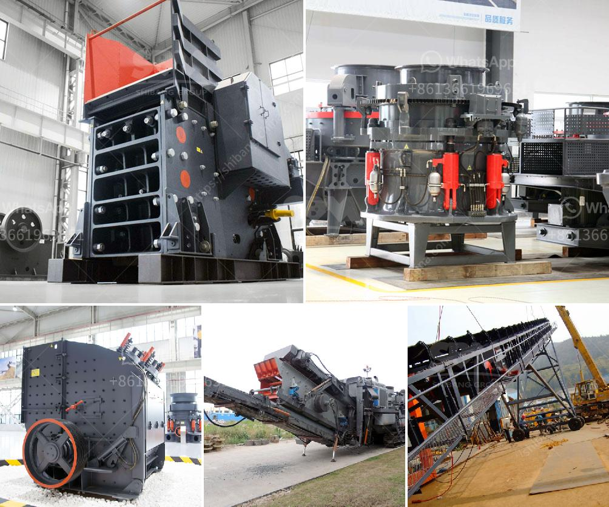

<h3>كسارات الفك في جنوب أفريقيا</h3>
تعد جنوب أفريقيا واحدة من أكبر الدول الصناعية في القارة الإفريقية، وتتمتع بموارد طبيعية غنية وتنوع باستثنائي. وتلعب كسارات الفك دورًا حاسمًا في صناعة التعدين والبناء في جنوب أفريقيا.

تتباين كسارات الفك في جنوب أفريقيا من حيث الحجم والأداء. تُستخدم هذه الكسارات في طحن الحجارة وتكسير المعادن الصلبة بفعالية عالية، مما يجعلها أداة أساسية لعمليات التعدين والبناء في البلاد. وتتميز كسارات الفك في جنوب أفريقيا بالقدرة على تكسير المواد ذات القوة العالية والتي تمتاز بمقاومتها العالية للتآكل.

يتم تصنيع هذه الكسارات باستخدام تكنولوجيا حديثة ومتقدمة. وتتكون من هيكل قوي ومتين وفكين قابلين للتحريك. تتميز الكسارات الفكية في جنوب أفريقيا بقدرتها على تكسير المواد الكبيرة والثقيلة إلى قطع أصغر تستخدم في العديد من التطبيقات المختلفة.

علاوة على ذلك، تعتبر كسارات الفك في جنوب أفريقيا ذات كفاءة عالية واقتصادية. فهي تسمح بإنتاج مواد أكثر دقة وفعالية من خلال استخدام قوة الفك في سحق المواد. يمكن أيضًا ضبط حجم الفتحة للفك لتحقيق حجم المواد المطلوب وتلبية احتياجات العميل المحددة.

بفضل هذه القدرات والتقنيات المتقدمة، تعتبر كسارات الفك في جنوب أفريقيا وسيلة فعالة لاستخراج الموارد الطبيعية وتقديم مواد البناء اللازمة للبنية التحتية والمشاريع الكبيرة في البلاد.

وفي الختام، تُعد كسارات الفك في جنوب أفريقيا أداة حاسمة في صناعة التعدين والبناء. تمتاز بمقاومتها للتآكل وكفاءتها العالية، مما يجعلها الخيار المثالي للأعمال الكبيرة والمشاريع في جنوب أفريقيا. ومن المتوقع أن تستمر هذه الصناعة في النمو والتطور لتلبية الاحتياجات المحلية والدولية.
<h3>Contact us</h3><ul><li><strong>Whatsapp:&nbsp;<a href="https://wa.me/8613661969651">+8613661969651</a></strong></li><li><a href="https://swt.shibang-china.com/?git&amp;zhl&amp;كسارات الفك في جنوب أفريقيا"><strong>Online Service(chat now)</strong></a></li></ul><h3>Related</h3><ul><li><a href='كسارات الحجر المحمولة في جنوب أفريقيا.md'>كسارات الحجر المحمولة في جنوب أفريقيا</a></li><li><a href='قائمة مصنعي آلات سحق اليابان.md'>قائمة مصنعي آلات سحق اليابان</a></li><li><a href='آلة فحص متنقلة في جنوب أفريقيا.md'>آلة فحص متنقلة في جنوب أفريقيا</a></li><li><a href='آلات طحن للمعادن في إندونيسيا.md'>آلات طحن للمعادن في إندونيسيا</a></li><li><a href='آلة طحن الكرة في الهند.md'>آلة طحن الكرة في الهند</a></li></ul>