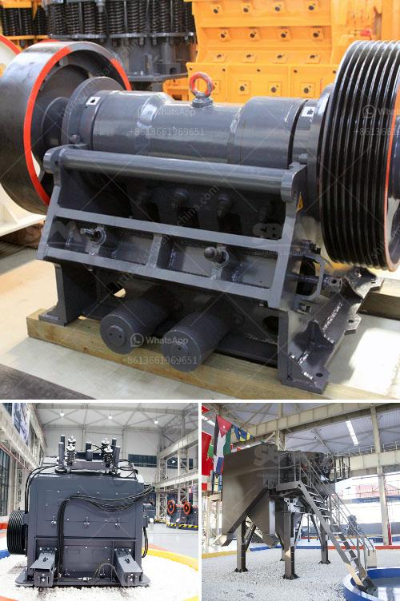

<h3>كسارات الفك مسحوق كربيد التنجستن</h3>
تعتبر كسارات الفك مسحوق كربيد التنجستن أدوات قوية وفعالة تُستخدم في صناعة التعدين ومعالجة المحاجر والبناء والهندسة المدنية. تعتبر هذه الكسارات من أفضل التقنيات المتاحة للتسليم المستدام للصخور الكبيرة إلى حجم أصغر وتحويلها إلى مواد جاهزة للاستخدام.

تعمل كسارات الفك عن طريق وضع الصخور بين صفائح الفك الثابتة والمتحركة ثم ضغطها بالقوة لتمزيقها. واحدة من أبرز المزايا لكسارات الفك مسحوق كربيد التنجستن هي صلابتها العالية، حيث يُستخدم مسحوق كربيد التنجستن لتحسين المتانة والصلابة. كما يتم استخدام المزيد من الصلب عالي المقاومة لتعزيز القوة والمتانة لهذه الكسارات.

توفر هذه الكسارات أداءً ممتازًا في سحق الصخور ذات المقاومة العالية مثل البازلت والجرانيت والرخام. كما يمكنها طحن المواد الكبيرة إلى مسحوق ناعم والتحكم في حجم الجسيمات بسهولة. تمتاز هذه الكسارات بالكفاءة العالية، وسرعة الإنتاج، وخفة الوزن، والقدرة على التكيف مع أنواع مختلفة من الصخور والمواد الخام.

بفضل تقنية كربيد التنجستن، فإن هذه الكسارات تتميز بمتانة عالية وقدرة على تحمل الاجهادات والضغوط الشديدة. تستخدم عادة في المناطق القاسية والبيئات التي تتطلب صلابة استثنائية، مثل التعدين تحت الأرض والمحاجر الكبيرة والمناجم.

بوجه عام، يشتمل تصميم هذه الكسارات على نظام تزييت متطور وفعال لضمان تشغيل سلس واستقرار في الأداء على المدى الطويل. كما تتميز بسهولة الصيانة والتشغيل، مما يسهل على العمال الحفاظ على أدائها بأعلى مستوى.

إجمالاً، تُعد كسارات الفك مسحوق كربيد التنجستن أدوات هامة وضرورية في صناعة التعدين والبناء. تحتوي على مزايا فريدة تشمل صلابة عالية ومتانة قوية وكفاءة عالية في الإنتاج. يتمتع تصميمها بالقدرة على مجانسة مختلف الصخور والمواد الخام الصعبة، وتحويلها إلى مواد جاهزة للاستخدام وفقًا للاحتياجات المحددة.
<h3>Contact us</h3><ul><li><strong>Whatsapp:&nbsp;<a href="https://wa.me/8613661969651">+8613661969651</a></strong></li><li><a href="https://swt.shibang-china.com/?git&amp;zhl&amp;كسارات الفك مسحوق كربيد التنجستن"><strong>Online Service(chat now)</strong></a></li></ul><h3>Related</h3><ul><li><a href='كسارة الحجر للبيع في بيرو.md'>كسارة الحجر للبيع في بيرو</a></li><li><a href='كسارة التعدين في تنزانيا.md'>كسارة التعدين في تنزانيا</a></li><li><a href='كسارة الفك هي.md'>كسارة الفك هي</a></li><li><a href='جهاز كسر الصخور في جنوب أفريقيا.md'>جهاز كسر الصخور في جنوب أفريقيا</a></li><li><a href='قائمة أسعار معدات كسارة الحجر الثقيلة.md'>قائمة أسعار معدات كسارة الحجر الثقيلة</a></li></ul>