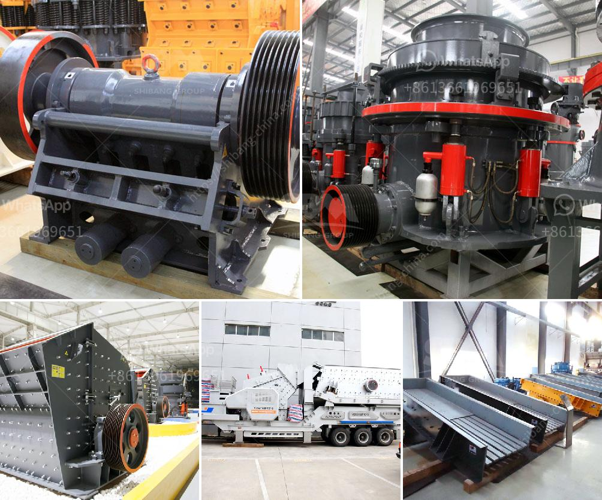

<h3>كسارات الكرة في كينيا</h3>
في السنوات الأخيرة، شهدت كينيا نموًا ملحوظًا في صناعة البناء والتشييد، وذلك بفضل توسع الاقتصاد وزيادة الاستثمارات في البنية التحتية والعقارات. تلبية الطلب المتزايد على مواد البناء يعتبر تحديًا كبيرًا، ولكن هناك حلاً فعالًا ومهمًا يقدمه كسارات الكرة في كينيا.

تعتبر كسارات الكرة مصانع تصنيع الركام الصخري، حيث يتم سحق الصخور الصلبة وتجهيزها لاستخدامها في البناء والتشييد. تلعب كسارات الكرة دورًا حيويًا في تلبية الطلب المتزايد على المواد الصلبة عالية الجودة في قطاع البناء والتشييد في كينيا.

تتميز كسارات الكرة في كينيا بعدة مزايا. فأولًا، توجد بكثرة في المناطق التي تحتوي على تجمعات صخرية، مما يقلل من تكاليف النقل والتوزيع. كما تعمل كسارات الكرة على تقليل حجم الصخور الصلبة وتكسيرها إلى حجم يمكن استخدامه في مختلف تطبيقات البناء.

ثانيًا، تستخدم كسارات الكرة عادة تقنيات الطحن والتكسير المتقدمة التي تؤدي إلى إنتاج ركام ذو جودة عالية. فبسبب استخدام الآلات المتطورة والتحكم الدقيق في العملية، تقدم كسارات الكرة ركامًا يلبي المعايير العالية للبناء ويمتاز بالقوة والمتانة.

ثالثًا، تساهم كسارات الكرة في تعزيز التنمية المستدامة. فعندما يتم استخدام الركام المستخرج من الكسارات في بناء المنازل والمباني، يتم تقليل فرصة التلوث البيئي والحفاظ على الموارد الطبيعية. هذا يساهم في الاستدامة البيئية للنشاطات الإنشائية في المجتمع.

وفي الختام، يمكن القول إن كسارات الكرة في كينيا تلعب دورًا هامًا في تلبية احتياجات قطاع البناء والتشييد. فهي توفر ركامًا ذو جودة عالية بتكاليف منخفضة وتساهم في التنمية المستدامة. بفضل هذه الكسارات، يتم تحقيق نمو أسرع في البناء والتشييد وتأمين إمدادات مستدامة من المواد الصلبة في كينيا.
<h3>Contact us</h3><ul><li><strong>Whatsapp:&nbsp;<a href="https://wa.me/8613661969651">+8613661969651</a></strong></li><li><a href="https://swt.shibang-china.com/?git&amp;zhl&amp;كسارات الكرة في كينيا"><strong>Online Service(chat now)</strong></a></li></ul><h3>Related</h3><ul><li><a href='تأجير سيارات الكسارة في كالتيم.md'>تأجير سيارات الكسارة في كالتيم</a></li><li><a href='عملية تعدين الكوارتز في ولاية أندرا براديش.md'>عملية تعدين الكوارتز في ولاية أندرا براديش</a></li><li><a href='سعر كسارة الحجر في الساعة.md'>سعر كسارة الحجر في الساعة</a></li><li><a href='الهيدروليك في مطحنة الكرة الرأسية.md'>الهيدروليك في مطحنة الكرة الرأسية</a></li><li><a href='كسارات متنقلة في قطر.md'>كسارات متنقلة في قطر</a></li></ul>