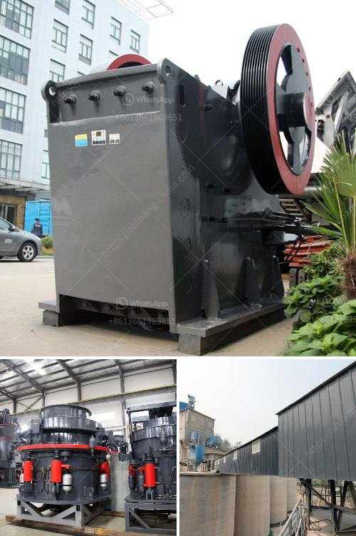

<h3>كسارات تأثير ثانوية</h3>
تعتبر الكسارات التأثيرية الثانوية جزءًا مهمًا من صناعة التعدين والبناء. تستخدم هذه الكسارات لسحق المواد الخام الكبيرة ، مثل الصخور والحجارة ، إلى جزيئات صغيرة ومتجانسة. لديها القدرة على تحويل المواد الصلبة إلى مواد ناعمة تستخدم في إنتاج الخرسانة والبناء وغيرها من التطبيقات الصناعية. سنلقي نظرة أعمق على قوة وأهمية الكسارات التأثيرية الثانوية.

تتكون الكسارات التأثيرية الثانوية من كسارة أساسية تتألف من غرفة سحق ، وحدة المطرقة والمكره ووحدة التغذية. تعمل هذه الكسارة عن طريق استخدام قوة الصدمة لسحق المواد. عندما يتم إلقاء المادة في الغرفة المؤثرة ، تتحرك المطارق بسرعة عالية وتصطدم بالمادة لتكسيرها. يتم سحق المواد ثم تفريزها وفقًا للحجم المطلوب.

تتميز الكسارات التأثيرية الثانوية بعدة مزايا. أهمها هو أنها قادرة على سحق المواد بشكل فعال وفي وقت قصير. كما أنها قادرة على معالجة مجموعة متنوعة من المواد بما في ذلك الأحجار الصلبة والصخور. تعمل الكسارات التأثيرية الثانوية أيضًا على تحقيق توزيع حجم الجسيمات المتجانس ، مما يسهل استخدامها في صناعات مختلفة.

في صناعة البناء ، تعتبر الكسارات التأثيرية الثانوية أداة أساسية لإعادة تدوير الخرسانة المتبقية والتخلص منها. يتم استخدام مواد الخرسانة المكسرة في إعادة تدوير الطرق والرصف وبناء الجدران. هذا يلعب دورًا في استدامة البناء وحماية البيئة.

علاوة على ذلك ، تساعد الكسارات التأثيرية الثانوية في إنتاج مواد بناء بجودة عالية. بفضل تقنيتها الفريدة ، تسمح هذه الكسارات بالحفاظ على خصائص ومظهر المواد الأصلية ، وفقًا للمواصفات المطلوبة. يتم استخدام المواد المنتجة في مشاريع مختلفة مثل البناء السكني والصناعي والتجاري.

في الختام ، تعد الكسارات التأثيرية الثانوية أداة أساسية في صناعة البناء والتعدين. يلعبون دورًا حاسمًا في سحق المواد الخام وإعادة تدوير الخرسانة المتبقية. توفر هذه الكسارات مواد بناء عالية الجودة ومتجانسة وتعزز الاستدامة البيئية في صناعة البناء.
<h3>Contact us</h3><ul><li><strong>Whatsapp:&nbsp;<a href="https://wa.me/8613661969651">+8613661969651</a></strong></li><li><a href="https://swt.shibang-china.com/?git&amp;zhl&amp;كسارات تأثير ثانوية"><strong>Online Service(chat now)</strong></a></li></ul><h3>Related</h3><ul><li><a href='عمليات سحق الركام.md'>عمليات سحق الركام</a></li><li><a href='سعر آلة المحجر.md'>سعر آلة المحجر</a></li><li><a href='كسارة مخروطية سلسلة CS.md'>كسارة مخروطية سلسلة CS</a></li><li><a href='طاحونة مسحوق ناعمة جدا.md'>طاحونة مسحوق ناعمة جدا</a></li><li><a href='آلة تصنيع الكرة الجبسية.md'>آلة تصنيع الكرة الجبسية</a></li></ul>