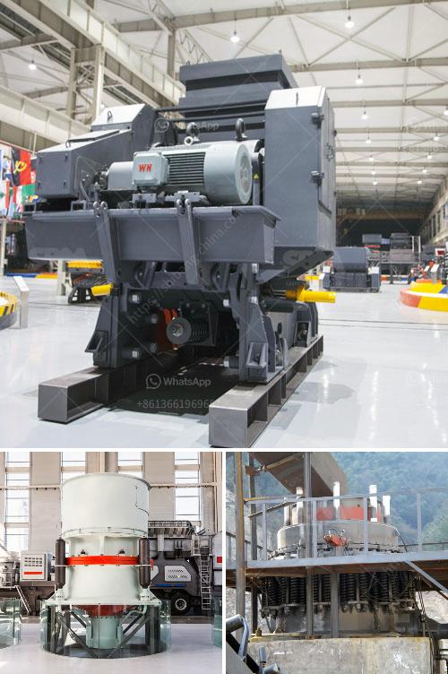

<h3>كسارات تأثير للبيع في الولايات المتحدة</h3>
يعتبر قطاع البناء والتشييد من أهم القطاعات الاقتصادية في الولايات المتحدة الأمريكية. ومن أبرز المكونات التي تساهم في نجاح عمليات البناء هي الكسارات التي تعتبر أدوات أساسية في إنتاج الركام والحصى المطلوبة لإنشاء المباني والطرق والجسور وغيرها.

تعد كسارات التأثير من أنواع الكسارات الأكثر استخداماً في صناعة البناء. تتميز هذه الكسارات بقدرتها على تكسير المواد وتحويلها إلى حجم مطلوب بفضل تأثيرها الهيدروليكي القوي الذي يتمثل في توجيه المواد بسرعة عالية إلى الجدران الداخلية للكسارة ما يؤدي إلى تحطيمها وتكسيرها. يتم استخدام الكسارات التأثير لتكسير الصخور الصلبة والحجارة والخرسانة القوية والطوب والأسفلت والزجاج والمعادن وغيرها من المواد.

تتوفر العديد من كسارات التأثير للبيع في الولايات المتحدة بمختلف الأحجام والقدرات التي تناسب احتياجات العملاء المختلفة. تتراوح قدراتها عادةً بين 30 إلى 600 طن في الساعة. يتم تحديد حجم الكسارة وقوتها حسب حجم الصخور الذي يجب تحويله واستخدامه في عمليات البناء.

إحدى الكسارات التأثير الشهيرة المتوفرة في السوق الأمريكية هي كسارة "Eagle Crusher Ultramax 1200-25CC" التي تتميز بأداء قوي وقدرة عالية على التكسير. تعمل هذه الكسارة بمحرك قوي يمكنها معالجة حتى 500 طن في الساعة. تتضمن أيضًا نظام تغذية متقدمة يجعل من السهل تغذية المواد إلى الكسارة بشكل متساوٍ وسلس. بالإضافة إلى ذلك، فإن هذه الكسارة مزودة أيضًا بأنظمة تحكم ذكية تجعل من السهل ضبط تدفق المواد وحجم المنتج النهائي.

إلى جانب الأداء القوي، تتميز الكسارات التأثير بسهولة الصيانة والتشغيل. تحتوي العديد من الكسارات على منصات تفتيش يمكن للفنيين الوصول إليها بسهولة لفحص وصيانة المكونات الداخلية. يتم تجهيز بعض الكسارات أيضًا بأنظمة تعمل باللمس وأجهزة استشعار ضوء للتحكم الكامل في عملية التكسير.

باختصار، تعتبر كسارات التأثير العنصر الأساسي في عمليات البناء وتعتبر أدوات مهمة لتحسين الإنتاجية وجودة البناء. وعند اختيار الكسارة المناسبة، يجب أن تلبي احتياجات المشروع وتتوافق مع المواصفات الفنية المطلوبة وتمتلك الميزات التشغيلية المناسبة. لذلك، ينصح بأخذ المشورة من الخبراء والمتخصصين قبل شراء الكسارة المناسبة لضمان الاستثمار الناجح والمستدام في عمليات البناء.
<h3>Contact us</h3><ul><li><strong>Whatsapp:&nbsp;<a href="https://wa.me/8613661969651">+8613661969651</a></strong></li><li><a href="https://swt.shibang-china.com/?git&amp;zhl&amp;كسارات تأثير للبيع في الولايات المتحدة"><strong>Online Service(chat now)</strong></a></li></ul><h3>Related</h3><ul><li><a href='قائمة أسعار إعادة تدوير زجاج كونسول للطن.md'>قائمة أسعار إعادة تدوير زجاج كونسول للطن</a></li><li><a href='كم تكلفة آلة المحجر.md'>كم تكلفة آلة المحجر</a></li><li><a href='خطة عمل لكربونات الكالسيوم.md'>خطة عمل لكربونات الكالسيوم</a></li><li><a href='شاشة اهتزازية لرمل الكوارتز.md'>شاشة اهتزازية لرمل الكوارتز</a></li><li><a href='كسارة الحجر المحمولة.md'>كسارة الحجر المحمولة</a></li></ul>