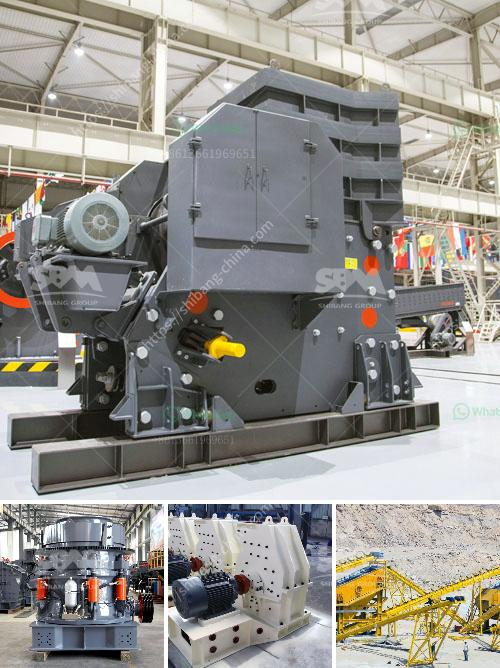

<h3>كسارات تأجير</h3>
تعتبر كسارات التأجير أداة أساسية في صناعة البناء والهندسة المدنية. تستخدم هذه الكسارات لتكسير الصخور الكبيرة والحجارة الكبيرة إلى قطع صغيرة يسهل نقلها واستخدامها في المشاريع الإنشائية المختلفة.

توفر كسارات التأجير عدة فوائد للمقاولين والعملاء. أولاً وقبل كل شيء، توفر هذه الخدمة توفيرًا كبيرًا في التكاليف. بدلاً من شراء كسارة جديدة وصيانتها وتشغيلها بشكل مستمر، يمكن للعميل استئجار الكسارة لفترة زمنية محددة ودفع تكلفة استئجار فقط. هذا يعتبر حلاً اقتصاديًا ممتازًا للمشاريع الصغيرة ولأولئك الذين لا يحتاجون لاستخدام الكسارة بشكل دائم.

ثانيًا، توفر كسارات التأجير حرية ومرونة أكبر للعملاء. يمكن للمقاول أن يختار الحجم والنوع المناسب من الكسارة حسب الاحتياجات الخاصة بمشروعه. بالإضافة إلى ذلك، يمكن للمقاول أيضًا أن يستأجر العديد من الكسارات المختلفة للعمل في مشاريع متعددة في نفس الوقت، مما يحسن من إنتاجيته ويوفر الوقت والجهد.

ثالثًا، توفر كسارات التأجير حلاً سريعًا للعملاء. في حالات الطوارئ أو المشاريع القصيرة المدى، يمكن للعميل استئجار الكسارة بسرعة وسهولة، بدلاً من الانتظار لشراء الكسارة وصيانتها وتشغيلها.

في الختام، تعد كسارات التأجير حلاً مثاليًا للشركات والمقاولين الذين يحتاجون إلى استخدام الكسارات بشكل مؤقت ومقتصر. توفر هذه الخدمة توفيرًا في التكاليف ومرونة أكبر وسرعة في الحصول على الكسارات المناسبة. بفضل تلك الفوائد، يمكن أن تكون كسارات التأجير اختيارًا موفقًا للعديد من الشركات والمشاريع في قطاع البناء والهندسة المدنية.
<h3>Contact us</h3><ul><li><strong>Whatsapp:&nbsp;<a href="https://wa.me/8613661969651">+8613661969651</a></strong></li><li><a href="https://swt.shibang-china.com/?git&amp;zhl&amp;كسارات تأجير"><strong>Online Service(chat now)</strong></a></li></ul><h3>Related</h3><ul><li><a href='موردي خط إنتاج الحبر.md'>موردي خط إنتاج الحبر</a></li><li><a href='مطحنة طحن الحجر الصناعي.md'>مطحنة طحن الحجر الصناعي</a></li><li><a href='آلة تكسير الصخور في الفلبين.md'>آلة تكسير الصخور في الفلبين</a></li><li><a href='آلة مسحوق الدولوميت.md'>آلة مسحوق الدولوميت</a></li><li><a href='طاقة إنتاج مسحوق الجبس 80 طن في الساعة.md'>طاقة إنتاج مسحوق الجبس 80 طن في الساعة</a></li></ul>