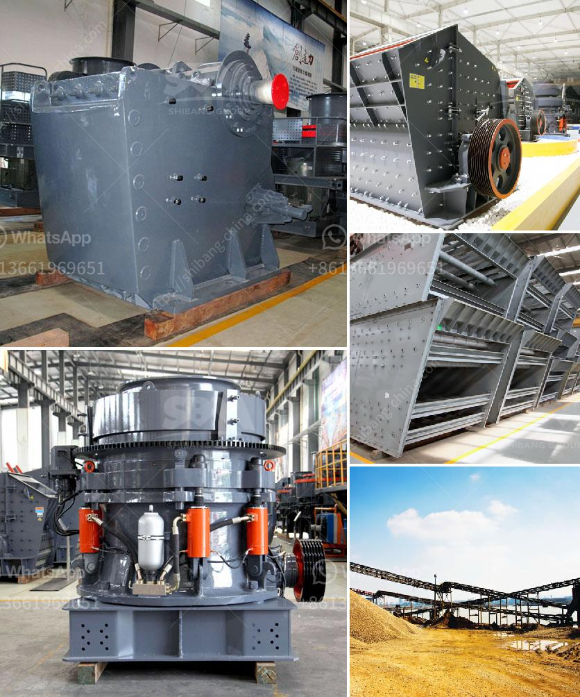

<h3>كسارات جنوب أفريقيا</h3>
جنوب أفريقيا هي دولة تعتبر مصدرا رئيسيا لكثير من الموارد الطبيعية، ومن بين هذه الموارد، كسارات جنوب أفريقيا. تعتبر صناعة التعدين والبناء من أهم القطاعات الاقتصادية في البلاد، ويسهم الاستخراج والتعامل مع المناجم والمحاجر في رفع النمو الاقتصادي وتوفير فرص العمل.

كسارات جنوب أفريقيا هي وحدات صناعية تستخدم لسحق وطحن المواد الخام في صناعة التعدين والبناء. تعتمد هذه الكسارات على القوة الميكانيكية لتحويل المواد الصلبة إلى جسيمات أصغر قابلة للتعامل والاستخدام في مجالات مختلفة. تتراوح قدرات الكسارات في جنوب أفريقيا من الصغيرة التي تستخدم في المشاريع الصغيرة والمتوسطة، إلى الكبيرة التي تستخدم في المشاريع الضخمة.

تشكل صناعة الكسارات قطاعا هاما في جنوب أفريقيا، حيث تعمل العديد من الشركات المحلية والعالمية في هذا المجال. يتم تصميم وتصنيع الكسارات بأحجام ومواصفات مختلفة لتلبية احتياجات العملاء في مختلف الصناعات.

تتميز كسارات جنوب أفريقيا بتقنياتها المتقدمة وكفاءتها العالية، حيث تعتبر أجهزة قوية قادرة على سحق المواد الصلبة مثل الصخور والأحجار والمواد المعدنية بسهولة وسرعة. تتوفر العديد من الأنواع المختلفة من الكسارات في السوق، بما في ذلك الكسارات الفكية والكسارات التصادمية والكسارات المخروطية، ويمكن اختيار النوع المناسب بناءً على نوع المواد المراد سحقها وأحجام الجسيمات المطلوبة.

تستخدم كسارات جنوب أفريقيا في العديد من المشاريع، مثل بناء الطرق والجسور ومشاريع البنية التحتية. بفضل قدرتها على سحق المواد الصلبة، تعد الكسارات أداة أساسية في عملية إنتاج الخرسانة والأسفلت والحصى وغيرها من المواد اللازمة لمشاريع البناء. تساهم هذه الكسارات في تسهيل عملية البناء وتوفير الوقت والمال.

ومن الجدير بالذكر أن صناعة التعدين في جنوب أفريقيا تعتبر أيضا مهمة جدا للاقتصاد الوطني، حيث تعتبر الماس والذهب والبلاتين والفحم والفوسفات بعض الموارد الطبيعية الرئيسية التي تستخرج من الأراضي الجنوب أفريقية.

بالاعتماد على الكسارات الموجودة في البلاد، يمكن لجنوب أفريقيا الاستفادة من هذه الموارد الثمينة وتحقيق تنمية اقتصادية قوية. تعزز صناعة الكسارات في البلاد الاستدامة البيئية والتنمية المستدامة، حيث يتم اعتماد تقنيات حديثة لإدارة المخلفات والمحافظة على البيئة.

باختصار، تعد كسارات جنوب أفريقيا أدوات أساسية في صناعة التعدين والبناء، حيث تسهم في تحقيق التنمية الاقتصادية وتوفير فرص العمل وتلبية احتياجات البنية التحتية في البلاد. ومع استخدام تكنولوجيا حديثة والتزام بالمسؤولية الاجتماعية والبيئية، يعد هذا القطاع من القطاعات الحيوية في جنوب أفريقيا.
<h3>Contact us</h3><ul><li><strong>Whatsapp:&nbsp;<a href="https://wa.me/8613661969651">+8613661969651</a></strong></li><li><a href="https://swt.shibang-china.com/?git&amp;zhl&amp;كسارات جنوب أفريقيا"><strong>Online Service(chat now)</strong></a></li></ul><h3>Related</h3><ul><li><a href='سعر آلة المحجر.md'>سعر آلة المحجر</a></li><li><a href='سعر رخيص لآلة تصنيع حبيبات الفحم.md'>سعر رخيص لآلة تصنيع حبيبات الفحم</a></li><li><a href='موزع كسارة في إندونيسيا.md'>موزع كسارة في إندونيسيا</a></li><li><a href='معدات تعدين كاثود النحاس.md'>معدات تعدين كاثود النحاس</a></li><li><a href='كسارة الكرةست في كينيا صنعت في الصين.md'>كسارة الكرةست في كينيا صنعت في الصين</a></li></ul>