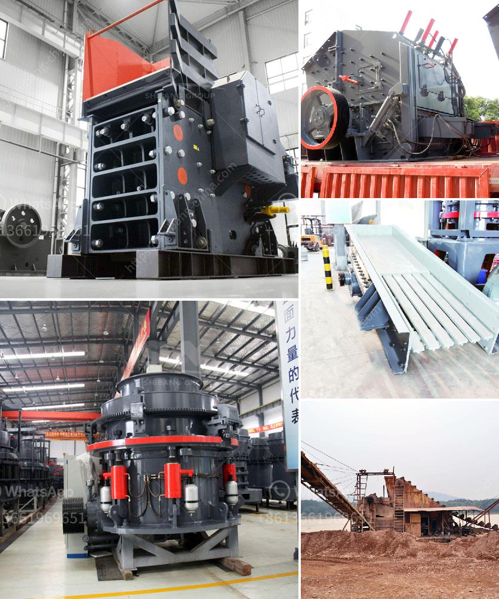

<h3>كسارات حجر بسيطة من زيفيث في كينيا</h3>
تعد كسارات الحجر البسيطة من زيفيث في كينيا من أهم المصادر للمواد الأساسية في صناعة البناء والتشييد. تمتاز هذه الكسارات ببساطتها وفاعليتها، حيث توفر مواد البناء الأساسية بأسعار معقولة وجودة عالية.

تقع معظم كسارات الحجر البسيطة في مقاطعة زيفيث بكينيا، وتشتهر المنطقة بتوفرها الكبير للصخور والحجارة. يتم استخدام هذه الكسارات لاستخراج الحجارة وتكسيرها للحصول على الصخور ذات الحجم المناسب للاستخدام في البناء والتشييد.

تتميز كسارات الحجر البسيطة بالمعدات والآليات البسيطة التي تستخدمها. غالبًا ما تعمل هذه الكسارات بواسطة اليد العاملة، حيث يعمل العمال على سحق الصخور وتصنيفها يدويًا. رغم بساطة العملية، إلا أنها فعالة وتنتج مواد البناء ذات الجودة العالية.

يعتبر الحجر المستخرج من كسارات زيفيث في كينيا مناسبًا للعديد من استخدامات البناء والتشييد المختلفة. يمكن استخدام هذه الحجارة في بناء الطرق والجسور والمباني والأسوار والمنشآت الأخرى. تحظى بشعبية كبيرة في صناعة البناء بسبب قوتها ومتانتها، مما يجعلها مادة مثالية لتحمل ضغوط البناء وظروف الاستخدام المختلفة.

من الجوانب الإيجابية لاستخدام كسارات الحجر البسيطة، أنها تعتبر وسيلة لتشغيل الكثير من العمال في المناطق الريفية، وبالتالي تسهم في توفير فرص عمل وتنمية اقتصاد المنطقة. بالإضافة إلى ذلك، تساهم هذه الكسارات في توفير الحجر المستدام وتقليل الاعتماد على الموارد الطبيعية الأخرى.

ومع ذلك، فإن هناك بعض التحديات التي تواجه كسارات الحجر البسيطة في زيفيث. يأتي هذا بسبب القلة في توفير المعدات الحديثة والتكنولوجيا المتقدمة، مما يؤثر على كفاءة العمليات ورفع مستوى الإنتاجية. بالإضافة إلى ذلك، تواجه هذه الكسارات أيضًا تحديات بيئية وصحية، حيث يتم توليد الكثير من الغبار والانبعاثات الضارة أثناء عمليات التكسير.

باختصار، تعد كسارات الحجر البسيطة من زيفيث في كينيا من المصادر الأساسية للمواد البنائية. تقدم هذه الكسارات فرص عمل وتوفر مواد البناء ذات الجودة العالية. ومع ذلك، هناك حاجة للتحديث التكنولوجي والاهتمام بالقضايا البيئية والصحية لمواجهة التحديات المستقبلية وتحسين كفاءة الإنتاج وجودة المنتجات.
<h3>Contact us</h3><ul><li><strong>Whatsapp:&nbsp;<a href="https://wa.me/8613661969651">+8613661969651</a></strong></li><li><a href="https://swt.shibang-china.com/?git&amp;zhl&amp;كسارات حجر بسيطة من زيفيث في كينيا"><strong>Online Service(chat now)</strong></a></li></ul><h3>Related</h3><ul><li><a href='إنتاج خام الحديد حسب الولاية في الهند.md'>إنتاج خام الحديد حسب الولاية في الهند</a></li><li><a href='معدات مصنع حجر الرمل.md'>معدات مصنع حجر الرمل</a></li><li><a href='موردين مطاحن الطحن في الصين.md'>موردين مطاحن الطحن في الصين</a></li><li><a href='مصنعين لشاشات الاهتزاز في جنوب أفريقيا.md'>مصنعين لشاشات الاهتزاز في جنوب أفريقيا</a></li><li><a href='آلة صنع الرمل الاصطناعي.md'>آلة صنع الرمل الاصطناعي</a></li></ul>