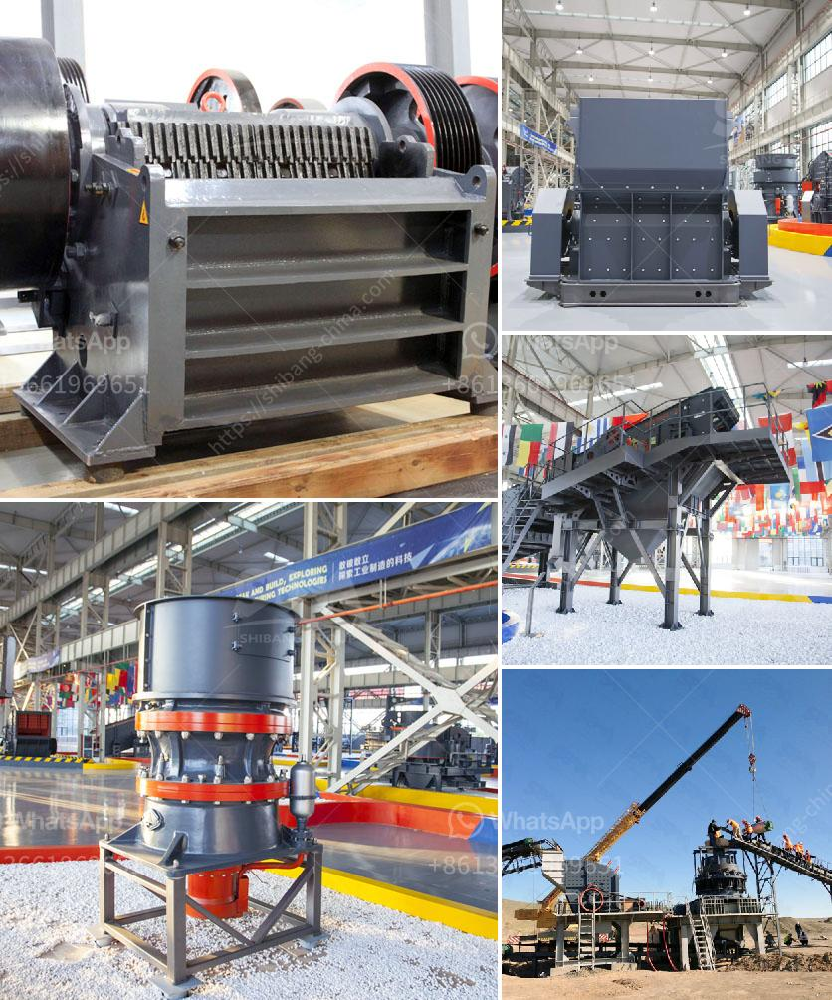

<h3>كسارات حجر محمولة أوغندا للبيع</h3>
تعد كسارات الحجر المحمولة في أوغندا أداة أساسية في صناعة التعدين والبناء. تتميز هذه الكسارات بقدرتها على سحق الصخور والحجارة بفعالية وسهولة، مما يجعلها اختيارًا شائعًا للعديد من المقاولين والمهندسين المعماريين في البلاد.

أحد أهم العوامل التي تجعل كسارات الحجر المحمولة مطلوبة هو قدرتها على العمل في المواقع النائية والبعيدة عن البنية التحتية المتطورة. في أوغندا، يوجد العديد من المناطق الريفية والمناطق التي تفتقر إلى الكهرباء أو الطرق المريحة. لذلك، فإن الاعتماد على كسارات الحجر المحمولة يعد حلاً مناسبًا لتلك المناطق.

تتميز كسارات الحجر المحمولة بحجمها الصغير ووزنها الخفيف، مما يوفر سهولة في نقلها وتركيبها في الموقع المراد العمل به. بالإضافة إلى ذلك، تتميز هذه الكسارات بالقوة العالية والكفاءة العالية في الأداء. يستخدم معظمها محركات قوية تعمل بالديزل لتشغيلها، وهذا يعني أنه يمكن تشغيلها بسهولة دون الحاجة إلى توفير مصدر كهرباء خارجي.

عملية تشغيل كسارات الحجر المحمولة بسيطة ومباشرة. تعمل بنظام سحق الصخور الذي يتضمن إدخال الصخرة في الكسارة ثم سحقها بواسطة آلية الدوار المتحرك والقطع المتحركة الأخرى. هذه العملية تتم بسرعة وبفضل قدرة الكسارة على تكرار العملية، يمكن سحق الكميات الكبيرة من الحجارة في وقت قياسي.

يمكن استخدام الحجارة المحجوزة من عملية سحق الصخور في البناء والتعدين. يتم استخدامها في صنع الخرسانة والأسفلت والرمل والحصى ومواد البناء الأخرى. وبالتالي، فإن امتلاك كسارة حجر محمولة يمكن أن يكون له تأثير كبير على إنتاجية مشروع البناء أو التعدين.

بالإضافة إلى ذلك، فإن كسارات الحجر المحمولة في أوغندا متوفرة بأسعار معقولة وتنافسية للغاية. يمكن العثور على مجموعة متنوعة من الموديلات بأسعار تتراوح بين 200 و 400 دولار، وهذا يعني أنها متاحة للعديد من الشركات والأفراد الذين قد يكونون بحاجة إلى استخدامها في مشاريعهم.

في النهاية، تعتبر كسارات الحجر المحمولة فرصة رائعة للشركات والأفراد في أوغندا للحصول على آلة قوية وفعالة في سحق الصخور والحجارة بسهولة وكفاءة. تعد هذه الكسارات خيارًا مربحًا لأولئك الذين يرغبون في زيادة إنتاجيتهم وتحسين جودة المواد التي ينتجونها.
<h3>Contact us</h3><ul><li><strong>Whatsapp:&nbsp;<a href="https://wa.me/8613661969651">+8613661969651</a></strong></li><li><a href="https://swt.shibang-china.com/?git&amp;zhl&amp;كسارات حجر محمولة أوغندا للبيع"><strong>Online Service(chat now)</strong></a></li></ul><h3>Related</h3><ul><li><a href='خطة عمل للمحجر.md'>خطة عمل للمحجر</a></li><li><a href='مصنع عملية التصنيع في جنوب أفريقيا.md'>مصنع عملية التصنيع في جنوب أفريقيا</a></li><li><a href='موزع كسارة مخروط في إندونيسيا.md'>موزع كسارة مخروط في إندونيسيا</a></li><li><a href='سعر حزام النقل.md'>سعر حزام النقل</a></li><li><a href='عمليات كسارة وغسل الحجر.md'>عمليات كسارة وغسل الحجر</a></li></ul>