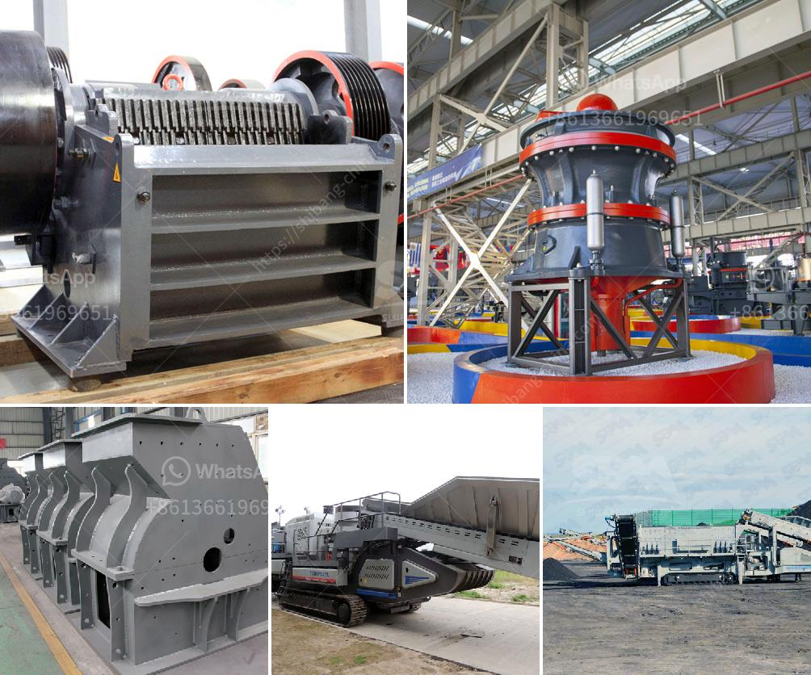

<h3>كسارات حجر مستعملة للبيع في كينيا</h3>
تشتهر كينيا بمواردها الطبيعية الغنية والمناظر الطبيعية الرائعة. ومن بين هذه الموارد الطبيعية الموجودة في البلاد، يأتي الحجر كواحد من الموارد التي تستخدم في العديد من الصناعات مثل البناء والتشييد. ومع تزايد الطلب على الحجر، فإن كسارات الحجر المستعملة أصبحت خياراً شائعاً للعديد من المشترين في كينيا.

كسارات الحجر المستعملة هي معدات تستخدم لكسر الصخور وتحويلها إلى قطع صغيرة من الحجر المستخدم في البناء والطرق والأعمال الخرسانية. تعتبر هذه الكسارات الحل المثلى للشركات التي تحتاج إلى تحطيم الصخور بشكل متكرر ومستمر، حيث أنها تتيح لهم استخدام الحجر المستعمل بدلاً من شراء الحجر الجديد، الأمر الذي يساعد هذه الشركات في تقليل التكاليف وتوفير المال.

وبالنظر إلى الأسعار المعقولة وتوافر هذه الكسارات المستعملة في كينيا، فإنها تعتبر خيارًا جيدًا للكثير من الأشخاص الذين يبحثون عن طرق اقتصادية وفعالة للحصول على الحجر لاستخدامه في المشاريع البنائية. ليس فقط يمكنك الحصول على الحجر الذي تحتاجه بأسعار معقولة، ولكن أيضًا تضمن جودة المنتج حيث أن كسارات الحجر المستعملة تعمل بشكل جيد وفعال وهي جاهزة للاستخدام الفوري.

وعلاوة على ذلك، تتميز الكسارات المستعملة بمجموعة متنوعة من الأحجام والأنواع، مما يتيح للمشترين مجموعة أوسع من الخيارات. بغض النظر عن طبيعة المشروع أو النوع المناسب لاستخدام الحجر، فإنه من الممكن العثور على كسارة حجر مستعملة تتناسب مع متطلبات المشتري وتلبي احتياجاته بشكل مثالي.

وبالإضافة إلى ذلك، فإن هذه الكسارات تأتي مع ضمانات تأكيد جودة المنتج وقدرتها على العمل لفترة طويلة من الزمن. وهذا يوفر راحة البال والثقة للمشترين فيما يتعلق بجودة وأداء المنتج. كما أن وجود توافر كسارات الحجر المستعملة في السوق يعني أنه يمكن الحصول عليها بسهولة وفي وقت قصير دون الحاجة إلى انتظار فترة طويلة للتوصيل.

في النهاية، يعتبر الاستثمار في كسارات الحجر المستعملة في كينيا خيارًا رائعًا للمشترين الذين يبحثون عن منتجات ذات جودة عالية بأسعار معقولة. وبالنظر إلى التوافر والتشكيلة المتنوعة المتاحة، يمكن للمشترين العثور على الكسارة المثالية لتلبية احتياجاتهم ومتطلباتهم. بالإضافة إلى ذلك، يمكن أن توفر هذه الكسارات توفيراً هائلاً من المال والوقت للشركات والأفراد على حد سواء، مما يجعلها اختيارًا اقتصاديًا وفعالًا.
<h3>Contact us</h3><ul><li><strong>Whatsapp:&nbsp;<a href="https://wa.me/8613661969651">+8613661969651</a></strong></li><li><a href="https://swt.shibang-china.com/?git&amp;zhl&amp;كسارات حجر مستعملة للبيع في كينيا"><strong>Online Service(chat now)</strong></a></li></ul><h3>Related</h3><ul><li><a href='كسارة تأثير خام الحديد المتنقلة في الهند.md'>كسارة تأثير خام الحديد المتنقلة في الهند</a></li><li><a href='آلة صغيرة لصنع المسحوق.md'>آلة صغيرة لصنع المسحوق</a></li><li><a href='سعر كسارات الفك المحمولة في جنوب أفريقيا.md'>سعر كسارات الفك المحمولة في جنوب أفريقيا</a></li><li><a href='تكلفة كسارة الرمل.md'>تكلفة كسارة الرمل</a></li><li><a href='مصنع الكرة لتكسير السليكات.md'>مصنع الكرة لتكسير السليكات</a></li></ul>