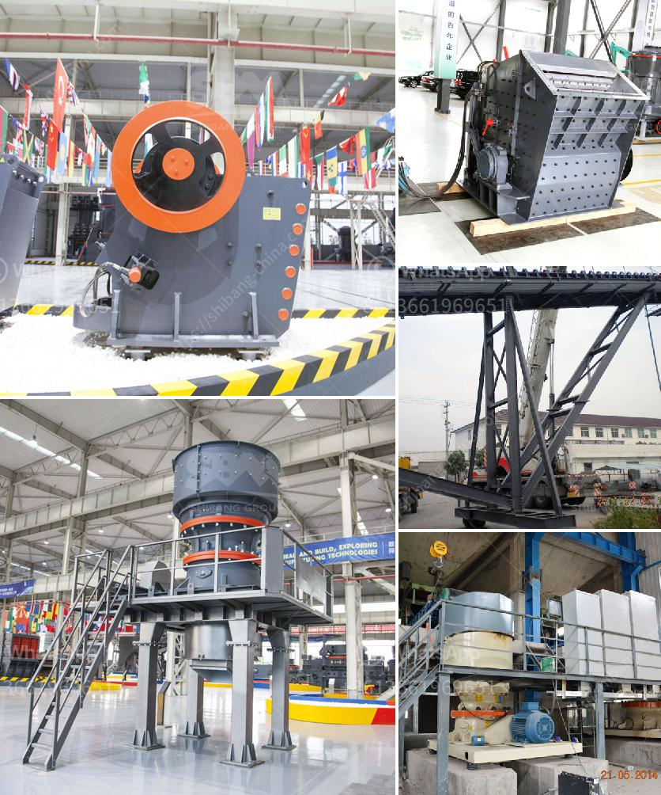

<h3>كسارات حجر مستعملة للبيع</h3>
تعتبر كسارات الحجر المستعملة فرصة مثالية للشركات والأفراد الذين يبحثون عن معدات ذات جودة عالية بأسعار معقولة. فمهما كانت احتياجاتك، ستجد بالتأكيد كسارة حجر مستعملة تناسبك. توفر هذه الكسارات العديد من الفوائد والتي نستعرضها في هذه المقالة.

أولاً وقبل كل شيء، يعتبر شراء كسارة حجر مستعملة اقتصاديًا بالمقارنة مع شراء كسارة جديدة. فسعر الكسارات المستعملة يكون أقل بكثير من السعر الأصلي لكسارة جديدة، مما يتيح لك تحقيق توفير كبير في الميزانية.

ثانيًا، الكسارات المستعملة توفر لك فرصة للحصول على معدات ذات جودة عالية بسعر أقل. فبالرغم من استخدامها من قبل أصحاب سابقين، إلا أن هذه الكسارات غالبًا ما تكون في حالة جيدة وقد تم صيانتها بشكل جيد. وإذا تم شراؤها من مصدر موثوق، فمن المحتمل أن تكون هذه الكسارات تعمل بكفاءة عالية وتكون على استعداد لتلبية احتياجاتك.

ثالثًا، شراء كسارة حجر مستعملة يعتبر خيارًا مستدامًا. فبدلاً من التخلص من كسارة قديمة وشراء كسارة جديدة، يتم استغلال الكسارة المستعملة لتلبية الاحتياجات الحالية. هذا يقلل من النفايات ويساهم في الحفاظ على البيئة.

لكن قبل شراء كسارة حجر مستعملة، هناك بعض الأشياء التي يجب أخذها في الاعتبار. أولاً، يجب عليك أن تقوم بفحص الكسارة بنفسك أو استعانة بخبير للتأكد من حالتها ووظائفها. قم بفحص الأجزاء الميكانيكية والهيدروليكية والكهربائية للتأكد من سلامتها وعملها السليم. كما يجب عليك التحقق من سجل الصيانة والإصلاحات السابقة التي تمت على الكسارة.

ثانيًا، ابحث عن مورد موثوق وذو سمعة جيدة. يمكنك الاطلاع على تقييمات العملاء السابقين والاستفسار عن تجربتهم مع هذا المورد. قد تكون هناك أيضًا ضمانات متاحة للكسارة المستعملة، وهذا يمكن أن يكون ميزة إضافية.

باختصار، يعتبر شراء كسارة حجر مستعملة فرصة رائعة للحصول على معدات ذات جودة عالية بأسعار معقولة. توفر لك التكاليف المنخفضة والأداء الجيد والاستدامة حلًا مثاليًا لاحتياجاتك. ولكن لا تنسى اتخاذ الاحتياطات اللازمة وشراء من مورد موثوق به.
<h3>Contact us</h3><ul><li><strong>Whatsapp:&nbsp;<a href="https://wa.me/8613661969651">+8613661969651</a></strong></li><li><a href="https://swt.shibang-china.com/?git&amp;zhl&amp;كسارات حجر مستعملة للبيع"><strong>Online Service(chat now)</strong></a></li></ul><h3>Related</h3><ul><li><a href='كل معدة لكل جهاز كسارة فك.md'>كل معدة لكل جهاز كسارة فك</a></li><li><a href='كسارة الصدم من نوع مانسبرجر.md'>كسارة الصدم من نوع مانسبرجر</a></li><li><a href='كم تكلفة آلة المحجر.md'>كم تكلفة آلة المحجر</a></li><li><a href='كيفية عمل مصنع سحق الحجر.md'>كيفية عمل مصنع سحق الحجر</a></li><li><a href='أحزمة ناقلة الشيفرون في الفلبين.md'>أحزمة ناقلة الشيفرون في الفلبين</a></li></ul>