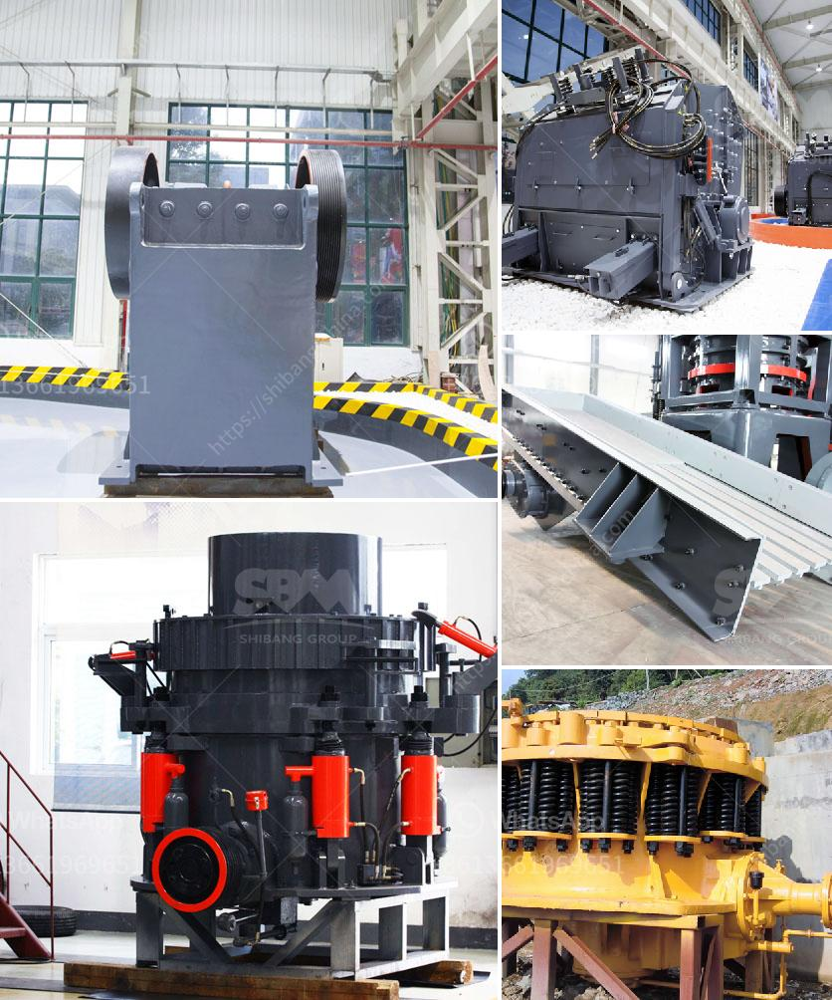

<h3>كسارات ستاملر الأمريكية لكسر المغذية</h3>
تأسست شركة ستاملر الأمريكية في عام 1931، وهي واحدة من الشركات الرائدة في مجال تصنيع الكسارات والمعدات الثقيلة. تعتبر كسارات ستاملر الأمريكية من أفضل الخيارات في سوق الكسارات، حيث تتميز بالقوة والكفاءة والاستدامة.

تتميز كسارات ستاملر الأمريكية بتصميمها المتقدم والمتطور، حيث تعمل على كسر المواد الخام بكفاءة عالية وبشكل متساوٍ. تم تصميمها بشكل يضمن الحد الأدنى من الضجيج والاهتزاز، مما يجعلها مثالية للاستخدام في الصناعات التي تتطلب كفاءة عالية ودقة في عملية الكسر.

تتوفر الكسارات ستاملر الأمريكية بمجموعة متنوعة من الأحجام والسعات، مما يتيح للمستخدمين اختيار الطراز المناسب وفقًا لاحتياجاتهم. تعتبر كسارات ستاملر الأمريكية مثلى لتعدين الحجر والركام ومواد البناء الأخرى. كما أنها تستخدم في صناعات أخرى مثل الطاقة والنفط والغاز والتعدين.

تعمل كسارات ستاملر الأمريكية بكفاءة عالية وتتميز بالقوة والمتانة. تستخدم تقنيات الهندسة المتقدمة والمواد المتينة في تصنيعها، مما يجعلها قادرة على التعامل مع المواد الصلبة والصعبة. تعتبر معدات الكسارة عالية الجودة جزءًا من التجهيزات الأساسية لأي موقع عمل، حيث تقلل من الهدر وتحسن كفاءة الإنتاج.

بالإضافة إلى الكفاءة، تهتم ستاملر الأمريكية بالاستدامة البيئية. تعتمد الشركة على تكنولوجيا حديثة لتقليل الانبعاثات الضارة وتحسين كفاءة استهلاك الطاقة. تهدف ستاملر الأمريكية إلى توفير معدات ذات تأثير بيئي منخفض دون التأثير على أداء العمليات.

في الختام، تعد كسارات ستاملر الأمريكية خيارًا مثلى لعمليات الكسر، حيث تجمع بين القوة والكفاءة والاستدامة. تصميمها المتقدم والتكنولوجيا المستخدمة في تصنيعها تجعلها اختيارًا موثوقًا وموثوقًا به في الصناعات المختلفة. تستجيب الكسارات ستاملر الأمريكية لاحتياجات المستخدمين بفضل تنوع أحجامها وسعاتها المتعددة.
<h3>Contact us</h3><ul><li><strong>Whatsapp:&nbsp;<a href="https://wa.me/8613661969651">+8613661969651</a></strong></li><li><a href="https://swt.shibang-china.com/?git&amp;zhl&amp;كسارات ستاملر الأمريكية لكسر المغذية"><strong>Online Service(chat now)</strong></a></li></ul><h3>Related</h3><ul><li><a href='مصنع آلات كسارة الحجر في كمبوديا.md'>مصنع آلات كسارة الحجر في كمبوديا</a></li><li><a href='مصانع الأسمنت الحجر في أفريقيا.md'>مصانع الأسمنت الحجر في أفريقيا</a></li><li><a href='مصانع التكسير والفحص.md'>مصانع التكسير والفحص</a></li><li><a href='مصنع غسيل الفحم للبيع في جنوب أفريقيا.md'>مصنع غسيل الفحم للبيع في جنوب أفريقيا</a></li><li><a href='مطحنة الكرة ماركاسيت.md'>مطحنة الكرة ماركاسيت</a></li></ul>