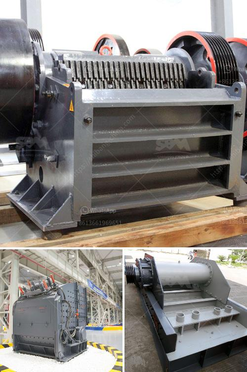

<h3>كسارات فك متنقلة للبيع في المملكة المتحدة</h3>
توفر الكسارات الفك المتنقلة للبيع في المملكة المتحدة حلاً فعالاً ومرناً لعمليات التكسير والفرز في قطاع التعدين والبناء. تتميز هذه الكسارات بقدرتها على نقل الأحجار والمواد الخام إلى موقع العمل دون الحاجة إلى إعداد أو إزالة أنظمة النقل الثابتة. يتم تصميم هذه الكسارات بحيث يمكن تركيبها على عجلات أو على هيكل متحرك، مما يسمح بنقلها بسهولة بين المواقع وترتيبها بشكل سريع.

إحدى المزايا الرئيسية للاستفادة من الكسارات الفك المتنقلة هي قدرتها على العمل في بيئات صعبة وغير مرغوب فيها، حيث يمكن تعديلها واستخدامها بسهولة في الظروف الجغرافية المتغيرة. بالإضافة إلى ذلك، يتم تجهيز هذه الكسارات بمحركات قوية تمكنها من تكسير الصخور الصلبة والمواد الخام بكفاءة عالية.

تتميز الكسارات الفك المتنقلة بمجموعة واسعة من الاختيارات والإعدادات بحسب احتياجات المستخدم. يتم توفيرها بمجموعة من الأحجام المختلفة والقدرات المختلفة تبعاً لمتطلبات التكسير المحددة. يمكن أيضاً تجهيز الكسارات بخيارات متعددة لنظام التغذية والفرز، مما يسهل عملية التكيف مع مختلف التطبيقات.

تتميز الكسارات الفك المتنقلة أيضاً بكونها مجهزة بتقنيات حديثة للتحكم في العملية، مما يسمح للمشغلين بضبط الإعدادات والمعايير بدقة. يمكن استخدام هذه التقنيات لتحقيق توفير الطاقة وتقليل التلوث البيئي من خلال تحسين كفاءة عمليات التكسير.

بالإضافة إلى ذلك، توفر الكسارات الفك المتنقلة البيع المتنقل في المملكة المتحدة فرصة للشركات والمقاولين للعمل بكفاءة في بيئة مستدامة. يتم تحقيق ذلك من خلال تقليل حجم النقل وتلوث الهواء والضوضاء الناجمة عن استخدام الكسارات الثابتة التقليدية.

استخدام الكسارات الفك المتنقلة في المملكة المتحدة يعزز الإنتاجية ويحسن كفاءة العمليات. كما يساهم أيضًا في تحسين سلامة العمل، حيث يمكن التحكم في عملية التكسير من موقع آمن. كما يعني الحجم المدمج لهذه الكسارات أنها يمكن أن تعمل في مناطق صغيرة أو ضيقة الفضاء، مما يجعلها مناسبة للعمل في مشاريع البناء الحضري.

باختصار، الكسارات الفك المتنقلة للبيع في المملكة المتحدة هي حلاً عالي الجودة وفعال من حيث التكلفة لعمليات التكسير والفرز. تتيح هذه الكسارات المتنقلة نقل المواد الخام بسهولة وتعديلها للعمل في مختلف البيئات والتطبيقات. تعتبر هذه الخيارات المتنقلة مثالية للشركات والمقاولين الذين يحتاجون إلى أداء عملية التكسير بشكل فعال ومرن في المملكة المتحدة.
<h3>Contact us</h3><ul><li><strong>Whatsapp:&nbsp;<a href="https://wa.me/8613661969651">+8613661969651</a></strong></li><li><a href="https://swt.shibang-china.com/?git&amp;zhl&amp;كسارات فك متنقلة للبيع في المملكة المتحدة"><strong>Online Service(chat now)</strong></a></li></ul><h3>Related</h3><ul><li><a href='كسارة الحجر بوزولانا 100 طن في الساعة.md'>كسارة الحجر بوزولانا 100 طن في الساعة</a></li><li><a href='سعر مصنع الرمل والحصى في الهند.md'>سعر مصنع الرمل والحصى في الهند</a></li><li><a href='تكنولوجيا عملية البنتونيت للبيع.md'>تكنولوجيا عملية البنتونيت للبيع</a></li><li><a href='آلة طحن المطرقة بمعدل طن في الساعة.md'>آلة طحن المطرقة بمعدل طن في الساعة</a></li><li><a href='مطحنة أسطوانية عمودية.md'>مطحنة أسطوانية عمودية</a></li></ul>