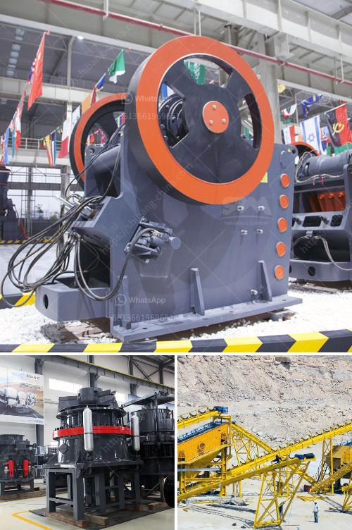

<h3>كسارات في المملكة العربية السعودية</h3>
تعتبر صناعة الكسارات من الصناعات الهامة في المملكة العربية السعودية، حيث تلعب دوراً رئيسياً في تطوير البنية التحتية والبناء في البلاد. تُستخدم الكسارات لسحق المواد الصلبة مثل الحجارة والحصى والركام لإنتاج مواد البناء المختلفة.

تُعتبر المملكة العربية السعودية من الدول التي تمتلك موارداً طبيعية غنية في مجال التعدين والحجر، وتتميز بتواجد كميات كبيرة من الحجارة المتنوعة في مختلف مناطقها. تعتبر هذه الموارد قاعدة قوية لتطوير صناعة الكسارات في المملكة.

تشتمل عمليات الكسارات على مراحل متعددة، حيث تبدأ بعملية التعدين لاستخراج المواد الصلبة من المحاجر. بعدها يتم نقل المواد إلى محطات الكسارة وسحقها باستخدام آلات خاصة. تتميز الكسارات المستخدمة في المملكة بالتقنيات المتقدمة والعمليات الآلية التي تساهم في زيادة الكفاءة وتحقيق الجودة المطلوبة.

تختلف مناطق المملكة في تواجد الكسارات، وتُعتبر مناطق مثل الرياض وجدة والخبر من أبرز المناطق التي تشهد نشاطاً كبيراً في صناعة الكسارات. يتم استخدام المواد المنتجة من الكسارات لإنتاج مواد البناء المختلفة، مثل الخرسانة والأسفلت والحجر المكسر، والتي تعمل على توفير الأساس لأعمال البناء والتشييد في المملكة.

وتتكون فائدة استخدام الكسارات في المملكة من عدة جوانب. فعلى المستوى الاقتصادي، فإن صناعة الكسارات تعزز الاستدامة الاقتصادية وتساهم في تعزيز قطاع البناء والتشييد. كما تؤدي إلى خفض تكلفة الإنشاءات وتوفير الموارد البشرية. أما على المستوى البيئي، فإن استخدام الكسارات يقلل من استغلال المحاجر وتدمير الحياة البرية. بالإضافة إلى ذلك، فإن الكسارات الحديثة تعتمد على تقنيات متطورة للتحكم في الانبعاثات وضبط الغبار، مما يحمي البيئة وصحة العاملين.

في الختام، تلعب صناعة الكسارات دوراً هاماً في تطوير البنية التحتية وتحقيق التنمية المستدامة في المملكة العربية السعودية. يتم تطبيق أحدث التقنيات في مجال صناعة الكسارات، مما يؤدي إلى زيادة الإنتاجية وتحسين جودة المنتجات. كما تعمل الكسارات على تحقيق الاستدامة البيئية وتوفير المواد اللازمة لدعم قطاع البناء والتشييد في المملكة.
<h3>Contact us</h3><ul><li><strong>Whatsapp:&nbsp;<a href="https://wa.me/8613661969651">+8613661969651</a></strong></li><li><a href="https://swt.shibang-china.com/?git&amp;zhl&amp;كسارات في المملكة العربية السعودية"><strong>Online Service(chat now)</strong></a></li></ul><h3>Related</h3><ul><li><a href='سعر معدات الطحن 250 طن.md'>سعر معدات الطحن 250 طن</a></li><li><a href='مطحنة الكرة للبيع في جنوب أفريقيا.md'>مطحنة الكرة للبيع في جنوب أفريقيا</a></li><li><a href='مطاحن الرمل للتصنيع.md'>مطاحن الرمل للتصنيع</a></li><li><a href='كسارات مخروط هيدروليكية.md'>كسارات مخروط هيدروليكية</a></li><li><a href='مصنع كسارة الحصى الجرانيت.md'>مصنع كسارة الحصى الجرانيت</a></li></ul>