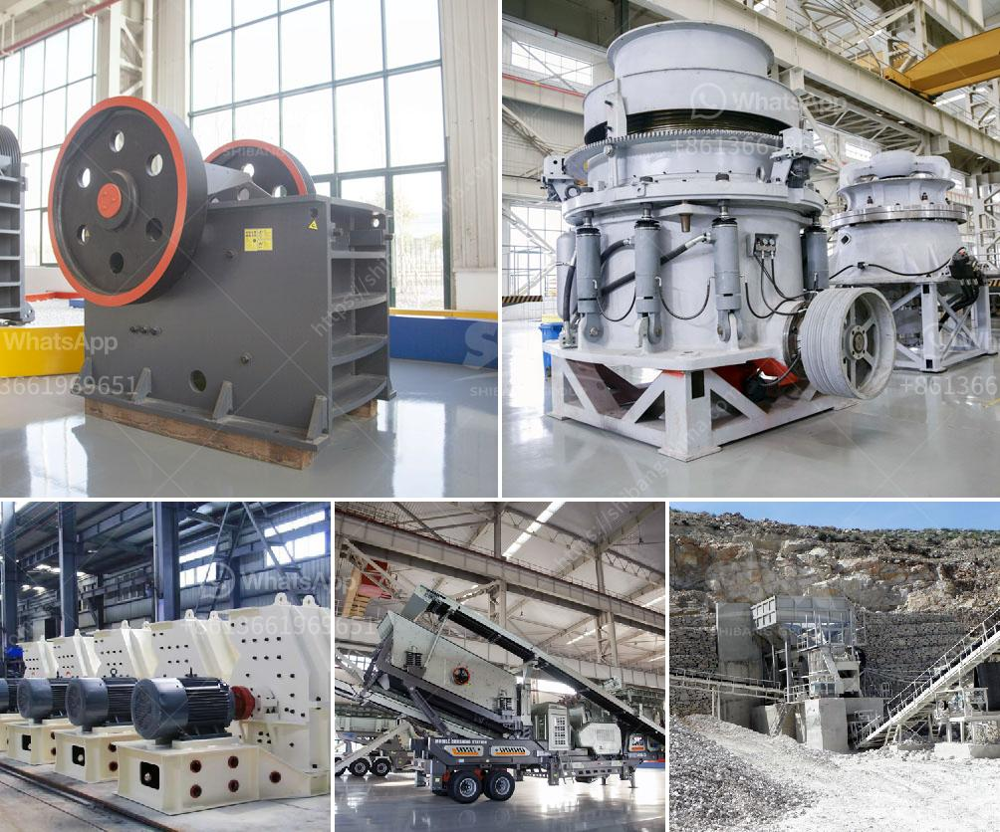

<h3>كسارات كوبي في سنغافورة، الموردين</h3>
تعد كسارات كوبي في سنغافورة من بين أبرز الموردين للرمال والزلط في المنطقة. تأسست كسارات كوبي في عام 1979 واكتسبت سمعة ممتازة في توفير منتجات ذات جودة عالية وخدمات متميزة لعملائها.

تتمتع كسارات كوبي بموقع استراتيجي في سنغافورة، مما يسهل عملية توصيل منتجاتها لعملائها في المدينة والمناطق المجاورة. تعمل الشركة على تقديم مجموعة واسعة من المنتجات بما في ذلك الرمال الطبيعية والرمال المصنعة والزلط.

تعتبر الرمال والزلط من المواد الأساسية في البناء والإنشاءات. تُستخدم الرمال على نطاق واسع في صناعة الخرسانة وتشييد المباني وصيانة الطرق، بينما يستخدم الزلط في تعزيز الأساسات والتربة المحمولة. وتعتبر منتجات كسارات كوبي الاختيار الأمثل للعملاء الذين يبحثون عن الموثوقية والجودة والاحترافية.

تضع كسارات كوبي معايير صارمة لضمان أن المنتجات التي تقدمها تلبي احتياجات العملاء بشكل كامل. تستخدم الشركة أحدث التقنيات في عمليات التصنيع والتحكم في الجودة للتأكد من أن المنتجات تتوافق مع المواصفات العالمية. تقوم كسارات كوبي أيضًا بتحليل العينات واختبار السلامة المعملية لضمان جودة منتجها وسلامته.

بالإضافة إلى ذلك، تعتمد كسارات كوبي على فريق عمل مؤهل ومدرب بشكل جيد لتقديم خدمة عملاء ممتازة. يوفر الفريق المهني المساعدة والاستشارات للعملاء لتحديد احتياجاتهم وتلبية متطلباتهم بأفضل الطرق الممكنة. كما تلتزم الشركة بتقديم خدمة التوصيل في الوقت المحدد لتلبية جميع احتياجات العملاء.

باختصار، كسارات كوبي في سنغافورة هي موردين رائدين للرمال والزلط في المنطقة. تعتمد الشركة على المهنية والجودة والالتزام لتلبية احتياجات العملاء وتقديم منتجات عالية الجودة وخدمات استثنائية. إذا كنت بحاجة إلى مورد موثوق وموثوق للرمال والزلط، فإن كسارات كوبي هي الخيار الأفضل.
<h3>Contact us</h3><ul><li><strong>Whatsapp:&nbsp;<a href="https://wa.me/8613661969651">+8613661969651</a></strong></li><li><a href="https://swt.shibang-china.com/?git&amp;zhl&amp;كسارات كوبي في سنغافورة، الموردين"><strong>Online Service(chat now)</strong></a></li></ul><h3>Related</h3><ul><li><a href='سعر كسارة الحجر المحمول في باكستان.md'>سعر كسارة الحجر المحمول في باكستان</a></li><li><a href='آلة كسارة حجر تاتا في نيروبي.md'>آلة كسارة حجر تاتا في نيروبي</a></li><li><a href='تكلفة مصنع تكسير الحجر.md'>تكلفة مصنع تكسير الحجر</a></li><li><a href='آلة كسارة الحجر في جنوب أفريقيا.md'>آلة كسارة الحجر في جنوب أفريقيا</a></li><li><a href='سعر طاحونة المطرقة.md'>سعر طاحونة المطرقة</a></li></ul>