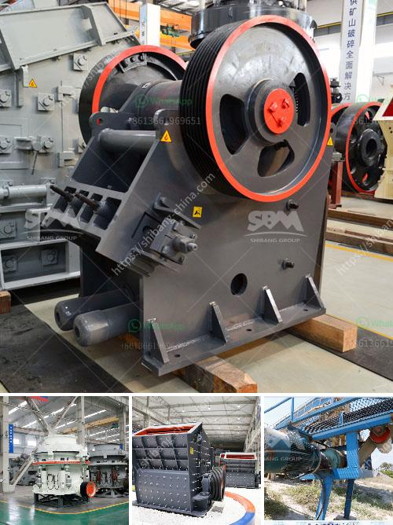

<h3>كسارات لآلة إعادة التدوير في الإمارات</h3>
تعتبر كسارات لآلة إعادة التدوير في الإمارات من التقنيات الحديثة التي تلعب دورًا مهمًا في الحد من تلوث البيئة والمساهمة في الاستدامة البيئية. تعتبر تلك الكسارات وسيلة فعالة لإعادة تدوير المخلفات البنائية والأنقاض واستخدامها في بناء المباني والطرق والأعمال العامة الأخرى.

تعد الإمارات من الدول النشطة في مجال إعادة التدوير والحفاظ على البيئة. وقد تم اعتماد عدد من الكسارات في العديد من المواقع في البلاد. تعمل تلك الكسارات على تكسير المخلفات البنائية إلى جزيئات صغيرة يمكن استخدامها في البناء والأعمال العامة. وبالتالي، تمنح تلك الكسارات المقاولين والشركات في الدولة فرصة لتوفير تكاليف الإنشاءات وتقليل الاعتماد على المواد الخام الجديدة.

من المزايا الرئيسية لاستخدام كسارات لآلة إعادة التدوير في الإمارات هو الحد من استغلال الموارد الطبيعية. فبدلاً من استخدام المواد الخام الجديدة واستنفادها، يمكن استغلال المخلفات البنائية في إنتاج مواد بناء ذات جودة عالية. يقدم ذلك فرص مهمة لتخفيض تكاليف البناء والحد من النفايات التي تنتج عن الإنشاءات الجديدة.

تعمل الكسارات أيضًا على تقليل الاعتماد على الموارد الطبيعية وتقليل نسبة استهلاك الطاقة. في حين أن تكوين المواد الخام الجديدة يتطلب الكثير من الطاقة والموارد، فإن استخدام المخلفات البنائية يعتبر بديلاً مستدامًا واقتصاديًا. وبالتالي، تلعب الكسارات دورًا في الحفاظ على توازن البيئة والحد من الانبعاثات الضارة المرتبطة بصناعة البناء.

علاوة على ذلك، تساهم الكسارات في خلق فرص عمل جديدة وتعزيز النمو الاقتصادي في الإمارات. يشتهر البلد بالعديد من المشاريع الكبيرة والتطور العمراني الهائل، وتحتاج تلك المشاريع إلى الكثير من المواد البنائية. وبالتالي، يمكن لإنشاء الكسارات في البلاد أن يسهم في تلبية الطلب وتوفير فرص عمل للمواطنين في هذا القطاع الحيوي.

في الختام، فإن كسارات لآلة إعادة التدوير تلعب دورًا مهمًا في الحد من تلوث البيئة وتحقيق الاستدامة البيئية في الإمارات. تعمل تلك الكسارات على تحويل المخلفات البنائية إلى مواد بناء قابلة للاستخدام، مما يسهم في توفير تكاليف البناء وتقليل استغلال الموارد الطبيعية. علاوة على ذلك، تسهم الكسارات في خلق فرص عمل جديدة وتعزيز النمو الاقتصادي في البلاد.
<h3>Contact us</h3><ul><li><strong>Whatsapp:&nbsp;<a href="https://wa.me/8613661969651">+8613661969651</a></strong></li><li><a href="https://swt.shibang-china.com/?git&amp;zhl&amp;كسارات لآلة إعادة التدوير في الإمارات"><strong>Online Service(chat now)</strong></a></li></ul><h3>Related</h3><ul><li><a href='جول محطم الحجر.md'>جول محطم الحجر</a></li><li><a href='سحق متنقل في دبي.md'>سحق متنقل في دبي</a></li><li><a href='مصنع غسيل الفحم المتنقل في جنوب أفريقيا.md'>مصنع غسيل الفحم المتنقل في جنوب أفريقيا</a></li><li><a href='عملية تصنيع هيدروتون الحصى الطيني.md'>عملية تصنيع هيدروتون الحصى الطيني</a></li><li><a href='آلة طحن دقيقة في الصين.md'>آلة طحن دقيقة في الصين</a></li></ul>