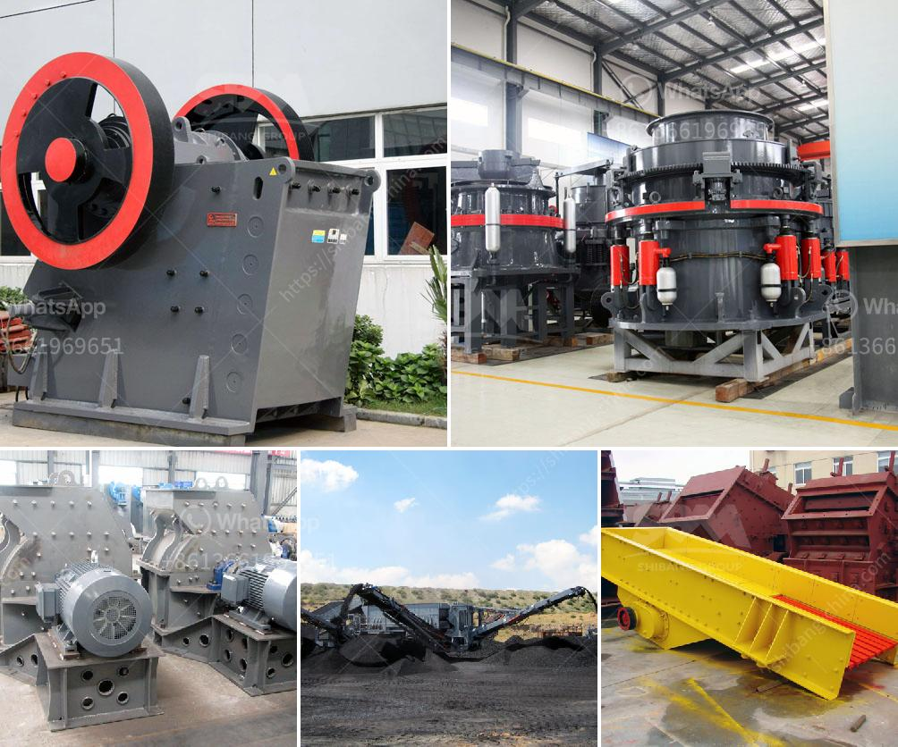

<h3>كسارات للإيجار في سينسيناتي</h3>
تعتبر صناعة الإنشاء والبناء من القطاعات الحيوية والمهمة في أي مدينة، حيث تتواجد داخلها العديد من الشركات الصناعية والتجارية التي تحتاج إلى استخدام الكسارات في أعمالها اليومية. إذا كنت تعمل في مجال البناء أو لديك مشروع قائم وتحتاج إلى كسارات للإيجار في سينسيناتي، فأنت على الطريق الصحيح لتحقيق ما تسعى إليه.

يوفر سوق الإيجار للكسارات في سينسيناتي العديد من الخيارات للمهنيين والشركات، حيث يمكنهم استئجار الكسارات التي تناسب احتياجاتهم بسهولة ويسر. تتواجد في سينسيناتي العديد من شركات التأجير التي توفر مجموعة متنوعة من الكسارات بأحجام وموديلات مختلفة. تشمل هذه الكسارات كسارات الفك وكسارات الصدم وكسارات المخروط، وتأتي بقدرات مختلفة لتتناسب مع مجموعة متنوعة من المشاريع البنائية.

تعد الكسارات المتاحة للإيجار في سينسيناتي خيارًا مثاليًا للعديد من الأسباب. أولًا، فإن استئجار الكسارات يعتبر كبديل ميسور التكلفة بالمقارنة مع شراء كسارة جديدة. هذا يعني أنك لن تضطر إلى استخدام رأس المال الكبير لشراء الكسارة من البداية. بالإضافة إلى ذلك، فإن استئجار الكسارات يتيح لك الحصول على أحدث التقنيات والموديلات التي تلبي احتياجات مشروعك الحالي.

ثانيًا، يقدم استئجار الكسارات مرونة أكبر للشركات والمهنيين. فعندما تستأجر كسارة، يمكنك تحديد المدة الزمنية التي ترغب في استخدامها، سواء كان ذلك لأسبوع واحد أو عدة أشهر. هذا يتيح لك التحكم في تكاليف المشروع وتقديرها بشكل أفضل، حيث يمكنك دفع الأجرة فقط خلال فترة استخدامك للكسارة بدلاً من دفع مبلغ ضخم عند الشراء.

ثالثًا، فإن استئجار الكسارات يخفف من العبء اللوجستي للشركات والمهنيين. حيث تتولى شركات التأجير تسليم الكسارات إلى موقع العمل واستلامها وصيانتها في حالة حدوث أية أعطال. هذا يوفر على المستأجرين الجهد والوقت اللازم لنقل وصيانة الكسارات، ويسمح لهم بالتركيز على تحقيق أهداف المشروع بدلاً من التدريس في التفاصيل اللوجستية.

قد تكون تكلفة استئجار الكسارات في سينسيناتي تتراوح بين 200 و 400 دولار في اليوم على حسب الحجم والمواصفات المطلوبة. وقد تنتهي بأن يكون سعر الإيجار أعلى أو أقل حسب الشركة المؤجرة والعوامل الأخرى المتعلقة بالاتفاق.

بشكل عام، إذا كنت بحاجة إلى كسارات لمشروعك في سينسيناتي، فإن استئجارها هو الخيار الأمثل الذي يتيح لك تحقيق الكفاءة في العمل وتحقيق النتائج المرجوة بأقل تكلفة وأقل جهد من خلال التعامل مع شركات التأجير المحلية والاستفادة من خدماتها المتوفرة وفقًا لاحتياجاتك الفردية.
<h3>Contact us</h3><ul><li><strong>Whatsapp:&nbsp;<a href="https://wa.me/8613661969651">+8613661969651</a></strong></li><li><a href="https://swt.shibang-china.com/?git&amp;zhl&amp;كسارات للإيجار في سينسيناتي"><strong>Online Service(chat now)</strong></a></li></ul><h3>Related</h3><ul><li><a href='السحق النبات هو.md'>السحق النبات هو</a></li><li><a href='عملية تعدين الكوارتز في ولاية أندرا براديش.md'>عملية تعدين الكوارتز في ولاية أندرا براديش</a></li><li><a href='كسارات الحجر المحمولة للبيع في جنوب أفريقيا.md'>كسارات الحجر المحمولة للبيع في جنوب أفريقيا</a></li><li><a href='مصنع DMS للماس المستعمل للبيع في كيمبرلي.md'>مصنع DMS للماس المستعمل للبيع في كيمبرلي</a></li><li><a href='مطاحن الكرة للبيع في زيمبابوي.md'>مطاحن الكرة للبيع في زيمبابوي</a></li></ul>