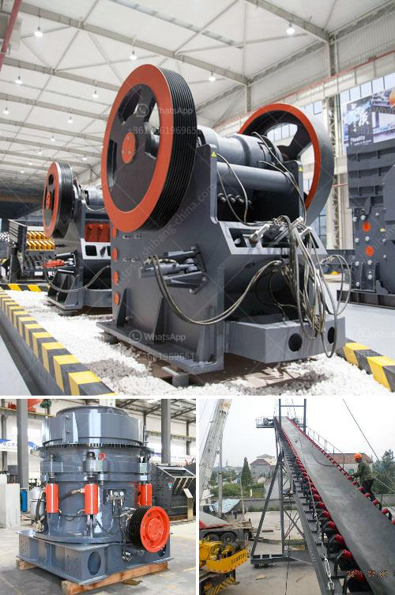

<h3>كسارات للركام الجرانيت</h3>
تعتبر الكسارات للركام الجرانيت أحد أهم الصناعات في مجال البناء والإنشاءات. يتم استخدام الركام الجرانيت في مجموعة واسعة من التطبيقات مثل بناء الطرق والجسور والمباني. وتمثل الكسارات المصدر الرئيسي لمثل هذا الركام.

تعمل الكسارات للركام الجرانيت عن طريق تكسير الصخور الجرانيتية الكبيرة إلى قطع أصغر من الحجم يمكن استخدامها في البناء. ويتم ذلك عادة بواسطة الكسارات الفكية والصدمية والمخروطية. تتميز الكسارات الفكية بالقدرة على تكسير الصخور الصلبة والأحجام الكبيرة، بينما تعمل الكسارات الصدمية على تكسير الصخور عن طريق ضربها بقوة عالية. وتعد الكسارات المخروطية مناسبة لتكسير الصخور الثانوية والعالية الصلابة.

يتم استخراج الجرانيت من المحاجر ونقله إلى الكسارات حيث يتم تكسيره وتحويله إلى ركام. يتم تصنيف الركام وفقًا للأحجام المطلوبة، حيث يمكن الحصول على ركام بحجم مناسب بناءً على متطلبات المشروع.

يتم استخدام الركام الجرانيت في العديد من التطبيقات، وأحد الاستخدامات الشائعة هو في بناء الطرق. يعمل الركام على مصادرة الفراغات بين الصخور الأصغر، وبالتالي تحسين قوة التربة وزيادة التحمل. كما يضاف الركام إلى الخرسانة لتعزيز خصائصها الميكانيكية وزيادة قوتها واستقرارها.

تستخدم الكسارات للركام الجرانيت أيضًا في بناء المباني والجسور والأعمال الهندسية الأخرى. يتم استخدام الركام كطبقة أساسية في هذه المشاريع لتوحيد التربة وتوفير قاعدة قوية للهياكل والأساسات. بالإضافة إلى ذلك، يعمل الركام كعازل حراري وصوتي ويعزز عزل البناء وضمان راحة السكان.

بصفة عامة، تلعب الكسارات للركام الجرانيت دورًا حيويًا في صناعة البناء والإنشاءات. تمثل مصدرًا موثوقًا للركام وتؤمن الأساس القوي والمستدام للمشاريع الكبيرة والصغيرة على حد سواء. بالاعتماد على هذه الكسارات، يمكن بناء مباني ومنشآت عالية الجودة ومتينة، مع الحفاظ على الموراد الطبيعية والبيئة.
<h3>Contact us</h3><ul><li><strong>Whatsapp:&nbsp;<a href="https://wa.me/8613661969651">+8613661969651</a></strong></li><li><a href="https://swt.shibang-china.com/?git&amp;zhl&amp;كسارات للركام الجرانيت"><strong>Online Service(chat now)</strong></a></li></ul><h3>Related</h3><ul><li><a href='شركة تصنيع مطحنة الكرة الدقيقة في الهند.md'>شركة تصنيع مطحنة الكرة الدقيقة في الهند</a></li><li><a href='معدات تعدين الكروم للبيع في جنوب أفريقيا.md'>معدات تعدين الكروم للبيع في جنوب أفريقيا</a></li><li><a href='كسارة للإيجار في نيو جيرسي.md'>كسارة للإيجار في نيو جيرسي</a></li><li><a href='مطاحن الكرة للمواد.md'>مطاحن الكرة للمواد</a></li><li><a href='صانع كسارة في مدينة سيبو.md'>صانع كسارة في مدينة سيبو</a></li></ul>