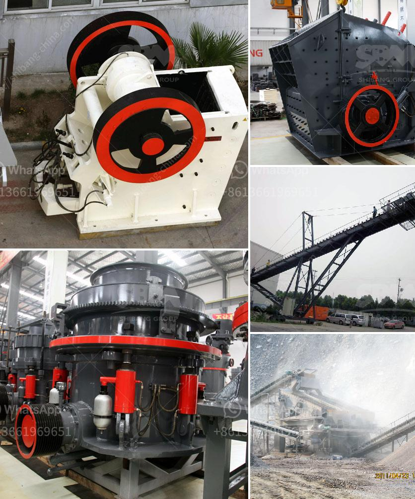

<h3>كسارات متنقلة في الولايات المتحدة المتحدة</h3>
كسارات متنقلة في الولايات المتحدة: الابتكار في صناعة التعدين

تُعد الولايات المتحدة الأمريكية واحدة من الدول الرائدة في صناعة التعدين في العالم. وبفضل التطور التكنولوجي، أصبحت الكسارات المتنقلة تحظى بشعبية متزايدة في هذا القطاع. تعتبر الكسارات المتنقلة آلات ثقيلة محمولة تستخدم لكسر وتفتيت الصخور والمواد الصلبة في المحاجر والمناجم العاملة في مختلف أنحاء الولايات المتحدة.

تتميز الكسارات المتنقلة بقدرتها على التحرك بسهولة بين مختلف المواقع، مما يوفر مرونة كبيرة لشركات التعدين. وتتميز أيضًا بقدرتها على معالجة مجموعة واسعة من المواد، بدءًا من الحصى والحجارة الصغيرة إلى الصخور الكبيرة والخرسانة المتصلبة. هذا يجعلها أداة مثالية في عمليات التعدين الحديثة التي تهدف إلى تحقيق أقصى استفادة من الموارد الطبيعية.

تُستخدم الكسارات المتنقلة لكسر الصخور بالحجم المطلوب، مما يسهل بعد ذلك نقلها بواسطة الناقلات أو الشاحنات إلى موقع الاستخدام النهائي. بفضل الابتكار التكنولوجي، تقوم بعض الكسارات المتنقلة بعملية فصل الصخور الذهبية والفضية والنحاسية وغيرها من الخامات المعدنية من الصخور المحطمة باستخدام الجاذبية أو التزويد بالمياه أو الهواء. تمثل هذه التقنيات طفرة في عملية استخراج المعادن وتساهم في زيادة الكفاءة وتقليل النفايات.

توفر الكسارات المتنقلة أيضًا مزايا بيئية. فبدلاً من تفتيت الصخور والخرسانة في المواقع الثابتة، يمكن نقل الكسارة المتنقلة إلى موقع العمل مباشرة، مما يقلل من تكلفة وسائل النقل والانبعاثات الناجمة عنها. بالإضافة إلى ذلك، يمكن استخدام بعض الكسارات المتنقلة بشكل فعال لإعادة تدوير مواد البناء والديموليشن، مثل الخرسانة المكسرة والركام، مما يقلل من النفايات ويحافظ على الموارد الطبيعية.

تمثل الكسارات المتنقلة قدرة تكنولوجية مبتكرة في صناعة التعدين في الولايات المتحدة. تتيح هذه الآلات للشركات الاستفادة الكاملة من مواردها المعدنية وتحسين عمليات التعدين التقليدية. وباعتبارها صديقة للبيئة، تلعب الكسارات المتنقلة دورا حاسما في تعزيز الاستدامة البيئية وحماية الموارد الطبيعية في البلاد.
<h3>Contact us</h3><ul><li><strong>Whatsapp:&nbsp;<a href="https://wa.me/8613661969651">+8613661969651</a></strong></li><li><a href="https://swt.shibang-china.com/?git&amp;zhl&amp;كسارات متنقلة في الولايات المتحدة المتحدة"><strong>Online Service(chat now)</strong></a></li></ul><h3>Related</h3><ul><li><a href='مقترح مشروع أعمال لكسارة الحجر.md'>مقترح مشروع أعمال لكسارة الحجر</a></li><li><a href='شركة موردة لكسارة الحجر.md'>شركة موردة لكسارة الحجر</a></li><li><a href='آلات معالجة الكاولين للبيع.md'>آلات معالجة الكاولين للبيع</a></li><li><a href='كسارات مخروط متنقلة.md'>كسارات مخروط متنقلة</a></li><li><a href='طاحونة كرات في كينيا.md'>طاحونة كرات في كينيا</a></li></ul>