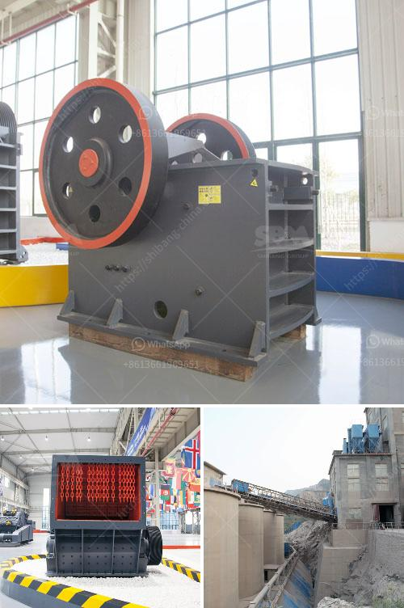

<h3>كسارات متنقلة في قطر</h3>
تعد الكسارات المتنقلة من المعدات الهامة في صناعة البناء والتشييد في قطر. تستخدم هذه الكسارات لسحق الصخور والحجارة إلى أجزاء صغيرة تستخدم في إنتاج المواد الخرسانية والأسفلت والركام.

تتميز الكسارات المتنقلة بأنها متحركة، مما يسهل نقلها بسهولة من موقع إلى آخر حسب الحاجة. هذا يوفر المرونة والكفاءة العالية في إدارة عمليات التكسير. بدلاً من نقل المواد إلى موقع ثابت للكسارة، يمكن نقل الكسارة المتنقلة إلى الموقع الذي تحتاج إليه لتحقيق عملية تكسير فعالة وفعالة من حيث التكلفة.

تعتبر قطر من الدول التي تشهد نشاطًا كبيرًا في صناعة البناء والتشييد، مع توسع المدن والمشاريع الضخمة المستمرة. تعتبر الكسارات المتنقلة من العوامل المساعدة في تلبية احتياجات هذه الصناعة المنتجة بسرعة وكفاءة.

توفر الكسارات المتنقلة مجموعة متنوعة من المزايا لقطاع البناء في قطر. فهي توفر إمكانية التكسير في موقع العمل بدلاً من نقل المواد الخام إلى موقع الكسارة. بصفة عامة، يتم نقل المواد الخام من موقع التعدين إلى موقع البناء بأقل تكلفة وجهد.

قد يكون الاعتماد على الكسارات المتنقلة في صناعة البناء في قطر خطوة استراتيجية مهمة للمقاولين. فهي تعزز الإنتاجية وتحسن كفاءة التكسير وتقلل من النفايات وتوفر الوقت والجهد.

بالإضافة إلى ذلك، تساهم الكسارات المتنقلة أيضًا في الحفاظ على البيئة. تسمح تقنيات التكسير المتقدمة التي تستخدمها هذه الكسارات بتقليل الانبعاثات الضارة والضوضاء بشكل كبير. تستخدم الكسارات المتنقلة أيضًا أنظمة رش المياه للتحكم في الغبار الناتج من عملية التكسير، مما يحسن جودة الهواء المحيط.

إن الاستخدام المتزايد للكسارات المتنقلة في قطر يعكس التطور المستمر في صناعة البناء والتشييد. يتم اعتبار استثمار في الكسارات المتنقلة على أنه استثمار ذكي، إذ يساهم في زيادة الإنتاجية والكفاءة وتقليل التكاليف، مع الحفاظ على البيئة.

بشكل عام، فإن الكسارات المتنقلة في قطر لعبت دورًا حاسمًا في تلبية احتياجات صناعة البناء المتزايدة. فهي توفر الكفاءة والمرونة التي تحتاجها هذه الصناعة وتساهم في تعزيز الاستدامة البيئية.
<h3>Contact us</h3><ul><li><strong>Whatsapp:&nbsp;<a href="https://wa.me/8613661969651">+8613661969651</a></strong></li><li><a href="https://swt.shibang-china.com/?git&amp;zhl&amp;كسارات متنقلة في قطر"><strong>Online Service(chat now)</strong></a></li></ul><h3>Related</h3><ul><li><a href='ملصق السلامة لمحطة توليد الفحم.md'>ملصق السلامة لمحطة توليد الفحم</a></li><li><a href='طبقة ألمنيوم عالية لمطحنة الكرة.md'>طبقة ألمنيوم عالية لمطحنة الكرة</a></li><li><a href='آلات الأسطوانة للطحن.md'>آلات الأسطوانة للطحن</a></li><li><a href='كسارات حجر بسيطة من زيفيث في كينيا.md'>كسارات حجر بسيطة من زيفيث في كينيا</a></li><li><a href='كسارة حجرية بمحرك ديزل قائمة أسعار في الهند.md'>كسارة حجرية بمحرك ديزل قائمة أسعار في الهند</a></li></ul>