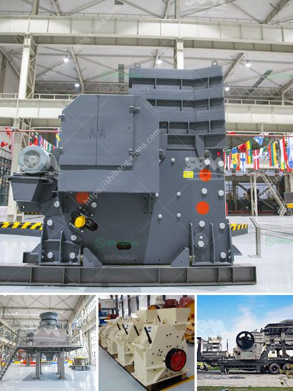

<h3>كسارات متنقلة مجنزرة</h3>
تعد الكسارات المتنقلة المجنزرة من أهم الأدوات في صناعة التعدين والبناء والإنشاءات. تم تصميم هذه الكسارات خصيصًا ليتم نقلها واستخدامها بسهولة في المواقع المختلفة دون الحاجة إلى إعدادات معقدة أو وقت طويل للتثبيت والتوصيل. تعمل الكسارات المتنقلة المجنزرة على تفتيت الصخور والمواد الصلبة الأخرى إلى حجم أصغر، مما يتيح استخدامها في إعادة تدوير الخرسانة والحصى والصخور المنتجة من أعمال الحفر والتنقيب. 

تتميز الكسارات المتنقلة المجنزرة بقدرتها على التحرك بسهولة على الأراضي الوعرة والمناطق الضيقة، مما يتيح الوصول إلى المواقع التي قد يكون من الصعب الوصول إليها بواسطة الكسارات الثابتة. فهي مجهزة بجنزير معدني قوي يتيح لها العبور عبر الطين والرمال والتضاريس الصعبة، كما تحتوي على محرك قوي يمكنها من الحركة بسلاسة حتى في المحيطات الجبلية.

تتوفر الكسارات المتنقلة المجنزرة بمجموعة متنوعة من الأحجام والقدرات، مما يتيح اختيار الجهاز المناسب للاحتياجات الخاصة بالمشروع. بعض الكسارات المتنقلة المجنزرة تأتي مزودة بشاشة تهتز، وناقلة للمواد وصوامع لتخزين الحجارة المكسورة، مما يزيد من كفاءة العمل وسرعة الإنتاج. كما أن الكسارات المتنقلة المجنزرة تأتي بتصميمات مقاومة للصدمات والاهتزازات، مما يضمن استقرارها أثناء العمل ويقلل من خطر حدوث أي أعطال.

بفضل مرونتها وسهولة نقلها وتركيبها، أصبح استخدام الكسارات المتنقلة المجنزرة شائعًا جدًا في العديد من الصناعات. فهي تستخدم في مشاريع البناء والطرق والتعدين والتجميع وإعادة التدوير. كما أنها تستخدم في تجهيز المواد الأولية مثل الخرسانة الجاهزة والحصى والرمل والحجر المكسور.

وفي الختام، تعد الكسارات المتنقلة المجنزرة أداة أساسية لصناعة البناء والتعدين. فهي توفر القدرة على تحويل وتكسير المواد الصلبة بسهولة وفعالية على المواقع المختلفة، مما يجعلها اختيارًا مثاليًا للمشاريع التي تتطلب النقل المتكرر والعمل في الظروف القاسية.
<h3>Contact us</h3><ul><li><strong>Whatsapp:&nbsp;<a href="https://wa.me/8613661969651">+8613661969651</a></strong></li><li><a href="https://swt.shibang-china.com/?git&amp;zhl&amp;كسارات متنقلة مجنزرة"><strong>Online Service(chat now)</strong></a></li></ul><h3>Related</h3><ul><li><a href='قائمة معدات مصنع الأسمنت.md'>قائمة معدات مصنع الأسمنت</a></li><li><a href='أسعار آلات المحجر.md'>أسعار آلات المحجر</a></li><li><a href='آلة مسحوق الدولوميت.md'>آلة مسحوق الدولوميت</a></li><li><a href='مصانع مطاحن الأسمنت.md'>مصانع مطاحن الأسمنت</a></li><li><a href='معدات تعدين الذهب.md'>معدات تعدين الذهب</a></li></ul>