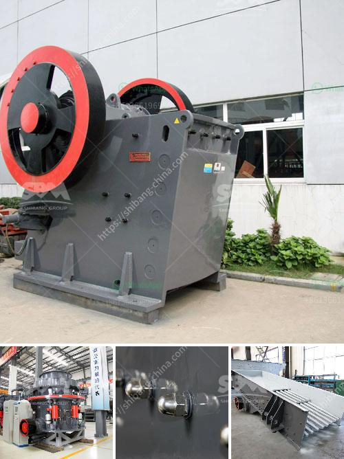

<h3>كسارات متنقلة وشاشات مستعملة في جنوب أفريقيا</h3>
تعتبر صناعة البناء هي أحد القطاعات الحيوية في دولة جنوب أفريقيا، ومن العوامل المهمة لتحقيق النجاح في هذا القطاع هو توفير المعدات اللازمة للإنتاج. إحدى المعدات التي استحوذت على اهتمام كبير في السنوات الأخيرة هي الكسارات المتنقلة وشاشاتها المستعملة.

تتميز الكسارات المتنقلة بكونها محمولة وقادرة على العمل في موقع البناء بشكل مستقل، مما يتيح استخدامها بسهولة في أي مكان، حتى في المناطق النائية أو التي لا تتوفر فيها البنية التحتية اللازمة لاستخدام الكسارات الثابتة. كما أن هذه الكسارات تتميز بإمكانية نقلها بسهولة بين مواقع العمل، وتتيح فعالية عالية في عملية التكسير والفرز، مما يسهم في زيادة إنتاجية العمل وتحسين كفاءة العملية.

إضافة إلى ذلك، يعتبر استخدام الشاشات المستعملة في صناعة البناء في جنوب أفريقيا هو خيار اقتصادي وفعال وملائم للعمل. حيث يمكن شراء الشاشات المستعملة بأسعار أقل من الجديدة، مع الحفاظ على جودة الأداء والكفاءة. تتيح هذه الشاشات تصنيف المواد وفرزها وفقًا للحجم والشكل المطلوب، بالإضافة إلى إمكانية التحكم في مستوى الاهتزاز وسرعة الشاشة لضمان الحصول على نتائج مثالية.

بفضل التطور التكنولوجي السريع، تتوفر الكسارات المتنقلة والشاشات المستعملة بتقنيات ومواصفات متقدمة، مما يضمن تلبية الاحتياجات المتنوعة لصناعة البناء. فهذه المعدات قادرة على التعامل مع مجموعة متنوعة من المواد الخام، بدءًا من الأحجار الصلبة إلى الركام المتنوع، ويمكنها تنفيذ عمليات التكسير والفرز بمختلف الأحجام والمواصفات.

يعتبر استخدام الكسارات المتنقلة والشاشات المستعملة في جنوب أفريقيا خيارًا مستدامًا وفعالًا، حيث يتم تجديد واستخدام هذه المعدات بدلاً من شراء جديدة، ما يساهم في تقليل تكاليف الإنتاج والحد من التلوث الناجم عن تصنيع المعدات الجديدة.

باختصار، فإن استخدام الكسارات المتنقلة والشاشات المستعملة في جنوب أفريقيا يعتبر خيارًا اقتصاديًا وفعالًا ومستدامًا لصناعة البناء. توفر هذه المعدات القدرة على العمل في أي مكان وتحقيق أعلى مستويات الإنتاجية، كما تساهم في تقليل التكاليف والحد من التلوث البيئي. يمكن القول بأنها تمثل موارد قيمة للشركات في قطاع البناء في جنوب أفريقيا.
<h3>Contact us</h3><ul><li><strong>Whatsapp:&nbsp;<a href="https://wa.me/8613661969651">+8613661969651</a></strong></li><li><a href="https://swt.shibang-china.com/?git&amp;zhl&amp;كسارات متنقلة وشاشات مستعملة في جنوب أفريقيا"><strong>Online Service(chat now)</strong></a></li></ul><h3>Related</h3><ul><li><a href='صنع الحجر الجيري.md'>صنع الحجر الجيري</a></li><li><a href='كسارة متنقلة القطرة.md'>كسارة متنقلة القطرة</a></li><li><a href='سعر الكسارة من الصين.md'>سعر الكسارة من الصين</a></li><li><a href='آلة طحن صناعية في نيجيريا.md'>آلة طحن صناعية في نيجيريا</a></li><li><a href='عملية تصنيع لوح الجبس.md'>عملية تصنيع لوح الجبس</a></li></ul>