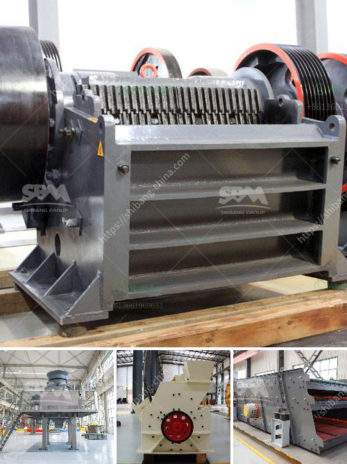

<h3>كسارات محمولة بمعدل ١٠٠ طن في الساعة</h3>
الكسارات المحمولة التي تعمل بسعة 100 طن في الساعة هي معدات مهمة في صناعة التعدين والبناء. تعتبر هذه الكسارات مرنة وسهلة الاستخدام، وتتميز بتصميمها المحمول الذي يسهل نقلها من موقع إلى آخر بسهولة، مما يوفر المزيد من الكفاءة والتنقل في مواقع العمل المختلفة.

إن الكسارات المحمولة بسعة 100 طن في الساعة تستخدم أساسًا لسحق الصخور والأحجار الكبيرة إلى قطع صغيرة بأحجام معينة. تتميز هذه الكسارات بالعديد من الميزات التي تجعلها ضرورية في مجالات البناء والتعدين. على سبيل المثال، تتميز بقدرتها على سحق الصخور الصلبة بسرعة كبيرة، وذلك بفضل الفك المتحرك والثابت الذي يعمل بنظام هيدروليكي.

بالإضافة إلى ذلك، تتميز الكسارات المحمولة بـ 100 طن في الساعة بكفاءتها في معالجة الكميات الكبيرة من المواد بشكل يومي. يمكن لهذه الكسارات سحق مختلف أنواع الصخور مثل الجرانيت والحجر الجيري والصخر البركاني وغيرها. بالإضافة إلى ذلك، تأتي الكسارات المحمولة بمعدل إنتاج 100 طن في الساعة مع خطوط نقل الحزام ومجموعة من الشاشات المثقوبة، مما يتيح للعملاء إعادة تدوير المواد وفصلها بسهولة.

توفر الكسارات المحمولة بمعدل إنتاج 100 طن في الساعة فوائد عديدة للشركات والمقاولين في صناعة البناء والتعدين. فالقدرة على نقل الكسارة من موقع إلى آخر بسهولة يوفر المرونة والتنقل في عمليات البناء والتعدين المختلفة. بدلاً من تثبيت الكسارة بشكل دائم في موقع واحد، يُمكن تجهيز العديد من المواقع بكسارات محمولة واستخدامها في الأماكن التي تحتاج إليها بشكل روتيني.

بالإضافة إلى ذلك، تتميز الكسارات المحمولة بزيادة الإنتاجية وتقليل تكاليف الإنتاج. حيث يمكن استخدام الكسارات لسحق الصخور وتجهيز المواد في الموقع، مما يوفر الوقت والجهد اللازمين لنقل المواد إلى الموقع الآخر. بالإضافة إلى ذلك، يمكن أيضًا إعادة تدوير المواد المعالجة واستخدامها في مشروعات أخرى بدلاً من التخلص منها.

في النهاية، الكسارات المحمولة بسعة 100 طن في الساعة هي معدات أساسية في البناء والتعدين. توفر هذه الكسارات القدرة على سحق الصخور والأحجار الكبيرة بكفاءة عالية، وتتميز بقابلية التنقل والمرونة في الاستخدام. تساعد الكسارات المحمولة على زيادة الإنتاجية وتقليل التكاليف، وتوفر أيضًا فرصة إعادة التدوير واستخدام المواد المعالجة في مشروعات أخرى.
<h3>Contact us</h3><ul><li><strong>Whatsapp:&nbsp;<a href="https://wa.me/8613661969651">+8613661969651</a></strong></li><li><a href="https://swt.shibang-china.com/?git&amp;zhl&amp;كسارات محمولة بمعدل ١٠٠ طن في الساعة"><strong>Online Service(chat now)</strong></a></li></ul><h3>Related</h3><ul><li><a href='إنتاج خام الحديد حسب الولاية في الهند.md'>إنتاج خام الحديد حسب الولاية في الهند</a></li><li><a href='كسارات الحجر المستخدمة في ألمانيا.md'>كسارات الحجر المستخدمة في ألمانيا</a></li><li><a href='كسارة الحجر الجيري للبيع.md'>كسارة الحجر الجيري للبيع</a></li><li><a href='معدات تعدين الذهب للبيع في نيجيريا.md'>معدات تعدين الذهب للبيع في نيجيريا</a></li><li><a href='كسارة الفك الصينية PE 150 250 في الفلبين.md'>كسارة الفك الصينية PE 150 250 في الفلبين</a></li></ul>