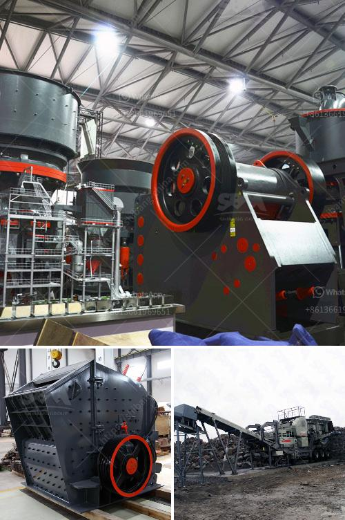

<h3>كسارات محمولة جنوب أفريقيا</h3>
تعد الكسارات المحمولة من الأدوات الهندسية الحديثة التي تستخدم في صناعة التعدين والبناء. وتعتبر جنوب أفريقيا واحدة من الدول التي تتمتع بإمكانية تصنيع وتوريد هذه الآلات العالية الجودة والفعالة.

تعتبر الكسارات المحمولة من الآلات المتنقلة التي يمكن نقلها بسهولة من موقع إلى آخر، مما يزيد من مرونتها في العمل في مناطق مختلفة. فهي تتكون عادةً من وحدات فرعية تحتوي على محركات كهربائية أو ديزل تعمل على تشغيل المطارق الهيدروليكية والفكين، وتأتي مع سيور ناقلة لنقل المواد الخام.

تتميز الكسارات المحمولة بعدة مزايا مهمة. فهي تعزز من كفاءة العمل وتقلل من تكاليف الإيجار والنقل لأنها غالباً ما تتمتع بسعة كبيرة وتحتاج إلى فريق عمل صغير للتحكم بها. كما أن فترة الاستخدام المطولة للكسارة تجعلها استثمارًا مثاليًا للشركات التي تحتاج إلى تقديم الخدمات في العديد من المواقع.

تعد جنوب أفريقيا واحدة من الدول النامية التي تعتمد بشكل كبير على صناعة التعدين والبناء. وتقدم الكسارات المحمولة للشركات في هذا القطاع فرصًا متعددة ومغرية لتحسين إنتاجيتهم ورفع العائدات. يمكن استخدام الكسارات المحمولة في سحق الصخور والركام والمواد الأخرى في مكان العمل الفعلي، مما يقلل من نقل المواد ويوفر الوقت والجهد.

ومن المهم أيضًا أن نذكر أن الكسارات المحمولة هي اختيار جيد للمقاولين الذين يعملون في مناطق بعيدة عن التجمعات السكانية. فعندما يتعين على المقاول إزالة الصخور أو الركام في مناطق نائية، يكون استخدام الكسارات المحمولة هو الحل المناسب.

بالإضافة إلى ذلك، فإن الكسارات المحمولة تَعِدُّ بيئية وصديقة للبيئة نسبةً لعدم وجود انبعاثات ضارة. وبفضل تكنولوجيا الكسارات المحمولة الحديثة، يُمَكِن خفض استهلاك الوقود وتكاليف الصيانة بشكل كبير.

في الختام، فإن الكسارات المحمولة تلعب دورًا حيويًا في صناعة التعدين والبناء في جنوب أفريقيا. وبدورها توفر للشركات فرصًا لتحسين إنتاجيتها وتوفير الوقت والجهد. وعليه، فإن استخدام الكسارات المحمولة يُعَد إضافة رائعة لأي شركة تعمل في هذا المجال.
<h3>Contact us</h3><ul><li><strong>Whatsapp:&nbsp;<a href="https://wa.me/8613661969651">+8613661969651</a></strong></li><li><a href="https://swt.shibang-china.com/?git&amp;zhl&amp;كسارات محمولة جنوب أفريقيا"><strong>Online Service(chat now)</strong></a></li></ul><h3>Related</h3><ul><li><a href='مصنع كسارة الحجر 100 tph.md'>مصنع كسارة الحجر 100 tph</a></li><li><a href='صناعة الحجر الجيري في الفلبين.md'>صناعة الحجر الجيري في الفلبين</a></li><li><a href='سيور ناقلة في جنوب أفريقيا.md'>سيور ناقلة في جنوب أفريقيا</a></li><li><a href='دراسة الجدوى حول حجر الأبعاد في إثيوبيا.md'>دراسة الجدوى حول حجر الأبعاد في إثيوبيا</a></li><li><a href='تكلفة معدات سحق الجرانيت.md'>تكلفة معدات سحق الجرانيت</a></li></ul>