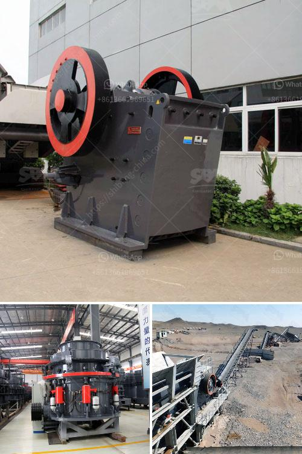

<h3>كسارات محمولة في السعودية</h3>
تعتبر كسارات المحمولة من الآلات والمعدات التي تستخدم في صناعة البناء والتعدين، وهي تتميز بقدرتها على التحرك من موقع لآخر بسهولة. في السعودية، شهدت صناعة البناء والتشييد نمواً كبيراً في السنوات الأخيرة، مما جعل الحاجة إلى استخدام كسارات المحمولة أمراً ضرورياً وفعالاً.

تتميز كسارات المحمولة بالكفاءة والمرونة التي توفرها. فهي تسمح للشركات البنائية بتحويل المواد وسحقها في الموقع، مما يقلل من تكاليف النقل والتخزين. بالإضافة إلى ذلك، تعمل كسارات المحمولة بشكل فعال في تقليل حجم المواد وتحويلها إلى مواد نهائية جاهزة للاستخدام، مما يزيد من إنتاجية العمل ويوفر الوقت والجهد.

تعتبر كسارات المحمولة مثالية للمشروعات الصغيرة والمتوسطة الحجم، حيث تتمتع بقدرة عالية على خدمة عدة مواقع في الوقت نفسه. بفضل تصاميمها المدمجة والقابلة للتكوين، يمكن تعديلها بسرعة وسهولة لتلبية احتياجات الموقع المحدد. كما أنها توفر القدرة على تكسير مجموعة متنوعة من المواد المختلفة بما في ذلك الصخور والحصى والرمال والخرسانة المكسرة.

تعد كسارات المحمولة في السعودية حلاً مثاليًا للمشروعات في المناطق النائية أو المناطق البعيدة عن المناطق الحضرية. حيث يمكن استخدامها بسهولة في أماكن تفتقد إلى البنية التحتية للكسارات الثابتة. علاوة على ذلك، يمكن أن تعمل كسارات المحمولة بشكل مستدام وفعال من حيث استهلاك الطاقة والحفاظ على البيئة، وذلك بفضل محركاتها المتقدمة وأنظمة التحكم العالية التقنية.

في الختام، يمكن القول أن كسارات المحمولة تعتبر حلاً مبتكرًا وفعالًا في صناعة البناء والتشييد في السعودية. فإلى جانب مرونتها في الاستخدام وسهولتها في التحرك، تعمل هذه الكسارات بكفاءة عالية وتوفر الوقت والجهد والموارد. ونظرًا لزيادة الاهتمام بالتنمية المستدامة في المملكة، يعتبر استخدام كسارات المحمولة بديلاً مستدامًا يساهم في الحفاظ على البيئة وتقليل التلوث.
<h3>Contact us</h3><ul><li><strong>Whatsapp:&nbsp;<a href="https://wa.me/8613661969651">+8613661969651</a></strong></li><li><a href="https://swt.shibang-china.com/?git&amp;zhl&amp;كسارات محمولة في السعودية"><strong>Online Service(chat now)</strong></a></li></ul><h3>Related</h3><ul><li><a href='كسارة الحجر للبيع في الإمارات.md'>كسارة الحجر للبيع في الإمارات</a></li><li><a href='حسابات في مطحنة الأسطوانة العمودية.md'>حسابات في مطحنة الأسطوانة العمودية</a></li><li><a href='المعدات المطلوبة لإنشاء محجر الجرانيت.md'>المعدات المطلوبة لإنشاء محجر الجرانيت</a></li><li><a href='سعر آلة صنع الرمل الاصطناعي.md'>سعر آلة صنع الرمل الاصطناعي</a></li><li><a href='خطة عمل للرمال.md'>خطة عمل للرمال</a></li></ul>