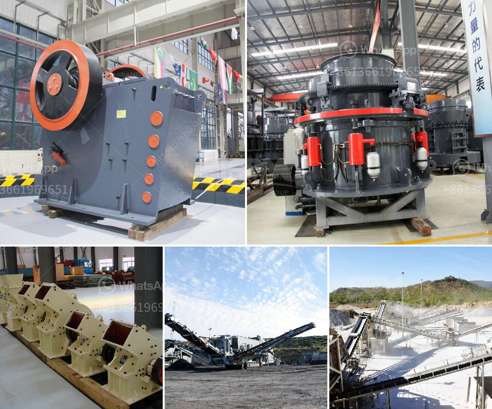

<h3>كسارات محمولة في اليابان</h3>
تعتبر اليابان واحدة من الدول الرائدة في مجال التكنولوجيا والابتكار. وفي مجال صناعة الكسارات المحمولة، تتمتع اليابان بسمعة عالمية. تعتبر الكسارات المحمولة في اليابان حلاً مثاليًا للشركات والمقاولين الذين يحتاجون إلى تكسير المواد في مواقع مختلفة.

تتميز الكسارات المحمولة بقدرتها على التنقل بسهولة من موقع إلى آخر، وتعزز من كفاءة العمل وتقلل من التكاليف الإضافية لنقل المواد إلى الموقع الثابت. هذه الكسارات قابلة للطي ويمكن نقلها على طرق سريعة بسلاسة، مما يوفر الوقت والجهد الذي يستنفد في نقل الكسارة التقليدية.

واحدة من الشركات اليابانية الرائدة في هذا المجال هي شركة كوماتسو. توفر شركة كوماتسو مجموعة واسعة من الكسارات المحمولة ذات الجودة العالية والأداء الموثوق. تم تصميم هذه الكسارات بعناية لتحقيق الكفاءة القصوى والاستدامة في عمليات التكسير.

تشتهر الكسارات المحمولة في اليابان بتقديم تجربة تكسير فائقة الجودة وتنتج مواد بحجم متناسب ومتناسق. تتميز الكسارات بقدرتها على تكسير مواد مختلفة مثل الخرسانة والأنقاض والأحجار الصلبة والحجارة الكبيرة وغيرها. كما تتميز بسرعة الانتقال بين تنسيقات التكسير المختلفة، مما يجعلها مثالية لمواقع البناء ذات الاحتياجات المتنوعة.

تعتبر الكسارات المحمولة في اليابان صديقة للبيئة أيضًا، حيث أن تصميمها يهدف إلى تقليل الانبعاثات الضارة والتأثير البيئي. تعتمد هذه الكسارات على محركات بنظام الهيدروليكي، وهي مصممة للحد من استهلاك الوقود والتلوث الصوتي. بالإضافة إلى ذلك، فإن تكنولوجيا التحكم والأتمتة المتقدمة تسمح للعمل بكفاءة ودقة عالية، وبالتالي الحد من الخطأ البشري والتقليل من الهدر.

باختصار، تعتبر الكسارات المحمولة في اليابان حلاً فعالًا ومستدامًا لصناعة التكسير. تجمع بين التقنيات الحديثة والجودة العالية والاحترام البيئي. بفضل قدرتها على التنقل وتقديم الأداء العالي في مواقع البناء المختلفة، فهي أداة لا غنى عنها للشركات البنائية والمقاولين في اليابان وفي جميع أنحاء العالم.
<h3>Contact us</h3><ul><li><strong>Whatsapp:&nbsp;<a href="https://wa.me/8613661969651">+8613661969651</a></strong></li><li><a href="https://swt.shibang-china.com/?git&amp;zhl&amp;كسارات محمولة في اليابان"><strong>Online Service(chat now)</strong></a></li></ul><h3>Related</h3><ul><li><a href='توازن المواد والطاقة لكسارة الفك.md'>توازن المواد والطاقة لكسارة الفك</a></li><li><a href='مبدأ عمل مطحنة الهامر.md'>مبدأ عمل مطحنة الهامر</a></li><li><a href='آلة طحن الحجر الصخري في فوجيان.md'>آلة طحن الحجر الصخري في فوجيان</a></li><li><a href='مصانع محمولة للبيع في جنوب أفريقيا.md'>مصانع محمولة للبيع في جنوب أفريقيا</a></li><li><a href='كسارة التعدين في تنزانيا.md'>كسارة التعدين في تنزانيا</a></li></ul>