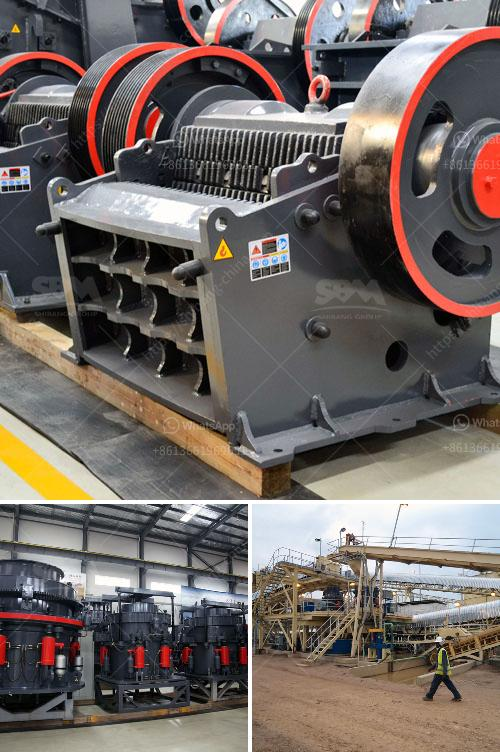

<h3>كسارات محمولة في محجر جنوب أفريقيا</h3>
تعتبر كسارات المحاجر المحمولة أداة حاسمة لصناعة التعدين والبناء في جنوب أفريقيا. تعتبر جنوب أفريقيا واحدة من الوجهات الرائدة لاستخراج الموارد المعدنية والإنشاءات، وتشتهر بوفرة مواردها الطبيعية والثروة المعدنية الهائلة التي تملكها. لذلك، فإن وجود كسارات محمولة في محاجر جنوب أفريقيا يلعب دورًا حاسمًا في تحسين كفاءة تعدين المحاجر وتسريع عمليات البناء.

توفر كسارات المحاجر المحمولة مزايا عدة تجعلها أداة مثالية للاستخدام في جنوب أفريقيا. أولاً وقبل كل شيء، فإنها مصممة لتكون قابلة للنقل بسهولة وسرعة بين مواقع التعدين المختلفة ومواقع البناء. وهذا يعني أنه بإمكان المشغلين نقل الكسارة إلى المواقع التي تحتاج إليها بسهولة وتشغيلها بشكل منتظم، مما يعزز الإنتاجية ويقلل من التوقفات غير المرغوب فيها.

ثانيًا، تتميز كسارات المحاجر المحمولة بقوة هائلة وقدرة عالية على تكسير المواد. تعتبر جنوب أفريقيا محجرًا للعديد من المواد الصلبة مثل الحجر الجيري والغرانيت والرخام والحجر الجيري، ويتطلب تكسير هذه المواد قوة وفعالية متقدمة. وبفضل الابتكار التكنولوجي، تم تصميم كسارات المحاجر المحمولة لتوفر تجربة تكسير قوية وفعالة.

ثالثًا، فإن استخدام كسارات المحاجر المحمولة يساهم في الحفاظ على البيئة. تعتمد تلك الكسارات على محركات كهربائية صديقة للبيئة، مما يحد من انبعاثات غازات الدفيئة والتلوث البيئي المرتبط بها. وهذا يتناسب تمامًا مع جهود جنوب أفريقيا للحفاظ على البيئة وتقليل التأثيرات البيئية السلبية لصناعة التعدين والبناء.

لخلاصة القول، فإن كسارات المحاجر المحمولة في جنوب أفريقيا تعد أدوات أساسية للتعدين والبناء. توفر هذه الكسارات قابلية للنقل وقوة تكسير فائقة وصديقة للبيئة، مما يجعلها الخيار الأمثل للناقلين والمشغلين. من المتوقع أن تستمر تلك الكسارات في تحقيق نجاح متزايد في جنوب أفريقيا وتوفير دور حاسم في تحسين صناعة التعدين والبناء في المستقبل.
<h3>Contact us</h3><ul><li><strong>Whatsapp:&nbsp;<a href="https://wa.me/8613661969651">+8613661969651</a></strong></li><li><a href="https://swt.shibang-china.com/?git&amp;zhl&amp;كسارات محمولة في محجر جنوب أفريقيا"><strong>Online Service(chat now)</strong></a></li></ul><h3>Related</h3><ul><li><a href='شركة تصنيع مطحنة ريموند.md'>شركة تصنيع مطحنة ريموند</a></li><li><a href='سعر آلة تصنيع لوحات الجبس.md'>سعر آلة تصنيع لوحات الجبس</a></li><li><a href='آلة الكوك البترولية.md'>آلة الكوك البترولية</a></li><li><a href='مصنع مطحنة الكرة للأسطوانة.md'>مصنع مطحنة الكرة للأسطوانة</a></li><li><a href='تكلفة تقديرية لمصنع التعدين.md'>تكلفة تقديرية لمصنع التعدين</a></li></ul>