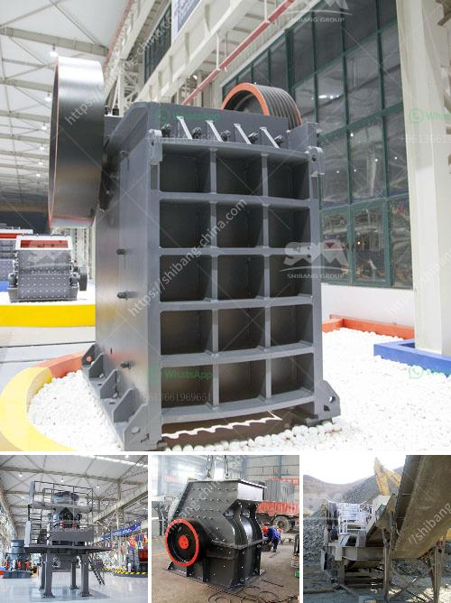

<h3>كسارات محمولة للإيجار</h3>
تعتبر الكسارات المحمولة للإيجار أداة حاسمة في صناعة البناء والتشييد. تتميز هذه الكسارات بسهولة نقلها وتركيبها في أي موقع بناء، مما يوفر الوقت والمال للمقاولين وأصحاب المشاريع. في هذه المقالة سنستعرض بعض المزايا والفوائد التي تقدمها الكسارات المحمولة للإيجار.

أحد أهم الفوائد العملية للكسارات المحمولة هو توفير الوقت والجهد الذي يستغرقه نقل المواد الخام إلى موقع البناء. بدلاً من استخدام شاحنات التفريغ التقليدية لنقل الصخور والحجارة، يتمكن المقاولون من استخدام الكسارات المحمولة لتكسير هذه المواد في الموقع نفسه. هذا يقلل من تكاليف النقل ويزيد من كفاءة العمل.

تتميز الكسارات المحمولة أيضًا بقدرتها على تكسير مجموعة متنوعة من المواد الخام بسرعة وكفاءة. مع وجود مجموعة واسعة من الكسارات المحمولة المتاحة للإيجار، يمكن للمقاولين اختيار الجهاز المناسب لاحتياجات المشروع الفردي. سواء كانت الحجارة، الصخور أو الخرسانة، فإن هذه الكسارات قادرة على تكسيرها وتحويلها إلى مواد بناء قابلة للاستخدام.

بالإضافة إلى ذلك، فإن الكسارات المحمولة توفر مرونة أكبر في إدارة المشاريع. حيث يمكن تكييف هذه الكسارات لتلبية احتياجات المشاريع المختلفة بسهولة، بدلاً من الاستثمار بشراء كسارات ثابتة. يمكن للمقاولين استئجار الكسارات المحمولة لفترة معينة حسب احتياجاتهم، وذلك يقلل من التكاليف الثابتة ويزيد من الكفاءة.

وأخيرًا، يجب أن نذكر أن استخدام الكسارات المحمولة للإيجار يحقق أيضًا فوائد بيئية. حيث توفر هذه الكسارات استخدامًا أكثر فعالية للطاقة وتقليل الانبعاثات الضارة للبيئة. تعتبر الكسارات المحمولة خيارًا صديقًا للبيئة مقارنة بالكسارات التقليدية والتي تعمل بوقود الديزل. 

باختصار، يعد استخدام الكسارات المحمولة للإيجار خيارًا مثاليًا لأي مقاول أو صاحب مشروع بناء. يساهم هذا الاختيار في تقليل التكاليف والوقت المستغرق في نقل المواد الخام وزيادة الكفاءة. بالإضافة إلى ذلك، فإن استخدام هذه الكسارات يحقق أيضًا مزايا بيئية، مما يجعلها خيارًا مستدامًا في صناعة البناء والتشييد.
<h3>Contact us</h3><ul><li><strong>Whatsapp:&nbsp;<a href="https://wa.me/8613661969651">+8613661969651</a></strong></li><li><a href="https://swt.shibang-china.com/?git&amp;zhl&amp;كسارات محمولة للإيجار"><strong>Online Service(chat now)</strong></a></li></ul><h3>Related</h3><ul><li><a href='كسارة الفك المحمولة في غرب أفريقيا تجار.md'>كسارة الفك المحمولة في غرب أفريقيا تجار</a></li><li><a href='شركة معدات تعدين الذهب في اليابان.md'>شركة معدات تعدين الذهب في اليابان</a></li><li><a href='سعر آلة طحن الرخام.md'>سعر آلة طحن الرخام</a></li><li><a href='مصنع تكسير المحاجر الكامل في جنوب أفريقيا.md'>مصنع تكسير المحاجر الكامل في جنوب أفريقيا</a></li><li><a href='معالجة الحجر الجيري في نيجيريا.md'>معالجة الحجر الجيري في نيجيريا</a></li></ul>