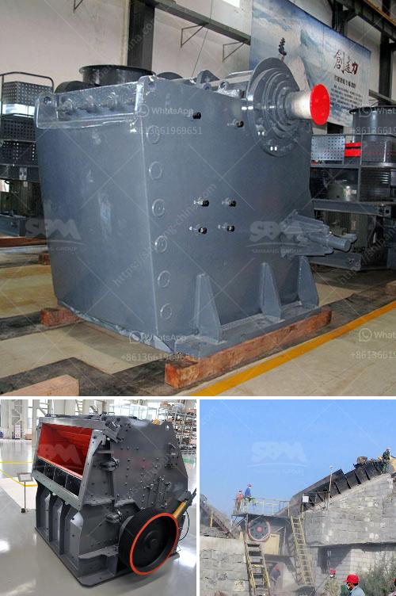

<h3>كسارات محمولة مستعملة للبيع في جنوب أفريقيا</h3>
تعتبر كسارات المحمولة المستعملة مرجعية هامة في صناعة التعدين والبناء في جنوب أفريقيا. تعد هذه الكسارات المحمولة خيارًا مثاليًا للشركات والمقاولين الذين يحتاجون إلى معدات موثوقة وفعالة لسحق وتكسير الصخور والحجارة عند المواقع البعيدة أو الأماكن التي تصعب الوصول إليها. يمكن العثور على العديد من كسارات المحمولة المستعملة للبيع في جنوب أفريقيا بأسعار تتراوح بين 200-400 ألف راند جنوب أفريقي.

تتميز كسارات المحمولة بمرونتها وسهولة نقلها بين المواقع المختلفة بسبب هيكلها المدمج ونظامها الهيدروليكي المتطور. تعمل هذه الكسارات على طحن الصخور بكفاءة عالية ومعالجة المواد الخام بدقة، مما يجعلها الخيار الأمثل للشركات التي تحتاج إلى إنتاجية عالية وجودة ممتازة.

توفر كسارات المحمولة العديد من المزايا للمستخدمين في جنوب أفريقيا. فهي توفر الوقت والجهد الذي يستغرقه نقل الصخور والحجارة من الموقع إلى مصانع الإنتاج. تساعد هذه المعدات على تقليل تكاليف الإنتاج، حيث يمكنها معالجة المواد المعدنية المتنوعة بسرعة وكفاءة عالية. بالإضافة إلى ذلك، تسهم كسارات المحمولة في حماية البيئة، حيث تقلل من حجم النفايات وتوفر استخدامًا فعالًا للموارد.

عند البحث عن كسارات محمولة مستعملة للبيع في جنوب أفريقيا، يجب أن يأخذ المشترين بعض العوامل في الاعتبار. على سبيل المثال، ينبغي التحقق من حالة الكسارة المحمولة ومدى قدرتها على التكيف مع الظروف البيئية المتنوعة في جنوب أفريقيا، مثل درجات الحرارة العالية والأمطار الغزيرة.

يجب أيضاً الاهتمام بصيانة المعدات التي سيتم شراؤها. يفضل تحقيق أدق قدر من المعلومات عن الموردين الموثوقين والموثوقية والخدمات الاحتياطية المتاحة للكسارات المحمولة المستخدمة. يجب أن يكون للمشتري إمكانية الفحص والاختبار للتأكد من أن المعدات قد تلبي احتياجاته بشكل صحيح.

وباختيار كسارة محمولة مستعملة ذات جودة عالية وفعالة بسعر معقول، يتيح ذلك للشركات والمقاولين في جنوب أفريقيا تحسين عملياتهم وزيادة الإنتاجية. يمكن لهذه المعدات أن تسهم في نمو وتطوير قطاعات التعدين والبناء، مما يعزز الاقتصاد الوطني ويخلق فرص عمل جديدة.

باختصار، من المهم اعتبار كسارات المحمولة المستعملة في جنوب أفريقيا كخيار ممتاز للشركات والمقاولين في صناعة التعدين والبناء. توفر هذه الكسارات المرونة والكفاءة وتسهل الوصول إلى المواقع النائية. باختيار العروض المناسبة والمراجعة الجيدة، يمكن للمستخدمين الحصول على كسارات محمولة مستعملة عالية الجودة بأسعار معقولة، مما يزيد من إنتاجيتهم ويعزز نمو القطاع الصناعي في جنوب أفريقيا.
<h3>Contact us</h3><ul><li><strong>Whatsapp:&nbsp;<a href="https://wa.me/8613661969651">+8613661969651</a></strong></li><li><a href="https://swt.shibang-china.com/?git&amp;zhl&amp;كسارات محمولة مستعملة للبيع في جنوب أفريقيا"><strong>Online Service(chat now)</strong></a></li></ul><h3>Related</h3><ul><li><a href='مصنع تصنيع لوحات الجبس في الهند.md'>مصنع تصنيع لوحات الجبس في الهند</a></li><li><a href='آلات محجر الجرانيت للبيع.md'>آلات محجر الجرانيت للبيع</a></li><li><a href='سعر تكسير الخرسانة في جنوب أفريقيا.md'>سعر تكسير الخرسانة في جنوب أفريقيا</a></li><li><a href='مطحنة ريموند في باكستان.md'>مطحنة ريموند في باكستان</a></li><li><a href='تكلفة كسارة الحجر في بيرو.md'>تكلفة كسارة الحجر في بيرو</a></li></ul>