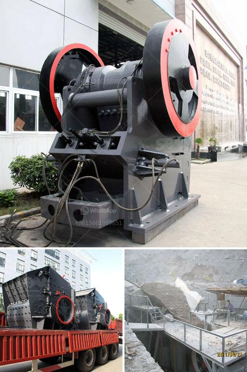

<h3>كسارات محمولة</h3>
يعتبر استخدام الكسارات المحمولة من أهم التطورات في صناعة البناء في العصر الحديث. تحظى هذه الآلات بشعبية كبيرة بين المقاولين والمهندسين المدنيين لما توفره من مزايا تنعكس بشكل إيجابي على عملية الإنشاءات.

تعمل الكسارات المحمولة على تكسير الصخور الكبيرة وتحويلها إلى الركام الصغير الذي يمكن استخدامه في مشروع البناء. بفضل تقنية التجميع المحمولة، يمكن تركيز هذه الكسارات في مواقع مختلفة وتحريكها بسهولة وفقًا لاحتياجات المشروع. هذا يساعد على تحسين كفاءة العمل وتقليل التكاليف.

إحدى أهم المزايا التي توفرها الكسارات المحمولة هي قابليتها للنقل السريع والسهل. فبدلاً من تحريك الحصى أو الصخور إلى مواقع البناء، يمكن نقل الكسارة نفسها إليها. هذا يعني عدم الحاجة إلى الاعتماد على مواقع كسارات ثابتة بعيدة عن مواقع البناء، مما يوفر الكثير من الوقت والجهد.

توفر الكسارات المحمولة أيضًا مرونة في عملية الإنتاج. حيث يمكن تغيير مخرجات الكسارة باستخدام معدات مختلفة، مثل الشاشات وأنظمة الفرز، للحصول على منتج نهائي يتناسب مع احتياجات المشروع. وبفضل ذلك، يمكن للمقاولين تلبية متطلبات العملاء بسهولة وتحقيق التوازن بين الكفاءة والجودة.

ومن بين المزايا الأخرى للكسارات المحمولة والتي لا يمكن إغفالها هو الحد الأدنى للتلوث البيئي. فهذه الآلات تستخدم تقنيات حديثة لتقليل انبعاثات الغبار والضوضاء. وبالتالي، فإن استخدام الكسارات المحمولة يساهم في الحفاظ على البيئة والحد من التأثيرات السلبية على المجتمع المحيط.

في الختام، يمكن القول إن الكسارات المحمولة هي الحلا العملي والفعال في صناعة الركام. تمثل هذه التكنولوجيا الحديثة خطوة نحو الأمام في مجال البناء، مما يسهل العمل ويقلل التكاليف ويحافظ على البيئة. ينبغي أن تكون هذه الكسارات ضمن قائمة الأولويات لأي مقاول أو مهندس مدني يسعى لتحسين عمله وتقديم خدمات ذات جودة عالية.
<h3>Contact us</h3><ul><li><strong>Whatsapp:&nbsp;<a href="https://wa.me/8613661969651">+8613661969651</a></strong></li><li><a href="https://swt.shibang-china.com/?git&amp;zhl&amp;كسارات محمولة"><strong>Online Service(chat now)</strong></a></li></ul><h3>Related</h3><ul><li><a href='موردين تكسير الكوارتز في أوروبا.md'>موردين تكسير الكوارتز في أوروبا</a></li><li><a href='كسارة عينة صغيرة.md'>كسارة عينة صغيرة</a></li><li><a href='إجمالي الطاقة لكسارة الفك 500 طن في الساعة.md'>إجمالي الطاقة لكسارة الفك 500 طن في الساعة</a></li><li><a href='آلة كسارة صخور صغيرة.md'>آلة كسارة صخور صغيرة</a></li><li><a href='أنواع الجبس.md'>أنواع الجبس</a></li></ul>