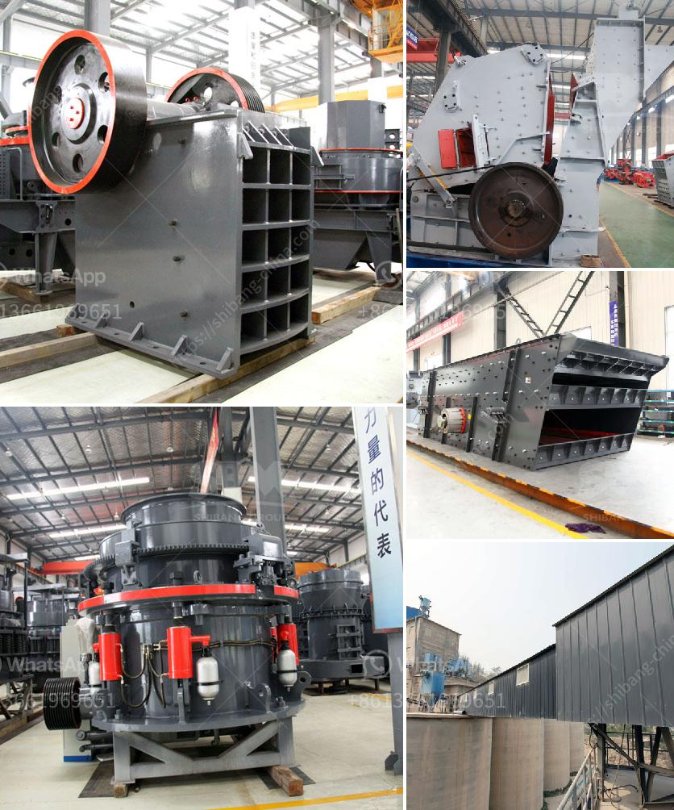

<h3>كسارات مخروط للإيجار في جنوب أفريقيا</h3>
تقدم جنوب أفريقيا مجموعة متنوعة من خدمات البناء والتشييد للمقاولين والشركات. واحدة من الخدمات المميزة التي توفرها هي خدمة تأجير كسارات المخروط في جنوب أفريقيا.

تعتبر كسارات المخروط من أدوات البناء الحديثة والتي تستخدم لكسر الصخور والأحجار الكبيرة إلى قطع صغيرة، وتستخدم في العديد من التطبيقات الصناعية مثل بناء وتطوير الطرق والسكك الحديدية والبناء الكبيرة الأخرى.

تأجير كسارات المخروط في جنوب أفريقيا يوفر العديد من المزايا للمقاولين والشركات. أولاً، فإن تأجير الكسارة يعني توفير تكلفة كبيرة في الاستثمار الأولي. بدلاً من شراء كسارة جديدة وصيانتها وتكلفة التشغيل والتخزين، يمكن للمقاولين تأجير الكسارات واستخدامها فقط عندما يكونون في حاجة إليها.

ثانيًا، تأجير الكسارات يوفر مزيدًا من المرونة للشركات. في بعض الأحيان، لا تكون الشركات في حاجة لكسارة طويلة الأمد، وربما تحتاج إلى استخدامها لفترة قصيرة من الوقت فقط. وفي مثل هذه الحالات، يكون تأجير الكسارة خيارًا أفضل، حيث يمكن إعادة تأجيرها لشركات أخرى بعد الانتهاء من الاستخدام الأول.

ثالثًا، يوفر تأجير الكسارات مستوى عاليًا من الاحترافية والخبرة. إذا قامت الشركات بتأجير الكسارة من موردين موثوقين يقدمون خدمة ذات مستوى عالٍ، فسيكون هناك ضمان للحصول على كسارة ذات جودة عالية وأمان في الاستخدام.

في النهاية، تعتبر تأجير كسارات المخروط في جنوب أفريقيا خيارًا مناسبًا للمقاولين والشركات الذين يحتاجون إلى دمج الكفاءة والاقتصاد في مشاريعهم. من خلال توفير المرونة والتكلفة المنخفضة والاحترافية، يساهم تأجير الكسارات في تعزيز كفاءة البناء وتنمية الصناعة في جنوب أفريقيا.

وفي النهاية، يجب على المقاولين والشركات البناء أن يستشيروا الشركات المتخصصة والموردين الموثوقين في جنوب أفريقيا للحصول على معلومات إضافية حول توفر وتأجير كسارات المخروط، واختيار الخيار الأفضل الذي يتناسب مع احتياجاتهم.
<h3>Contact us</h3><ul><li><strong>Whatsapp:&nbsp;<a href="https://wa.me/8613661969651">+8613661969651</a></strong></li><li><a href="https://swt.shibang-china.com/?git&amp;zhl&amp;كسارات مخروط للإيجار في جنوب أفريقيا"><strong>Online Service(chat now)</strong></a></li></ul><h3>Related</h3><ul><li><a href='مختلف طرق سحق وطحن السيراميك.md'>مختلف طرق سحق وطحن السيراميك</a></li><li><a href='معدات فاصل المغناطيس للبيع.md'>معدات فاصل المغناطيس للبيع</a></li><li><a href='آلة طحن الكرة في الهند.md'>آلة طحن الكرة في الهند</a></li><li><a href='تكنولوجيا معالجة الطين الصيني.md'>تكنولوجيا معالجة الطين الصيني</a></li><li><a href='مطحنة طحن الحجر الصناعي.md'>مطحنة طحن الحجر الصناعي</a></li></ul>