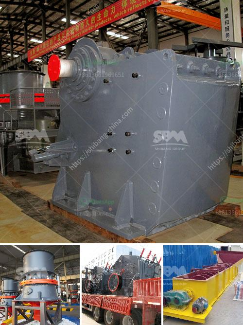

<h3>كسارات مخروط للبيع</h3>
تُستخدم كسارات المخروط في صناعة التعدين والبناء بشكل واسع في تكسير الصخور والأحجار الكبيرة إلى قطع صغيرة ومنتظمة الحجم. تعتبر هذه الكسارات فعالة للغاية وتوفر أداءً عاليًا مع تكلفة منخفضة للصيانة وعمر أطول للأجزاء التالفة مما يوفر الوقت والجهد والتكاليف على المشغلين.

تعمل كسارات المخروط عن طريق تكسير المواد بين طبقتين من المعدن تُعرف بالمخروط. يتم تغذية المادة المراد تكسيرها من الأعلى ويتم سحقها وطحنها بين المخروطين حتى تتم التحكم في حجم الجسيمات المخرجة من الجهة السفلية للماكينة بواسطة ضبط فجوة الكسر بين المخروطين. يتم ضبط فجوة الكسر بواسطة زر تعديل يقوم بتحريك المخروط السفلي للأعلى والسفل بحيث يمكن تعديلها وفقًا لمتطلبات المواد والمخرجات المرغوبة.

أحد الاستخدامات الشائعة لكسارات المخروط هو في صناعة التعدين حيث يتم استخدامها لتكسير الصخور الصلبة ومعالجة المواد المعدنية مثل الذهب والفضة والنحاس والحديد وغيرها. تعتبر كسارات المخروط متعددة المراحل وفعالة في تحقيق الكسر النهائي المطلوب والتقليل من حجم الجسيمات لاستخلاص المواد المعدنية.

كما تستخدم كسارات المخروط في صناعة البناء وخاصة في إنتاج الخرسانة. تمتاز بالقدرة على تكسير الصخور الصلبة والمواد المعدنية بشكل فعال مما يساعد في إنتاج الرمل والحصى بجودة عالية للاستخدام في البناء. تعد تلك الكسارات متينة وقوية ويمكن أن تتعامل مع الصخور الصلبة بكفاءة وسهولة.

وفي الأخير، يمكن العثور على كسارات المخروط للبيع بسعر مناسب يتراوح بين 200 إلى 400. يعتمد سعر الكسارة على العديد من العوامل مثل الحجم والنموذج والعمر والشركة المصنعة. تتوفر كسارات المخروط الجديدة والمستعملة للبيع، حيث يمكن للمشترين اختيار الخيار الذي يناسب احتياجاتهم وميزانيتهم.

بشكل عام، تُعد كسارات المخروط خيارًا مثاليًا للعديد من الصناعات حيث يمكن إنتاج مواد عالية الجودة بكفاءة واقتصادية. تعتبر هذه الآلات مفيدة في تحقيق الأهداف الإنتاجية والحفاظ على تكلفة الاستثمار وتكاليف الصيانة. بفضل تطور التكنولوجيا، يتم تحسين أداء الكسارات المخروط باستمرار وتطويرها لتلبية الاحتياجات المتزايدة في صناعة البناء والتعدين.
<h3>Contact us</h3><ul><li><strong>Whatsapp:&nbsp;<a href="https://wa.me/8613661969651">+8613661969651</a></strong></li><li><a href="https://swt.shibang-china.com/?git&amp;zhl&amp;كسارات مخروط للبيع"><strong>Online Service(chat now)</strong></a></li></ul><h3>Related</h3><ul><li><a href='تكلفة سيور النقل.md'>تكلفة سيور النقل</a></li><li><a href='مصنع أسمنت صغير بسعة 100 طن في اليوم.md'>مصنع أسمنت صغير بسعة 100 طن في اليوم</a></li><li><a href='كسارات الحجر في ماليزيا.md'>كسارات الحجر في ماليزيا</a></li><li><a href='آلة فرز للبيع في جنوب أفريقيا.md'>آلة فرز للبيع في جنوب أفريقيا</a></li><li><a href='تكلفة تقديرية لمصنع التعدين.md'>تكلفة تقديرية لمصنع التعدين</a></li></ul>