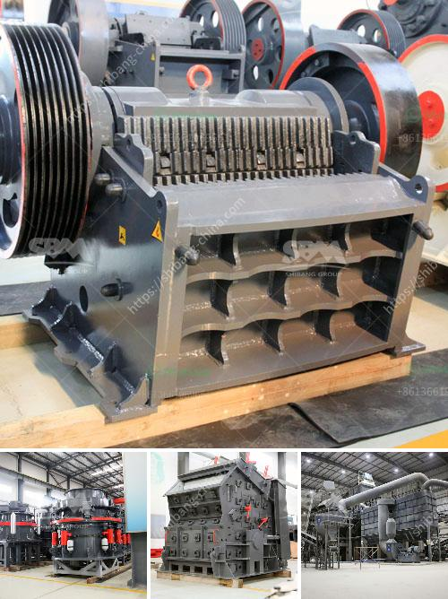

<h3>كسارات مخروط هيدروليكية</h3>
تعد الكسارات المخروطية الهيدروليكية أحد أنظمة الكسارات الحديثة التي تستخدم في صناعة التعدين والبناء. وتتميز هذه الكسارات بتصميمها الفريد وباستخدامها التقنيات الهيدروليكية المتطورة، مما يؤدي إلى تحسين كفاءة العملية وتقليل التكلفة.

إحدى الميزات الرئيسية للكسارات المخروطية الهيدروليكية هي قدرتها على تكسير الصخور ذات الصلابة العالية. تعمل هذه الكسارات عن طريق توجيه المادة إلى فتحة الكسارة المخروطية الموجودة في الجزء العلوي من الجهاز، ثم يتم طحن المواد بواسطة تعاقب الحجارة تلكثمجاد نغدلي الل كفةبحب.

وتتميز الكسارات المخروطية الهيدروليكية بآلية تعديل الفجوة، حيث يمكن ضبط الفجوة بسهولة من خلال نظام الهيدروليك. هذا التحكم الدقيق يساعد على تحقيق نسبة تفتيت مثالية للمواد المكسرة، مما يزيد من جودة المنتج النهائي.

تتميز الكسارات المخروطية الهيدروليكية أيضًا بوجود نظام آمن لحماية الكسارة والعاملين. فعندما تواجه الكسارة حمل زائد أو جسمًا غريبًا، يتم توجيه الضغط الهيدروليكي للإفراج عن المواد المكسرة بشكل سريع وآمن. يعمل الجهاز أيضًا بأقصى قدرة عند تعرضه لصدمة، مما يحمي الكسارة ويمنع التلف.

بالإضافة إلى ذلك، تعمل الكسارات المخروطية الهيدروليكية على توفير الطاقة، حيث يتم تحسين استخدام الطاقة بفضل محركاتها الهيدروليكية عالية الكفاءة. وتستخدم هذه الكسارات أيضًا التقنيات الحديثة للأتمتة، مما يزيد من كفاءة الشغل ويقلل من تكاليف التشغيل.

في الختام، تعد الكسارات المخروطية الهيدروليكية اختيارًا مثاليًا لإنتاج مواد بناء عالية الجودة بكلفة منخفضة. تكنولوجيا الهيدروليك توفر دقة وأمانًا في التشغيل، بالإضافة إلى زيادة كفاءة الطاقة. ومع البحث والتطوير المستمر، فإن هذه الكسارات تستمر في تحقيق تحسينات مستدامة وتلبية احتياجات صناعة التعدين والبناء المتنامية.
<h3>Contact us</h3><ul><li><strong>Whatsapp:&nbsp;<a href="https://wa.me/8613661969651">+8613661969651</a></strong></li><li><a href="https://swt.shibang-china.com/?git&amp;zhl&amp;كسارات مخروط هيدروليكية"><strong>Online Service(chat now)</strong></a></li></ul><h3>Related</h3><ul><li><a href='شركة تصنيع معدات التكسير.md'>شركة تصنيع معدات التكسير</a></li><li><a href='مطحنة الأسطوانة للحجر.md'>مطحنة الأسطوانة للحجر</a></li><li><a href='شاشة اهتزاز صناعية.md'>شاشة اهتزاز صناعية</a></li><li><a href='سعر ماكينة مولين في ميدان.md'>سعر ماكينة مولين في ميدان</a></li><li><a href='مطحنة رايموند للطحن الدقيق جدا.md'>مطحنة رايموند للطحن الدقيق جدا</a></li></ul>