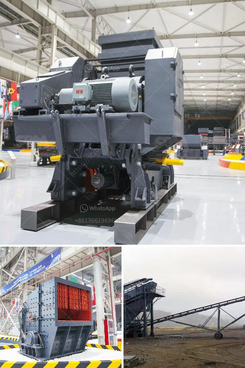

<h3>كسارات مزدوجة التبديل</h3>
تعتبر الكسارات المزدوجة التبديل واحدة من أهم الأدوات في صناعة التعدين والبناء. تتميز هذه الكسارات بكونها مزودة بنظام تشغيل ميكانيكي يتيح تقسيم المواد إلى قسمين بفضل وجود واجهة تفاعلية مزدوجة. سنتحدث في هذه المقالة عن أهم مزايا واستخدامات هذا النوع من الكسارات.

تتميز الكسارات المزدوجة التبديل بالحجم الصغير والتصميم الهندسي المتين، مما يجعلها قوية ومتينة تستطيع تحمل الأعباء الثقيلة. وبفضل وزنها الخفيف، فإنها يمكن نقلها بسهولة من مكان لآخر داخل الموقع البنائي.

أحد أهم استخدامات الكسارات المزدوجة التبديل في صناعة التعدين تكمن في سحق الصخور والمواد الصلبة بطريقة دقيقة وفعالة، مما يتيح استخراج المعادن بكفاءة عالية. ويمكن استخدامها أيضًا في تكسير الأحجار والحصى والخرسانة والأنقاض.

واحدة من أهم مزايا الكسارات المزدوجة التبديل هو قدرتها على التحكم في حجم الجسيمات المكسرة بسهولة، مما يعني أنه يمكن تنظيم الحجم بناءً على الاحتياجات المحددة للمشروع. وهذا يضمن جودة المنتج النهائي ويسمح بتحقيق التوازن بين الإنتاجية والكفاءة.

هذا النوع من الكسارات أيضًا يتميز بتكلفته المنخفضة للصيانة والتشغيل، مما يعني أنه يمكن الاعتماد عليها لفترة طويلة دون الحاجة إلى صيانة مستمرة. بالإضافة إلى ذلك، تعتبر هذه الكسارات بيئية الصديقة حيث تستخدم تكنولوجيا حديثة للتحكم في الانبعاثات والتقليل من الضوضاء.

لذا، يمكن القول أن الكسارات المزدوجة التبديل هي اختيار مثالي لكل من صناعة التعدين والبناء. فهي تجمع بين القوة والكفاءة والاقتصادية في تحقيق الأهداف المحددة. إذا كنت تبحث عن تجهيزات ذات جودة عالية وكفاءة عالية، فإن الكسارات المزدوجة التبديل هي الخيار الأمثل لك.
<h3>Contact us</h3><ul><li><strong>Whatsapp:&nbsp;<a href="https://wa.me/8613661969651">+8613661969651</a></strong></li><li><a href="https://swt.shibang-china.com/?git&amp;zhl&amp;كسارات مزدوجة التبديل"><strong>Online Service(chat now)</strong></a></li></ul><h3>Related</h3><ul><li><a href='آلات محجر الجرانيت للبيع.md'>آلات محجر الجرانيت للبيع</a></li><li><a href='الشركة المصنعة للكسارة الرئيسية من الرخام.md'>الشركة المصنعة للكسارة الرئيسية من الرخام</a></li><li><a href='آلة كسارة في أوروبا.md'>آلة كسارة في أوروبا</a></li><li><a href='سعر كسارة الفك في جنوب أفريقيا.md'>سعر كسارة الفك في جنوب أفريقيا</a></li><li><a href='مطاحن الحجر للبيع في كينيا.md'>مطاحن الحجر للبيع في كينيا</a></li></ul>