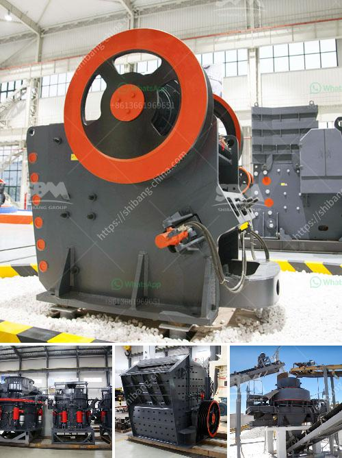

<h3>كسارات مستعملة في نيجيريا</h3>
تعتبر صناعة البناء والإنشاء من الصناعات الهامة في نيجيريا، وتشهد البلاد طلبًا متزايدًا على المواد الخام والمعدات اللازمة للبناء والإنشاء. ومن بين هذه المعدات المهمة هي كسارات الحجارة المستعملة، والتي تعد حلا فعالا واقتصاديا لتلبية احتياجات صناعة البناء والإنشاء في البلاد.

تعمل الكسارات المستعملة على تكسير الصخور الكبيرة إلى قطع مختلفة الأحجام، وتستخدم هذه الأحجام المكسورة في إنتاج الخرسانة والأسفلت والطرق والرصف والبناء والإصلاحات العامة والعديد من التطبيقات الأخرى في صناعة البناء. ويمتاز استخدام الكسارات المستعملة بعدة مزايا، منها:

1. تكلفة منخفضة: تعتبر الكسارات المستعملة بديلا ميسور التكلفة عن الكسارات الجديدة، حيث يمكن الحصول عليها بأسعار معقولة وأقل من سعر الكسارات الجديدة.

2. جودة عالية: على الرغم من أن الكسارات المستعملة يتم استخدامها بالفعل، إلا أنها غالبا ما تكون في حالة جيدة وجاهزة للعمل. ويمكن للشركات أو الأفراد الذين يعتزمون شراء كسارة مستعملة التحقق من حالتها وضمان عملها الجيد قبل الشراء.

3. الصيانة البسيطة: تتطلب الكسارات المستعملة صيانة أقل وتكاليف أقل من الكسارات الجديدة، حيث أن معظم المشاكل الصغيرة قد تكون قد تعاملت معها بالفعل أو تم إصلاحها.

بالإضافة إلى ذلك، يوجد في نيجيريا سوق نشط للكسارات المستعملة، حيث يمكن للمشترين والبائعين التواصل وإجراء المعاملات التجارية بسهولة. وتتوفر الكسارات المستعملة في مختلف الأحجام والطاقات، مما يتيح للمشترين اختيار الكسارة التي تناسب احتياجاتهم المحددة.

باختصار، تعتبر الكسارات المستعملة حلا مثاليا لصناعة البناء والإنشاء في نيجيريا، حيث توفر تكلفة منخفضة وجودة عالية بالإضافة إلى صيانة بسيطة. وتشكل هذه الكسارات البديل المثالي للشركات والأفراد الذين يبحثون عن تلبية احتياجاتهم في مجال الأعمال البنائية والإنشائية، مما يسهم في تعزيز قطاع البناء في البلاد.
<h3>Contact us</h3><ul><li><strong>Whatsapp:&nbsp;<a href="https://wa.me/8613661969651">+8613661969651</a></strong></li><li><a href="https://swt.shibang-china.com/?git&amp;zhl&amp;كسارات مستعملة في نيجيريا"><strong>Online Service(chat now)</strong></a></li></ul><h3>Related</h3><ul><li><a href='كسارة الحجر وشاشة الاهتزاز للبيع.md'>كسارة الحجر وشاشة الاهتزاز للبيع</a></li><li><a href='معدات تنظيف الرمال في الصغيرة.md'>معدات تنظيف الرمال في الصغيرة</a></li><li><a href='كتلة الآلات وكسارة في AutoCAD.md'>كتلة الآلات وكسارة في AutoCAD</a></li><li><a href='آلة غربلة الرمل للبيع في الفلبين.md'>آلة غربلة الرمل للبيع في الفلبين</a></li><li><a href='آلة حزمة مطحنة الكرة.md'>آلة حزمة مطحنة الكرة</a></li></ul>