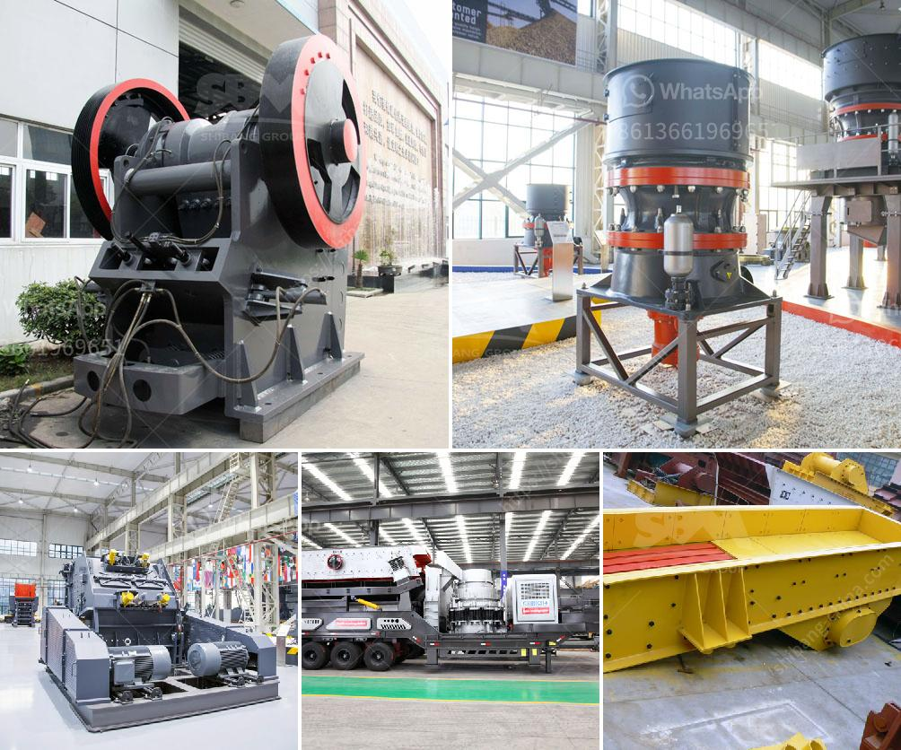

<h3>كسارات مستعملة للبيع في الولايات المتحدة</h3>
في الولايات المتحدة، هناك العديد من الشركات والمؤسسات التي تعمل في صناعة البناء والتشييد. وكجزء من هذه الصناعة، تعتبر الكسارات المستعملة للبيع من أهم الأدوات التي يستخدمها المقاولون لتحطيم وتكسير المواد الصلبة والصخور الكبيرة بفعالية.

الكسارات المستعملة هي الأجهزة التي تعمل على تحطيم المواد الخام وتقسيمها إلى أحجام صغيرة تستخدم في البناء وصناعات أخرى. تتوفر هذه الكسارات بمختلف الأحجام والأنواع، بما في ذلك كسارات الفك، وكسارات الصخور، وكسارات الصدم، والكسارات المخروطية، والكسارات المحمولة.

تتميز الكسارات المستعملة بأنها متوفرة بأسعار مخفضة مقارنةً بالكسارات الجديدة. وهذا يعني أن الشركات والمقاولين يمكنهم توفير الكثير من التكاليف عند شراء معدات الكسارة المستعملة. وبالإضافة إلى ذلك، فإن الكسارات المستعملة تكون قد قدمت الأداء الممتاز في وقت سابق، مما يجعلها خياراً جيداً للمقاولين الذين يبحثون عن كسارة جودة بأسعار معقولة.

بالنسبة لأولئك الذين يرغبون في شراء كسارات مستعملة في الولايات المتحدة، هناك العديد من المصادر المتاحة. يمكن للمقاولين البحث عبر الإنترنت في مواقع البيع والمزادات الإلكترونية التي تعرض الكسارات المستعملة للبيع. بالإضافة إلى ذلك، يمكن للمقاولين زيارة معارض المعدات المستعملة والتحدث إلى البائعين المختصين للحصول على نصيحة والتعرف على الكسارات المتاحة في المخزون.

ومع ذلك، يجب على المشترين أن يكونوا حذرين عندما يقررون شراء كسارة مستعملة، حيث أنه يجب التحقق من حالة الكسارة ومؤشرات الأداء السابقة. يجب مراجعة سجل الصيانة ومعرفة ما إذا كانت قد تمت صيانتها بشكل منتظم وبطرق صحيحة. يمكن أيضًا طلب التفاصيل الفنية وتقييم قدرة الكسارة وجودتها.

في النهاية، يعد الاستثمار في كسارة مستعملة في الولايات المتحدة خيارًا مثاليًا للمقاولين والشركات الصغيرة والكبيرة التي تحتاج إلى معدات تكسير عالية الجودة بتكاليف معقولة. عندما يتعلق الأمر بالبناء والتشييد، فإن الاستثمار الذكي في الكسارات المستعملة يمكن أن يساعد في تعزيز الإنتاجية وتقليل التكاليف العامة.
<h3>Contact us</h3><ul><li><strong>Whatsapp:&nbsp;<a href="https://wa.me/8613661969651">+8613661969651</a></strong></li><li><a href="https://swt.shibang-china.com/?git&amp;zhl&amp;كسارات مستعملة للبيع في الولايات المتحدة"><strong>Online Service(chat now)</strong></a></li></ul><h3>Related</h3><ul><li><a href='خط إنتاج مسحوق الجبس الرسم التخطيطي.md'>خط إنتاج مسحوق الجبس الرسم التخطيطي</a></li><li><a href='كسارة صغيرة للبيع في المحجر.md'>كسارة صغيرة للبيع في المحجر</a></li><li><a href='آلة صنع البليت الصغيرة للبيع في كينيا.md'>آلة صنع البليت الصغيرة للبيع في كينيا</a></li><li><a href='تقرير تفصيلي حول مصنع مسحوق الكوارتز.md'>تقرير تفصيلي حول مصنع مسحوق الكوارتز</a></li><li><a href='مصنع معدات تعدين الرخام.md'>مصنع معدات تعدين الرخام</a></li></ul>