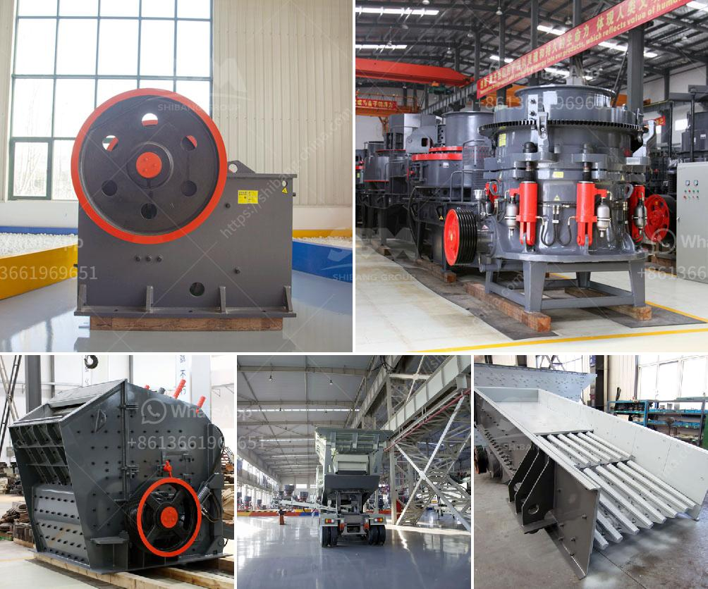

<h3>كسارات مستعملة للبيع في نيجيريا</h3>
تحظى نيجيريا بقطاع البناء والإنشاءات القوي والمتطور، مما يتطلب العديد من المعدات والآلات الثقيلة، ومن بين تلك المعدات الهامة هي الكسارات المستعملة. فعندما يتعلق الأمر بتفكيك وتجهيز المواد الخام وسحقها لتصبح جاهزة للاستخدام في البناء، تكون الكسارات المستعملة هي الخيار الأمثل.

تعتبر الكسارات المستعملة للبيع في نيجيريا أفضل خيار للعديد من الشركات والمقاولين الذين يتطلعون لتوفير المال والحصول على معدات عالية الجودة في نفس الوقت. تعد الكسارات المستعملة أقل تكلفة من الكسارات الجديدة، وهذا يعني أنه يمكن للشركات توفير الكثير من المال عند شرائها.

ومن جهة أخرى، الكسارات المستعملة غالبًا ما تكون في حالة تشغيلية جيدة وقادرة على العمل بفاعلية وفقًا لاحتياجات المشروع. تراجع الشركات عن استخدام الكسارات يتسبب في توفر العديد من الوحدات المستعملة التي لا تزال في حالة جيدة وتستخدم بشكل مستمر لفترة قصيرة. هذا يعني أنه يمكن للمشترين الحصول على كسارات تعمل بالكفاءة وتتوافق مع معايير الجودة بأسعار معقولة.

من بين الاعتبارات الأخرى التي يجب اتخاذها عند شراء كسارة مستعملة في نيجيريا هي حجم المشروع الذي ستستخدم فيه الكسارة. يجب أن تكون الكسارة تتناسب مع العمل المطلوب، وتلبي احتياجات المشروع من حيث السعة والكفاءة.

علاوة على ذلك، يُنصح بشراء الكسارات المستعملة من موردين موثوقين وقد سبق لهم توفير معدات ذات جودة عالية للعملاء. يجب أن تتوفر للمشترين فرصة لفحص الكسارة قبل الشراء والتأكد من أنها تعمل بشكل صحيح وأنها خالية من أي عيوب تؤثر على أدائها.

في النهاية، الكسارات المستعملة تعتبر خيارًا اقتصاديًا وفعالًا للشركات والمقاولين في نيجيريا. توفر هذه الكسارات التكلفة والجودة المطلوبة وتلبي متطلبات المشروع بشكل كامل. إذا كنت تبحث عن شراء كسارة في نيجيريا، فإن الكسارات المستعملة قد تكون الحل المثالي لك.
<h3>Contact us</h3><ul><li><strong>Whatsapp:&nbsp;<a href="https://wa.me/8613661969651">+8613661969651</a></strong></li><li><a href="https://swt.shibang-china.com/?git&amp;zhl&amp;كسارات مستعملة للبيع في نيجيريا"><strong>Online Service(chat now)</strong></a></li></ul><h3>Related</h3><ul><li><a href='آلات مطحنة في جنوب أفريقيا.md'>آلات مطحنة في جنوب أفريقيا</a></li><li><a href='قائمة أسعار كسارة الجرانيت.md'>قائمة أسعار كسارة الجرانيت</a></li><li><a href='مصنع لوحات الجبس الجديد في الهند.md'>مصنع لوحات الجبس الجديد في الهند</a></li><li><a href='آلة طحن الرخام للبيع.md'>آلة طحن الرخام للبيع</a></li><li><a href='مطحنة مسحوق عالي الضغط في الهند.md'>مطحنة مسحوق عالي الضغط في الهند</a></li></ul>