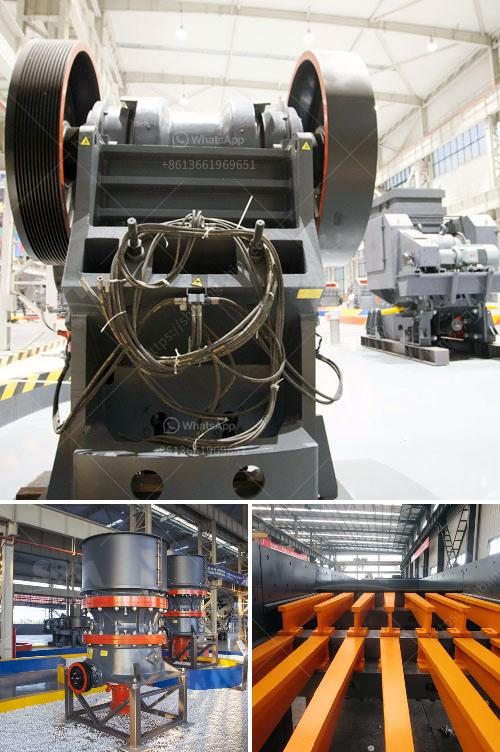

<h3>كسارات مسحوق التلك</h3>
تستخدم الكسارات في عملية تحويل التلك الخام إلى مسحوق التلك، الذي يعتبر من المنتجات المهمة في عدة صناعات مثل صناعة الورق والمواد الكيميائية ومستحضرات التجميل وصناعة البلاستيك. تعتبر كسارات مسحوق التلك الأداة الأساسية في هذه العملية.

تعتبر مسحوق التلك منتجًا حافظًا للرطوبة ومانعًا للتصاق الجسيمات، ويتم الحصول عليه بتكسير التلك الخام وطحنه حتى الحصول على الحبيبات الدقيقة وتصنيفها إلى درجات مختلفة. تعتمد جودة المسحوق على عدة عوامل مثل نسبة الكربونات والشوائب الموجودة في التلك الخام وكذلك عملية طحنه وتصنيفه.

تعمل الكسارات على تكسير التلك الخام إلى قطع صغيرة باستخدام القوة الميكانيكية. يتم ضبط حجم المنتج النهائي من خلال تعديل تجويف الكسارة. بعد ذلك، يتم نقل القطع الصغيرة إلى مطحنة التصنيف حيث يتم طحنها إلى حجم أصغر باستخدام الكرات المعدنية أو المطرقة. يتم ضبط حجم المسحوق النهائي بواسطة تغيير حجم الفتحة في الشاشة التي تشغل دورًا مهمًا في تحديد حجم الحبيبات.

يعتبر الكسارات ومطاحن التصنيف من أهم مراحل عملية إنتاج مسحوق التلك، حيث أنها تؤثر في جودة المنتج النهائي ودقته. فعلى سبيل المثال، إذا كانت الكسارات غير قادرة على تكسير التلك الخام بطريقة متساوية وبكفاءة، فقد يؤدي ذلك إلى تكون حبيبات غير متجانسة وعدم التصنيف الدقيق، مما يؤثر سلبًا على جودة المنتج النهائي.

بالإضافة إلى ذلك، تلعب تنظيف الكسارات والمطاحن دورًا هامًا في حفاظ على جودة التلك المنتج، حيث يجب تنظيفها بشكل دوري لإزالة الشوائب أو الأتربة التي قد تؤثر على جودة المسحوق النهائي.

بشكل عام، يمكن القول أن كسارات مسحوق التلك تلعب دورًا مهمًا في عملية إنتاج المسحوق، حيث تؤثر على جودة المنتج النهائي ودقته. بالاعتماد على تقنيات متقدمة والاهتمام بتنظيف وصيانة الكسارات والمطاحن، يمكن تحقيق جودة عالية واستخدام فعال للتلك في الصناعات المختلفة.
<h3>Contact us</h3><ul><li><strong>Whatsapp:&nbsp;<a href="https://wa.me/8613661969651">+8613661969651</a></strong></li><li><a href="https://swt.shibang-china.com/?git&amp;zhl&amp;كسارات مسحوق التلك"><strong>Online Service(chat now)</strong></a></li></ul><h3>Related</h3><ul><li><a href='موردي خط إنتاج الحبر.md'>موردي خط إنتاج الحبر</a></li><li><a href='مصنع معدات تعدين الرخام.md'>مصنع معدات تعدين الرخام</a></li><li><a href='تكلفة مصنع تكسير الحجر.md'>تكلفة مصنع تكسير الحجر</a></li><li><a href='شركة تصنيع فيلت فيلت للحزام الناقل.md'>شركة تصنيع فيلت فيلت للحزام الناقل</a></li><li><a href='آلة غسيل الرمال.md'>آلة غسيل الرمال</a></li></ul>