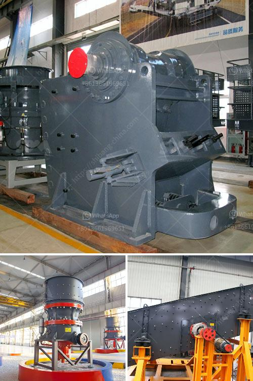

<h3>كسارات مصنوعة في الفلبين الجنوبية</h3>
تعتبر صناعة الكسارات من الصناعات الهامة في الفلبين الجنوبية، حيث تحظى بشعبية كبيرة وطلب متزايد. تعد الكسارات أداة أساسية في مجال البناء والهدم، حيث تقوم بسحق الصخور والحصى والركام وتحويلها إلى مواد بناء قابلة للاستخدام.

تتميز كسارات الفلبين الجنوبية بالاعتماد على التكنولوجيا المتقدمة والمواد ذات الجودة العالية. يتم تصنيع هذه الكسارات باستخدام أحدث الآلات والمعدات التي تضمن أقصى قدر من الكفاءة والكفاءة في العملية. تعتبر الفلبين الجنوبية واحدة من أبرز الدول المصدرة للكسارات في المنطقة، حيث يتم تصديرها إلى العديد من الدول المجاورة.

تلتزم الشركات المصنعة بتوفير منتجات ذات جودة عالية تلبي احتياجات العملاء وتتوافق مع المعايير الصناعية العالمية. تتميز الكسارات المصنوعة في الفلبين الجنوبية بالمرونة والقدرة على التكيف مع أنواع مختلفة من المواد الصلبة المستخدمة في البناء. تتوفر الكسارات بمختلف الأحجام والقدرات، مما يسهل اختيار العملاء المنتج الأنسب لمشروعهم.

يشتهر الفنيون في الفلبين الجنوبية بمهاراتهم الفنية والفنية المتقدمة في صناعة الكسارات. يتم تخصيص أفراد المهندسين والفنيين الذين لديهم الخبرة اللازمة للقيام بتصنيع وتصميم وتجميع الكسارات بأفضل الطرق الممكنة. تعد الكسارات المصنوعة في الفلبين الجنوبية اختيارًا مثاليًا للعملاء الذين يبحثون عن الجودة والكفاءة في نفس الوقت.

توفر صناعة الكسارات فرص عمل هامة للعديد من الأفراد في الفلبين الجنوبية. يتم توظيف الكثير من الفنيين والعمال في عمليات التصنيع والتجميع وصيانة الكسارات. بالإضافة إلى ذلك، يوفر قطاع الكسارات فرصًا متعددة للعديد من الشركات المتخصصة في الخدمات اللوجستية والتوزيع والتسويق.

باختصار، يعد قطاع الكسارات في الفلبين الجنوبية من الصناعات الحيوية التي تلعب دورًا هامًا في دعم البنية التحتية للبناء والتطوير. تتميز الكسارات المصنوعة في الفلبين الجنوبية بالجودة والتكنولوجيا المتقدمة، مما يجعلها اختيارًا مثاليًا للعملاء المهتمين بالاستثمار في مشاريع البناء. كما تسهم هذه الصناعة في توفير فرص عمل ودعم اقتصاد البلاد.
<h3>Contact us</h3><ul><li><strong>Whatsapp:&nbsp;<a href="https://wa.me/8613661969651">+8613661969651</a></strong></li><li><a href="https://swt.shibang-china.com/?git&amp;zhl&amp;كسارات مصنوعة في الفلبين الجنوبية"><strong>Online Service(chat now)</strong></a></li></ul><h3>Related</h3><ul><li><a href='آلة غسيل الرمال.md'>آلة غسيل الرمال</a></li><li><a href='سعر كسارة تأثير الصخور.md'>سعر كسارة تأثير الصخور</a></li><li><a href='شركة تصنيع آلات رمل السيليكا في الهند.md'>شركة تصنيع آلات رمل السيليكا في الهند</a></li><li><a href='محرك مطحنة الإسمنت للبيع في المملكة المتحدة.md'>محرك مطحنة الإسمنت للبيع في المملكة المتحدة</a></li><li><a href='مطحنة الأسطوانة في نيجيريا.md'>مطحنة الأسطوانة في نيجيريا</a></li></ul>