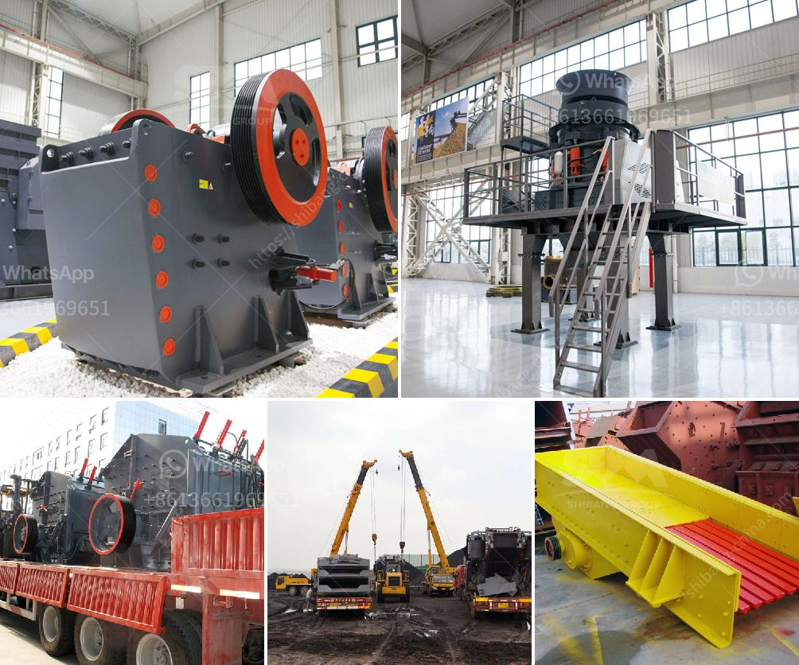

<h3>كسارات وشاشات متنقلة مستعملة في جنوب أفريقيا</h3>
تعد الكسارات والشاشات المتنقلة من الأدوات الهامة في صناعة البناء والتشييد في جنوب أفريقيا. تستخدم هذه الأدوات لتحطيم الصخور والحجارة الكبيرة وتحويلها إلى حصمة صغيرة وغير كبيرة. يتم استخدامها في العديد من المشاريع مثل بناء الطرق والجسور والمنازل وغيرها. يبحث العديد من المقاولين عن كسارات وشاشات متنقلة مستعملة لأنها توفر فرصة لتوفير التكاليف والحصول على أدوات ذات جودة عالية بأسعار معقولة.

تعد الكسارات المتنقلة مفيدة للغاية في جنوب أفريقيا حيث يتوفر هناك العديد من المواقع البعيدة والنائية التي يصعب الوصول إليها بالشاحنات الكبيرة. تتميز هذه الكسارات بقدرتها على العمل في مواقع ضيقة وصعبة وتنتقل بسهولة من موقع إلى آخر. تسمح الكسارات المتنقلة باستغلال الحصمة المتوفرة في مناطق العمل وتعزيز كفاءة العملية.

إضافة إلى ذلك، تلعب الشاشات المتنقلة دورًا مهمًا في صناعة البناء. تساعد الشاشات في فصل المواد المهملة من الحصمة وضمان حصول على منتج نهائي ذو جودة عالية. من خلال استخدام الشاشات المتنقلة، يمكن فصل المواد الكبيرة والصغيرة بكفاءة، مما يسمح بإعادة التدوير واستخدامها في المهام البنائية الأخرى مما يقلل من النفايات ويوفر الموارد بشكل عام.

عند البحث عن كسارات وشاشات متنقلة مستعملة في جنوب أفريقيا، يجب أخذ بعض الأمور في الاعتبار. على سبيل المثال، يجب التأكد من حالة هذه الأدوات المستعملة وضمان أنها في حالة جيدة وقادرة على العمل بكفاءة. ينبغي أيضًا النظر في توافر قطع الغيار والصيانة لهذه الأدوات وتكلفتها في حالة الاحتياج لإصلاحات. من المفيد أيضًا البحث عن البائعين الموثوق بهم والذين يوفرون ضمانات للمعدات المستعملة للحفاظ على استثمارك.

في الختام، تعتبر الكسارات والشاشات المتنقلة المستعملة في جنوب أفريقيا من الأدوات الهامة لصناعة البناء والتشييد. توفر هذه الأدوات فرصة لتوفير التكاليف والحصول على أدوات عالية الجودة بأسعار مناسبة. تدعم استخدام الكسارات والشاشات المتنقلة الاستدامة وتعزز فرص إعادة التدوير والحفاظ على الموارد الطبيعية. تجدر الإشارة إلى أهمية اختيار الكسارات والشاشات المتنقلة المستعملة بعناية والاستعانة بالبائعين الموثوق بهم لضمان الاستثمار الجيد والحصول على كفاءة عالية في العمل.
<h3>Contact us</h3><ul><li><strong>Whatsapp:&nbsp;<a href="https://wa.me/8613661969651">+8613661969651</a></strong></li><li><a href="https://swt.shibang-china.com/?git&amp;zhl&amp;كسارات وشاشات متنقلة مستعملة في جنوب أفريقيا"><strong>Online Service(chat now)</strong></a></li></ul><h3>Related</h3><ul><li><a href='براميل أحزمة الناقلات في ماليزيا.md'>براميل أحزمة الناقلات في ماليزيا</a></li><li><a href='قطع غيار لكسارات الحجر.md'>قطع غيار لكسارات الحجر</a></li><li><a href='كسارات الحجر في فرنسا.md'>كسارات الحجر في فرنسا</a></li><li><a href='مطحنة مسحوق الحجر الجيري.md'>مطحنة مسحوق الحجر الجيري</a></li><li><a href='مصنع غسيل الرمال للبيع في الإمارات.md'>مصنع غسيل الرمال للبيع في الإمارات</a></li></ul>