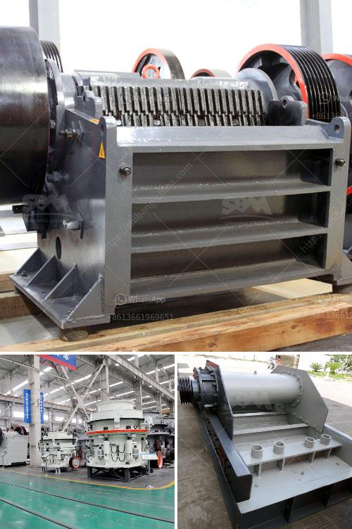

<h3>كسارة VSI لسحق الرمل</h3>
تعتبر كسارة VSI (Vertical Shaft Impact) واحدة من أهم الأدوات المستخدمة في صناعة البناء والتشييد وذلك لسحق الرمل والحصى والصخور الكبيرة إلى حجم أصغر. تتميز هذه الكسارة بقدرتها على توليد شكل حبيبي للمواد المسحوقة، مما يجعلها مثالية لاستخدامها في الأعمال الإنشائية والطرق.

تعمل كسارة VSI عن طريق إدخال المواد من خلال المدخل العلوي للكسارة، حيث يتم توجيهها إلى تجويف السحق. يتم تسريع المواد من قبل آلية الدوران عالية السرعة الموجودة في الكسارة، وبسبب القوة المركزية التي تتأثر بها المواد، يتم سحقها بشكل فعالحتى تصل إلى حجم الجسيمات المطلوب.

تُعد كسارة VSI فعالة للغاية في سحق الرمال والحصى لعدة أسباب. أولاً، تعتبر هذه الكسارة متعددة الاستخدامات وتستطيع إنتاج مجموعة متنوعة من المواد المسحوقة بأحجام وأشكال مختلفة. ثانيًا، توفر هذه الكسارة استهلاكًا أقل للطاقة مقارنة بالكسارات التقليدية، مما يقلل من تكاليف التشغيل ويحسن الكفاءة العامة للعملية. ثالثًا، تقلل الصيانة المنتظمة للكسارة VSI من الانقطاعات غير المرغوب فيها في العملية الإنتاجية، وبالتالي تعزز الإنتاجية وتحسن جودة المخرجات.

بالإضافة إلى ذلك، توفر الكسارة VSI أيضًا الفوائد البيئية. عندما يتم استخدامها لسحق الرمال والحصى، فإنها تقلل من استخدام المواد الخام الطبيعية مثل الحصى وتحفظ المساحات الطبيعية من التآكل. وبفضل توفير الكهرباء الذي تقدمه هذه الكسارة، يتم تقليل استهلاك الطاقة وبالتالي انبعاثات الغازات الضارة المرتبطة بها.

في الختام، تعد كسارة VSI أداة مهمة لسحق الرمل والحصى والصخور الكبيرة في صناعة البناء والتشييد. يمكن استخدامها لإنتاج مواد مسحوقة بأحجام وأشكال مختلفة، وتتميز بكفاءة عالية واستهلاك طاقة منخفض وصيانة سهلة وفوائد بيئية قوية. استخدام كسارة VSI يساعد في تحسين عملية الإنتاج وتوفير التكاليف والحفاظ على الموارد الطبيعية.
<h3>Contact us</h3><ul><li><strong>Whatsapp:&nbsp;<a href="https://wa.me/8613661969651">+8613661969651</a></strong></li><li><a href="https://swt.shibang-china.com/?git&amp;zhl&amp;كسارة VSI لسحق الرمل"><strong>Online Service(chat now)</strong></a></li></ul><h3>Related</h3><ul><li><a href='سعر معدات معالجة المنغنيز.md'>سعر معدات معالجة المنغنيز</a></li><li><a href='غسيل الرمال الصغيرة.md'>غسيل الرمال الصغيرة</a></li><li><a href='سعة مطحنة الكرة بالأطنان.md'>سعة مطحنة الكرة بالأطنان</a></li><li><a href='سعر مطحنة الكرة ريموند الفائقة الدقة.md'>سعر مطحنة الكرة ريموند الفائقة الدقة</a></li><li><a href='كسارة تأثير الفك بولندا.md'>كسارة تأثير الفك بولندا</a></li></ul>