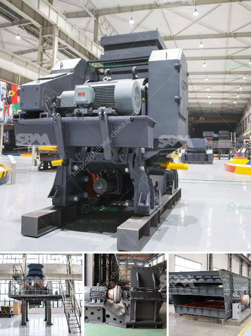

<h3>كسارة آلية</h3>
تعد الكسارة الآلية واحدة من الآلات الحديثة التي تستخدم في صناعة البناء والهندسة المدنية. فهي تستخدم لسحق المواد الخام الصلبة إلى حجم صغير وتحويلها إلى مواد خام قابلة للاستخدام في عمليات البناء.

تعمل الكسارة الآلية عن طريق تحطيم المواد الصلبة باستخدام قوة الضغط والتأثير. فمن خلال استخدام أدوات ميكانيكية معينة ، يتم تفتيت المواد إلى قطع صغيرة جدًا ومن ثم سحقها إلى حجم أصغر. تعتمد آلية الكسارة على العديد من الأجزاء الميكانيكية مثل المطارق والمطارق والسكاكين والأسطوانات.

يتم استخدام الكسارة الآلية في العديد من الصناعات مثل صناعة الأسمنت والبناء وإعادة التدوير. فهي تستخدم لسحق الصخور والأحجار والخرسانة المعاد تدويرها إلى قطع صغيرة لسهولة التخلص منها أو إعادة استخدامها في بناء مواد جديدة.

توفر الكسارة الآلية العديد من المزايا للمستخدمين. فمن خلال سحق المواد الصلبة وتحويلها إلى قطع صغيرة ، يمكن التخلص منها بشكل أسهل وتجنب فوضى الحاويات الكبيرة. بالإضافة إلى ذلك ، يسهل نقل هذه القطع الصغيرة وتخزينها أثناء النقل والتخلص منها.

بالنسبة لصناعة البناء ، تساعد الكسارة الآلية في إعادة استخدام المواد وتوفير التكاليف. فبدلاً من شراء مواد جديدة ، يمكن استخدام المواد المكسورة لإعادة بناء هياكل جديدة. هذا يلعب دورًا مهمًا في تقليل تأثير البناء على البيئة وتحسين استدامة البنية التحتية الموجودة.

على الرغم من المزايا العديدة للكسارة الآلية ، يجب أن نذكر أيضًا بعض العيوب. تحتاج الكسارة الآلية إلى صيانة ورعاية دورية للحفاظ على الأداء الأمثل. بالإضافة إلى ذلك ، قد تكون هناك تكاليف إضافية للتخلص من المواد المكسورة ، وخاصة إذا كانت تحتوي على مواد غير مرغوب فيها مثل الزجاج أو البلاستيك.

بشكل عام ، الكسارة الآلية تعد أداة مهمة في صناعة البناء والهندسة المدنية. تساهم في تسهيل عمليات البناء وإعادة تدوير المواد الخام ، مما يؤدي إلى حماية البيئة وتحسين استدامة البنية التحتية. يجب أن تتبع الكسارة الآلية برنامج صيانة منتظم للحفاظ على أداءها الأمثل والحد من التكاليف الإضافية.
<h3>Contact us</h3><ul><li><strong>Whatsapp:&nbsp;<a href="https://wa.me/8613661969651">+8613661969651</a></strong></li><li><a href="https://swt.shibang-china.com/?git&amp;zhl&amp;كسارة آلية"><strong>Online Service(chat now)</strong></a></li></ul><h3>Related</h3><ul><li><a href='كسارة الحجر في المغرب.md'>كسارة الحجر في المغرب</a></li><li><a href='إقامة مصنع تكسير الفحم.md'>إقامة مصنع تكسير الفحم</a></li><li><a href='دليل تصميم كسارة مخروط بتنسيق PDF.md'>دليل تصميم كسارة مخروط بتنسيق PDF</a></li><li><a href='خدمة تأجير الكسارة والغربال.md'>خدمة تأجير الكسارة والغربال</a></li><li><a href='كسارة متنقلة بسعة 100 طن في الساعة.md'>كسارة متنقلة بسعة 100 طن في الساعة</a></li></ul>