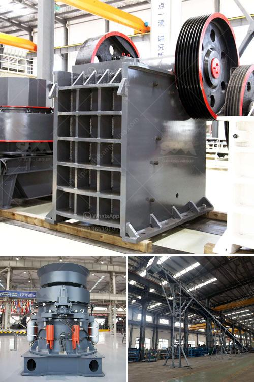

<h3>كسارة أسطوانية للحجر الجيري</h3>
تعتبر الكسارة الأسطوانية للحجر الجيري أحد الأدوات الهامة واللازمة في صناعة التعدين والبناء. تستخدم هذه الكسارة في تكسير الصخور الكبيرة إلى قطع صغيرة قابلة للاستخدام في عدة مجالات، مثل الأسفلت والخرسانة والبناء.

تتكون الكسارة الأسطوانية للحجر الجيري من اسطوانة عمودية طويلة مزودة بسطحين داخليين ملساء. بينما يتم تحريك الصخور من الجزء العلوي إلى الجزء السفلي من الكسارة، تتعرض الصخور للكسر والضغط بفضل القوة التصاعدية والوزن الذاتي للاسطوانة. يتم تغذية الصخور إلى الكسارة من الجزء العلوي باستخدام نظام تغذية خاص.

واحدة من الميزات الرئيسية للكسارة الأسطوانية للحجر الجيري هي قدرتها على تكسير الصخور إلى أجزاء صغيرة ومتجانسة، مما يجعلها مناسبة للاستخدام في صناعة البناء. كما أنها توفر عملية تكسير سريعة وفعالة، مما يؤدي إلى زيادة إنتاجية العمل وتوفير الوقت والجهد.

بالإضافة إلى ذلك، توفر الكسارة الأسطوانية للحجر الجيري أيضًا ميزة قابلية التشغيل والصيانة. فهي تعتبر سهلة الاستخدام والتشغيل، مما يجعلها مناسبة للعمل في البيئات الصعبة والمناطق النائية. كما أن تكلفة صيانتها منخفضة، وبالتالي فإنها تعد اختيارًا اقتصاديًا للشركات التي تعمل في صناعة التعدين والبناء.

وبالنظر إلى هذه الفوائد والميزات، يصبح من الواضح أن الكسارة الأسطوانية للحجر الجيري تعتبر أداة أساسية في صناعة التعدين والبناء. فهي تساهم في تحسين إنتاجية العمل وجودة المنتج النهائي، وبالتالي تلعب دورًا هامًا في تطوير البنية التحتية وتلبية احتياجات السوق المتزايدة. وعلاوة على ذلك، فإن استخدام الكسارة الأسطوانية للحجر الجيري يعكس الاهتمام المتنامي بالتنمية المستدامة والاستدامة البيئية، حيث توفر فرصة لإعادة تدوير واستخدام الحجر الجيري، مما يقلل من تأثير الأنشطة البشرية على البيئة.
<h3>Contact us</h3><ul><li><strong>Whatsapp:&nbsp;<a href="https://wa.me/8613661969651">+8613661969651</a></strong></li><li><a href="https://swt.shibang-china.com/?git&amp;zhl&amp;كسارة أسطوانية للحجر الجيري"><strong>Online Service(chat now)</strong></a></li></ul><h3>Related</h3><ul><li><a href='أفضل علامات تجارية للآلات في المحجر.md'>أفضل علامات تجارية للآلات في المحجر</a></li><li><a href='عصابات كسارة الحجر في جامايكا.md'>عصابات كسارة الحجر في جامايكا</a></li><li><a href='مطحنة طحن الحجر الصناعي.md'>مطحنة طحن الحجر الصناعي</a></li><li><a href='كسارة الفك وقطع الغيار.md'>كسارة الفك وقطع الغيار</a></li><li><a href='مورد كسارة الأسطوانة المزدوجة.md'>مورد كسارة الأسطوانة المزدوجة</a></li></ul>