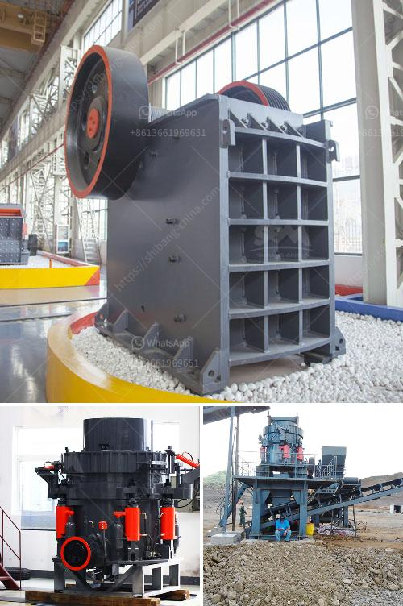

<h3>كسارة أولية للبيع</h3>
تعتبر الكسارات الأولية أدوات حيوية في صناعة التعدين والبناء، حيث تُستخدم لتكسير الصخور والأحجار الكبيرة إلى قطع صغيرة قابلة للاستخدام في تصنيع المواد الإنشائية والطرق والخرسانة. وعند البحث عن كسارة أولية للبيع، تعتبر عوامل مثل الجودة والكفاءة والسعر من الجوانب الهامة التي يجب أخذها في الاعتبار.

إحدى العوامل الأساسية المهمة أثناء شراء كسارة أولية هي قدرة الكسارة على تحمل قوة التكسير وتحميل المواد الكبيرة. تُعتبر الكسارات ذات الهياكل القوية والمتينة الأكثر فعالية ومناسبة للاستخدام في بيئات العمل الصعبة. ينبغي أن يتم اختيار الكسارة التي تناسب احتياجات المشروع وتتوافق مع مواد الاستخدام المحتملة.

علاوة على ذلك، يجب أن يتم اختيار كسارة أولية تتميز بكفاءة عالية في التكسير، حيث يؤثر ذلك مباشرةً على إنتاجية العملية. يمكن تحقيق الكفاءة العالية من خلال اختيار كسارة تعتمد على تكنولوجيا متقدمة، مثل الكسارات ذات الفك الهيدروليكي، والتي توفر طاقة تكسير فعالة وضوضاء منخفضة.

تكلفة الكسارة أيضًا تعتبر عاملًا مهمًا في عملية الشراء، حيث يجب أن تتناسب مع الميزانية المتاحة. يفضل شراء كسارة ذات تكلفة اقتصادية وفعالة، متوافقة مع العائد المتوقع من مشروعك.

عندما تبحث عن كسارة أولية للبيع، يمكنك أيضًا النظر في الشركة المصنعة وتقومها بتصنيع وتوريد الكسارات. يجب أن تكون الشركة ذات سمعة جيدة وتحظى بثقة العملاء وتوفر خدمة ما بعد البيع الممتازة. يمكنك الاطلاع على تقييمات العملاء والمشترين السابقين والبحث عن معلومات حول الشركة المصنعة قبل اتخاذ قرار الشراء.

باختصار، عند البحث عن كسارة أولية للبيع، يجب أن تتأكد من أن الكسارة تتوافق مع احتياجاتك من حيث الجودة والكفاءة والسعر. يجب أن تختار كسارة تتحمل قوة التكسير، وتتميز بكفاءة عالية، وتتوفر بتكلفة معقولة، وتكون منتجة من قبل شركة موثوقة. بالتأكيد، الاستثمار في كسارة أولية تلبي هذه المعايير سيكون له تأثير إيجابي على نجاح مشروعك وزيادة الإنتاجية.
<h3>Contact us</h3><ul><li><strong>Whatsapp:&nbsp;<a href="https://wa.me/8613661969651">+8613661969651</a></strong></li><li><a href="https://swt.shibang-china.com/?git&amp;zhl&amp;كسارة أولية للبيع"><strong>Online Service(chat now)</strong></a></li></ul><h3>Related</h3><ul><li><a href='الفرق بين الطحن والتلميع.md'>الفرق بين الطحن والتلميع</a></li><li><a href='تدفق عملية مصنع البنتونايت.md'>تدفق عملية مصنع البنتونايت</a></li><li><a href='عملية الكرة الطحن.md'>عملية الكرة الطحن</a></li><li><a href='مطحنة أسطوانية عمودية.md'>مطحنة أسطوانية عمودية</a></li><li><a href='مصنع تكسير المحاجر المحمول للبيع في جامايكا.md'>مصنع تكسير المحاجر المحمول للبيع في جامايكا</a></li></ul>