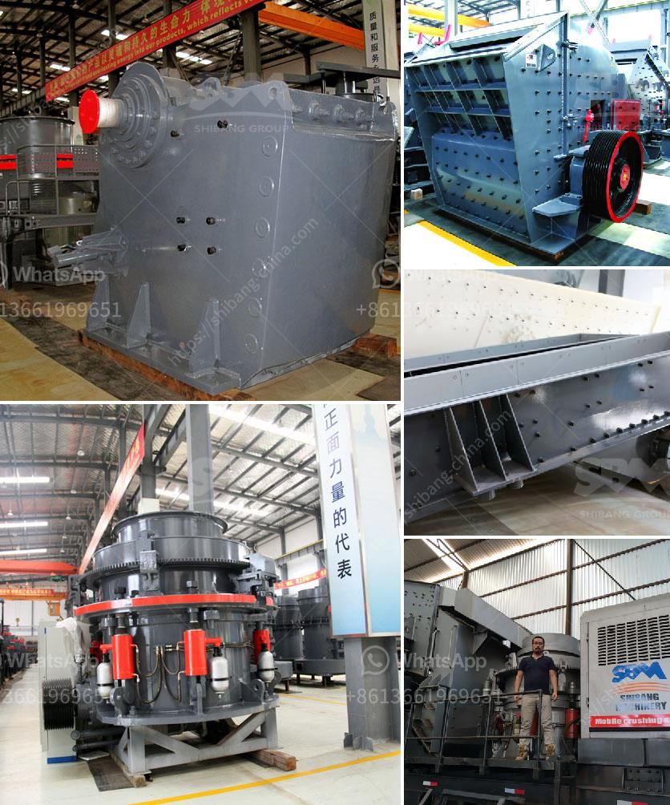

<h3>كسارة أولية للدولوميت</h3>
تُعد الكسارة الأولية للدولوميت جزءًا أساسيًا في صناعة التعدين والبناء، حيث يتم استخدامها لسحق الدولوميت الخام إلى حجم صغير يتوافق مع معايير المنتج النهائي المطلوب.

يتم استخراج الدولوميت من المحاجر أو تُحفر من الصخور الجيرية الطبيعية. بعد استخراجها، يتم نقل الدولوميت الخام إلى موقع الكسارة الأولية حيث يتم سحقها وتكسيرها إلى قطع صغيرة من حجم 200-400 ملم.

تتكون الكسارة الأولية للدولوميت من غرفة السحق ونظام تغذية وحدة التحكم، وتحتوي على ناقل مغناطيسي لإزالة الشوائب المغناطيسية من الدولوميت. تُستخدم تقنيات الكسارة المختلفة، مثل الكسارة الفكية أو الكسارة التصادمية، لتحقيق تكسير فعال وموثوق للدولوميت.

تتمتع الكسارة الأولية للدولوميت بعدة مزايا. فعلى سبيل المثال، تتميز بأداء قوي وقدرة عالية على التحمل في مواجهة أحمال العمل الثقيلة. كما أنها قادرة على سحق الدولوميت الصلبة والمتوسطة واللينة بكفاءة عالية وبأدنى تكلفة ممكنة.

بفضل استخدام الكسارة الأولية للدولوميت، يتم تحويل الدولوميت الخام إلى مواد قابلة للاستخدام في العديد من التطبيقات. فهي تستخدم في صناعة الأسمنت والزجاج والصلب ومواد البناء، حيث يمكن استخدامها كمادة خام أساسية أو كملء للجدران والأسطح.

وفي الختام، فإن الكسارة الأولية للدولوميت هي أداة أساسية لتحطيم الدولوميت الخام وتكسيرها إلى حجم مناسب. تلعب دورًا هامًا في صناعة التعدين والبناء، وتساعد في استخلاص المواد القيمة من الحجر الخام واستخدامها في تطبيقات مختلفة.
<h3>Contact us</h3><ul><li><strong>Whatsapp:&nbsp;<a href="https://wa.me/8613661969651">+8613661969651</a></strong></li><li><a href="https://swt.shibang-china.com/?git&amp;zhl&amp;كسارة أولية للدولوميت"><strong>Online Service(chat now)</strong></a></li></ul><h3>Related</h3><ul><li><a href='مصنعون لفاصل المغناطيسي في تركيا.md'>مصنعون لفاصل المغناطيسي في تركيا</a></li><li><a href='موقع إنتاج مطحنة المطرقة في نيجيريا.md'>موقع إنتاج مطحنة المطرقة في نيجيريا</a></li><li><a href='آلة طحن دقيقة في الصين.md'>آلة طحن دقيقة في الصين</a></li><li><a href='شركة مبيعات كسارة الحجر في كينيا.md'>شركة مبيعات كسارة الحجر في كينيا</a></li><li><a href='تكنولوجيا معالجة الطين الصيني.md'>تكنولوجيا معالجة الطين الصيني</a></li></ul>