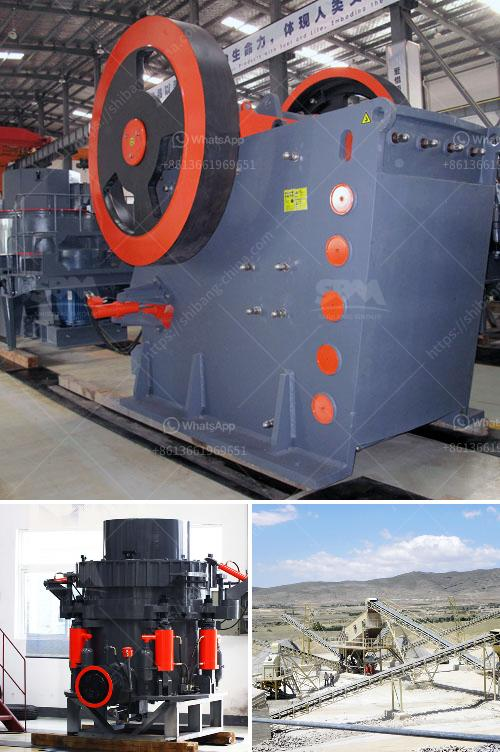

<h3>كسارة أولية مستخدمة في جنوب أفريقيا</h3>
تعد جنوب أفريقيا واحدة من أكبر دول القارة الأفريقية من حيث الصناعة والتنمية. وتعتبر صناعة التعدين من القطاعات الحيوية التي تسهم في التنمية الاقتصادية للبلاد. ومن بين الآلات المستخدمة في توسيع إمكانيات الإنتاج في صناعة التعدين، تأتي في مقدمتها الكسارات الأولية.

تستخدم الكسارات الأولية في جنوب أفريقيا لتكسير المواد الأولية المستخرجة من المناجم، مثل الصخور والمعادن، لتحويلها إلى قطع صغيرة قابلة للتعامل والاستخدام اللاحق. وتقوم هذه الكسارات الأولية بتدوير وسحق المواد الخام بشكل فعال وسريع، مما يزيد من قدرة الانتاج ويقلل من وقت التشغيل.

تتميز الكسارات الأولية المستخدمة في جنوب أفريقيا بقدرتها العالية على تحمل العمل الشاق والظروف الصعبة في مناجم التعدين. فهي مبنية من مواد قوية ومتينة تستطيع تحمل التأثيرات القوية والشد العالي أثناء عملية التكسير. وتوفر هذه الكسارات أيضًا ضمان الأمان لعمال المناجم حيث تتميز بنظام متطور للسلامة الذي يحمي العمال من التعرض للخطر أثناء التشغيل.

تتوفر الكسارات الأولية بموديلات وأحجام متنوعة لتناسب احتياجات العملاء المختلفة. وتعتمد الاختيار على نوع المواد المستخدمة وحجمها ومتطلبات الإنتاج. وتتميز هذه الكسارات بتقنيات متطورة مثل نظام التحكم بالكمبيوتر وقدرة تحمل عالية، مما يساهم في زيادة الكفاءة وإنتاجية العمل.

بغض النظر عن حجم الكسارات الأولية المستخدمة في جنوب أفريقيا، فإنها تبقى أداة أساسية لصناعة التعدين في البلاد. فهي تساهم في تحسين إنتاجية المناجم وتكسير المواد الأولية بسرعة وفعالية. ومن خلال استخدام الكسارات الأولية في جنوب أفريقيا، تستطيع البلاد الاستفادة من مواردها الطبيعية بشكل أفضل وتحقيق التنمية الاقتصادية المستدامة.
<h3>Contact us</h3><ul><li><strong>Whatsapp:&nbsp;<a href="https://wa.me/8613661969651">+8613661969651</a></strong></li><li><a href="https://swt.shibang-china.com/?git&amp;zhl&amp;كسارة أولية مستخدمة في جنوب أفريقيا"><strong>Online Service(chat now)</strong></a></li></ul><h3>Related</h3><ul><li><a href='كسارة الحجر من النوع الصغير.md'>كسارة الحجر من النوع الصغير</a></li><li><a href='طاحونة مسحوق ناعمة جدا.md'>طاحونة مسحوق ناعمة جدا</a></li><li><a href='كسارات الحجر في غانا.md'>كسارات الحجر في غانا</a></li><li><a href='كسارة الصدم المحمولة في إثيوبيا.md'>كسارة الصدم المحمولة في إثيوبيا</a></li><li><a href='مطحنة الكرات في تنزانيا.md'>مطحنة الكرات في تنزانيا</a></li></ul>