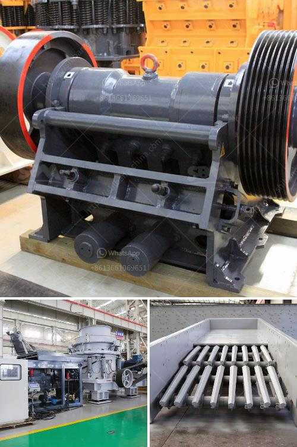

<h3>كسارة الأسطوانة PG 610 x 400</h3>
تعد كسارة الأسطوانة PG 610 x 400 واحدة من الآلات الهامة التي تستخدم في صناعة التكسير والطحن. تعتبر هذه الكسارة من الأنواع الأكثر شيوعًا واستخدامًا في عملية تقسية المواد الصلبة مثل الفحم والجبس والحجارة والطين والحجارة الجيرية والفوسفات وغيرها من المواد.

تتكون كسارة الأسطوانة PG 610 x 400 من اثنين من الأسطوانات الموازية ذات الدوران المتعاكس. تتميز الأسطوانات بأسنان صغيرة على سطحها الخارجي، وهي مصممة لطحن وتكسير المواد عن طريق الضغط والقص. يتم تفتيت المواد عبر الأسنان المتقابلة عند مرورها بين الأسطوانتين، مما يسهم في إنتاج جزيئات أصغر ومنتظمة.

تتميز كسارة الأسطوانة PG 610 x 400 بعدة مزايا. أولاً، فهي توفر أداءً ممتازًا في عملية التكسير والطحن. بفضل شكل الأسنان وتركيبتها، يتمكن الجهاز من تدمير المواد بشكل فعال وسريع. كما أنها تعمل بكفاءة عالية لتقليل الطاقة وزيادة إنتاجية الأسنان.

ثانيًا، تعتبر كسارة الأسطوانة PG 610 x 400 سهلة الصيانة والتشغيل. يتم تجميع الأسطوانة والأسنان بشكل صحيح وفعال، مما يسهل استبدال الأسنان المتآكلة عند الحاجة. بالإضافة إلى ذلك، يتميز الجهاز بقوة هيكله الصلب وموثوقيته العالية، مما يجعله قادرًا على التعامل مع المواد الصلبة بكفاءة وموثوقية.

ثالثًا، فإن كسارة الأسطوانة PG 610 x 400 تعتبر آمنة في الاستخدام. تتميز بأنظمة الحماية المزدوجة والحماية من الزيادة في الضغط والحمل الزائد، مما يمنع حوادث التشغيل غير المرغوب فيها ويحمي من خسائر الإنتاج والأجهزة.

وفي الختام، تعتبر كسارة الأسطوانة PG 610 x 400 حلاً فعالًا في عمليات التكسير والطحن في العديد من الصناعات. توفر أداءً ممتازًا، وسهولة في الصيانة والتشغيل، والسلامة في الاستخدام. بالإضافة إلى ذلك، يمكن تخصيص المواصفات وفقًا لاحتياجات المستخدمين، مما يجعلها مناسبة للعديد من التطبيقات المختلفة.

في النهاية، تعد كسارة الأسطوانة PG 610 x 400 خيارًا مثاليًا لأولئك الذين يبحثون عن جهاز فعال وموثوق به في أعمال التكسير والطحن. باستخدام هذه الكسارة، ستتمكن من تحسين جودة المواد وزيادة إنتاجيتك وتقليل التكاليف في العملية الإنتاجية.
<h3>Contact us</h3><ul><li><strong>Whatsapp:&nbsp;<a href="https://wa.me/8613661969651">+8613661969651</a></strong></li><li><a href="https://swt.shibang-china.com/?git&amp;zhl&amp;كسارة الأسطوانة PG 610 x 400"><strong>Online Service(chat now)</strong></a></li></ul><h3>Related</h3><ul><li><a href='مصنع تكسير خام البوكسيت.md'>مصنع تكسير خام البوكسيت</a></li><li><a href='آلة طحن مسحوق الحجر الصغيرة.md'>آلة طحن مسحوق الحجر الصغيرة</a></li><li><a href='التكلفة المتوسطة لمصنع تعدين الجرافيت.md'>التكلفة المتوسطة لمصنع تعدين الجرافيت</a></li><li><a href='مطحنة هامر تقليدية.md'>مطحنة هامر تقليدية</a></li><li><a href='سعر كسارة الحجر في إيران.md'>سعر كسارة الحجر في إيران</a></li></ul>