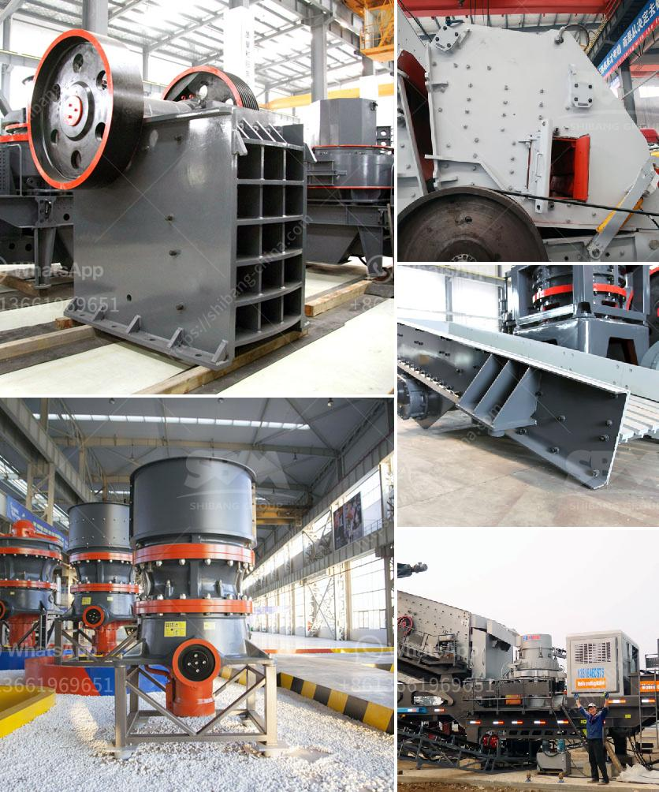

<h3>كسارة الأسطوانة لفحم متنوع الحجم</h3>
تعتبر كسارة الأسطوانة لفحم متنوع الحجم أحد الأجهزة الهامة في صناعة تحويل الفحم إلى مختلف المنتجات النهائية. تعتمد هذه الكسارة على مبدأ عمل بسيط وفعال يعمل على تقليل حجم الفحم وتحويله إلى حبيبات صغيرة تسهل عملية التعامل معها وتحسين استفادة الفحم في العمليات الصناعية.

تتكون كسارة الأسطوانة من اثنين من الأسطوانات الموجودة عموديًا وتُدار باستخدام محرك كهربائي. تحتوي كل أسطوانة على سطحين ملساء يُعدان من مواد تحمل الصدمات والاحتكاك مثل الصلب المقاوم للصدأ. يتم تعديل المسافة بين الأسطوانتين بواسطة ضوابط تعتمد على الاحتياجات المحددة لحجم الفحم المرغوب في الحصول عليه.

أثناء عملية التشغيل، يتم إدخال الفحم عبر مدخل الكسارة ويتم ضغطه بين الأسطوانتين. يتم تدحرج الأسطوانتين في اتجاه متعاكس مما يؤدي إلى تفتت الفحم بين الأسطوانتين بشكل ناعم ومتناسق. يتم تفتيت الفحم إلى قطع صغيرة ويتم فصل الحجم الصغير من الحجم الكبير أثناء عملية التكسير.

تساهم كسارة الأسطوانة في تعزيز استفادة الفحم بعدة طرق. فالفحم المكسور بشكل جيد يمتاز بتوزيع حجم حبيبات أكثر تجانساً، مما يسهل تداوله وتخزينه بشكل أكثر فعالية. تساعد هذه الحبيبات الصغيرة أيضًا في تقليل الفقد في الفحم أثناء العمليات الصناعية التالية مثل الاحتراق والتحويل الكيميائي. علاوة على ذلك، فإن الفحم الصغير الحجم يتميز بمساحة سطح أكبر مما يسمح بزيادة فعالية عملية الاحتراق وتحويل الفحم إلى طاقة حرارية أو كهربائية بصورة أكثر كفاءة.

تستخدم كسارة الأسطوانة لفحم متنوع الحجم في العديد من الصناعات مثل صناعة الطاقة والصناعات الكيميائية. وهذه الكسارات تتوفر بمختلف الأحجام والقدرات لتتناسب مع متطلبات المشاريع المختلفة. يمكن أيضًا تخصيص خصائص الكسارة بناءً على النوع والطاقة الحرارية المطلوبة من الفحم لضمان تحقيق الأداء المثلى والكفاءة العالية.

لذلك، يمكن القول أن كسارة الأسطوانة لفحم متنوع الحجم تعتبر أداة أساسية في صناعة تحويل الفحم. وبفضل قدرتها على تحويل الفحم إلى حبيبات صغيرة ومتجانسة، تساهم في تعزيز استفادة الفحم وتحسين الكفاءة العامة لعمليات الاحتراق والتحويل الكيميائي.
<h3>Contact us</h3><ul><li><strong>Whatsapp:&nbsp;<a href="https://wa.me/8613661969651">+8613661969651</a></strong></li><li><a href="https://swt.shibang-china.com/?git&amp;zhl&amp;كسارة الأسطوانة لفحم متنوع الحجم"><strong>Online Service(chat now)</strong></a></li></ul><h3>Related</h3><ul><li><a href='مصنع تكسير الحجر الكلي في الصين.md'>مصنع تكسير الحجر الكلي في الصين</a></li><li><a href='مصنع تحسين أكسيد النحاس في الصين.md'>مصنع تحسين أكسيد النحاس في الصين</a></li><li><a href='مصنع تكسير حجر الجرانيت في كينيا.md'>مصنع تكسير حجر الجرانيت في كينيا</a></li><li><a href='مطحنة أسطوانية لطحن المعادن في سالم.md'>مطحنة أسطوانية لطحن المعادن في سالم</a></li><li><a href='آلات إنتاج الجبس.md'>آلات إنتاج الجبس</a></li></ul>