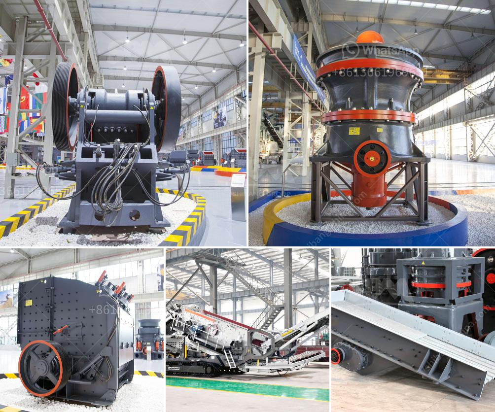

<h3>كسارة الإسمنت في تركيا</h3>
تعتبر صناعة الإسمنت من الصناعات الهامة واللازمة في العديد من القطاعات التنموية، بما في ذلك البناء والتشييد والبنية التحتية. تركيا هي واحدة من البلدان الرائدة في إنتاج الإسمنت على مستوى العالم، حيث تمتلك العديد من الكسارات المتقدمة والمتطورة التي تعتبر جزءًا هامًا من عملية إنتاج الإسمنت.

تتميز كسارات الإسمنت في تركيا بتوفيرها للمواد الأولية اللازمة لإنتاج الإسمنت وخلطها بالتركيبة المطلوبة، وذلك بهدف الحصول على منتج نهائي عالي الجودة ومطابق للمعايير العالمية. تعتمد كسارات الإسمنت في تركيا على التقنيات الحديثة والمعدات المتطورة التي تساعد في تحسين الكفاءة والإنتاجية.

كما أن الكسارات في تركيا تهتم بالاستدامة البيئية، حيث تعتبر صناعة الإسمنت واحدة من الصناعات التي تتسبب في انبعاث ثاني أكسيد الكربون. ولذلك، تعمل الكسارات على تحديث معداتها واستخدام تكنولوجيا نظيفة ومتطورة للحد من التلوث البيئي وتقليل انبعاثات الكربون.

تعد كسارات الإسمنت في تركيا مصدرًا هامًا لتوفير فرص العمل للعديد من العمال. فعلى سبيل المثال، يتم تشغيل العديد من الآلات والمعدات في الكسارات بشكل يدوم على مدار الساعة، مما يتطلب وجود فريق عمل كبير للتشغيل والصيانة.

بالإضافة إلى ذلك، تلعب الكسارات دورًا هامًا في تحقيق الاكتفاء الذاتي في إنتاج الإسمنت داخل تركيا، وبالتالي تحقيق الاستقلالية والاستدامة الاقتصادية. حيث يتم تصدير الإسمنت المنتج في تركيا إلى العديد من الدول الأخرى، مما يسهم في تعزيز العلاقات الاقتصادية وزيادة الإيرادات.

لخلاصة القول، تعتبر كسارات الإسمنت في تركيا ذات أهمية كبيرة في صناعة البناء والتشييد، حيث توفر المواد الأولية اللازمة لإنتاج الإسمنت عالي الجودة. ومن خلال استخدام التكنولوجيا المتطورة والاهتمام بالاستدامة البيئية، تعزز تركيا مكانتها كواحدة من البلدان الرائدة في إنتاج الإسمنت على مستوى العالم.
<h3>Contact us</h3><ul><li><strong>Whatsapp:&nbsp;<a href="https://wa.me/8613661969651">+8613661969651</a></strong></li><li><a href="https://swt.shibang-china.com/?git&amp;zhl&amp;كسارة الإسمنت في تركيا"><strong>Online Service(chat now)</strong></a></li></ul><h3>Related</h3><ul><li><a href='مطحنة طحن الطين الصيني.md'>مطحنة طحن الطين الصيني</a></li><li><a href='موردي آلات الأسمنت ووحدة الطحن.md'>موردي آلات الأسمنت ووحدة الطحن</a></li><li><a href='أسعار السيور الناقلة في ماليزيا.md'>أسعار السيور الناقلة في ماليزيا</a></li><li><a href='شاشات غسيل الركام في جنوب أفريقيا.md'>شاشات غسيل الركام في جنوب أفريقيا</a></li><li><a href='مصنع كسارة الصخور الذهبية المحمولة.md'>مصنع كسارة الصخور الذهبية المحمولة</a></li></ul>