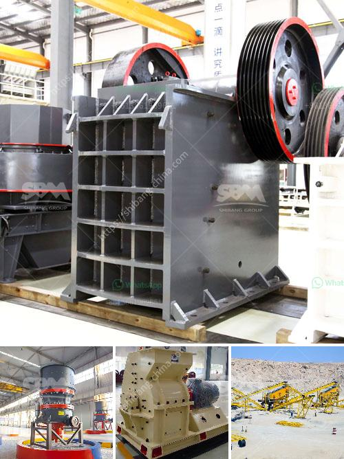

<h3>كسارة البليت في كينيا</h3>
تُعتبر كينيا واحدة من الدول النامية في شرق أفريقيا، وتعتمد اقتصادها بشكل كبير على قطاع البناء والبنية التحتية. ومع تزايد الطلب على المواد البنائية في البلاد، زادت أهمية مواجهة تحديات التخلص من النفايات البنائية وإعادة تدويرها بطرق صديقة للبيئة.

من أجل مواجهة هذا التحدي، تم تطوير كسارة البليت في كينيا، وهي عبارة عن آلة تقوم بتكسير النفايات البنائية مثل الأسمنت والخرسانة والأرضيات الرخامية. تُعد كسارة البليت ذات أهمية كبيرة في عملية إعادة التدوير، حيث تقوم بتحويل النفايات البنائية إلى بليت ناعمة يمكن استخدامها في صنع الخرسانة والأسفلت وغيرها من المواد البنائية.

تعتبر كسارة البليت حلاً مستدامًا للعديد من المشاكل البيئية والاقتصادية. فمن خلال إعادة تدوير النفايات البنائية، يمكن تقليل كمية النفايات الموجودة في المقالع والحفاظ على الموارد الطبيعية بشكل أفضل. كما أنها تخفض تكاليف البناء، حيث تمكن المقاولين من الحصول على مواد رخيصة وبجودة عالية تعتبر بديلاً مستدامًا للمواد التقليدية.

ومن الملفت للنظر أن كسارة البليت ليست مجرد آلة تكسير، بل تفتح أيضًا آفاقًا جديدة لفرص العمل في المناطق الريفية. حيث يعتبر جمع وفرز النفايات البنائية وتشغيل الكسارة مصدرًا محتملاً للعديد من الوظائف في البلدان النامية. يمكن للعمال المحليين تعلم كيفية تشغيل الكسارة وتوظيف المحتوى المحطم في صنع الخرسانة وتسويقها للشركات المحلية.

وعلى الرغم من الفوائد الكبيرة لكسارة البليت، فإنها لا تزال تواجه تحديات عديدة. من بين هذه التحديات هو ضمان جودة المواد المحطمة، حيث تحتاج البليت إلى أن تكون ناعمة وخالية من الشوائب لكي تكون صالحة للاستخدام في البناء. بالإضافة إلى ذلك، تحتاج كسارة البليت إلى التصاريح اللازمة وتنظيم صارم لضمان عملية تشغيلها بأمان وفعالية.

في الختام، تُعتبر كسارة البليت في كينيا حلاً مبتكرًا ومستدامًا لمشاكل التخلص من النفايات البنائية وإعادة تدويرها. ومع مزيد من الاستثمار والتطوير، يمكن لهذه التكنولوجيا أن تحدث تحولاً إيجابياً في قطاع البناء في البلاد، مما يعود بالفائدة على الاقتصاد والبيئة والمجتمع على حد سواء.
<h3>Contact us</h3><ul><li><strong>Whatsapp:&nbsp;<a href="https://wa.me/8613661969651">+8613661969651</a></strong></li><li><a href="https://swt.shibang-china.com/?git&amp;zhl&amp;كسارة البليت في كينيا"><strong>Online Service(chat now)</strong></a></li></ul><h3>Related</h3><ul><li><a href='مطحنة كرات مخروطية للبيع.md'>مطحنة كرات مخروطية للبيع</a></li><li><a href='سحق النفايات الخرسانية والحديد.md'>سحق النفايات الخرسانية والحديد</a></li><li><a href='سعر كسارة الحجر.md'>سعر كسارة الحجر</a></li><li><a href='كسارات مزدوجة التبديل.md'>كسارات مزدوجة التبديل</a></li><li><a href='مصنعي آلات تكسير حجر المحجر.md'>مصنعي آلات تكسير حجر المحجر</a></li></ul>